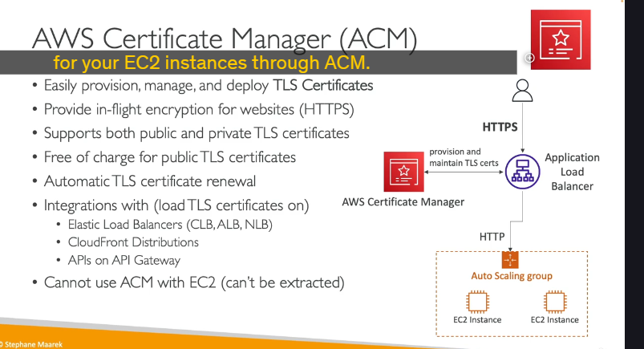
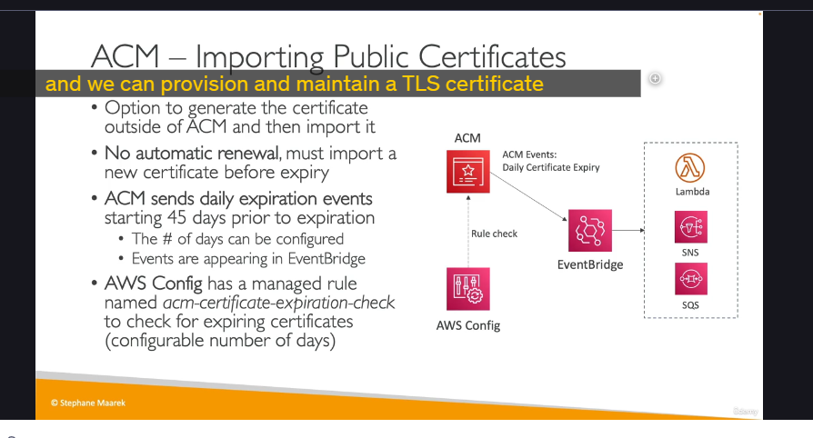
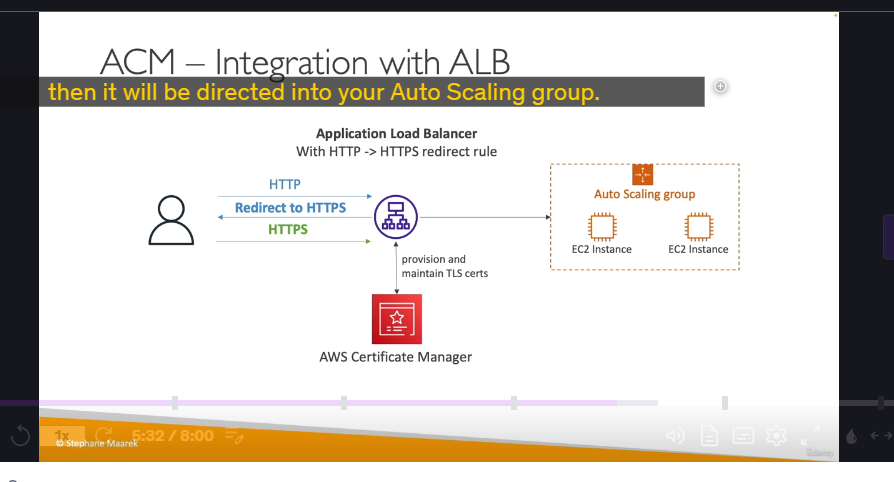
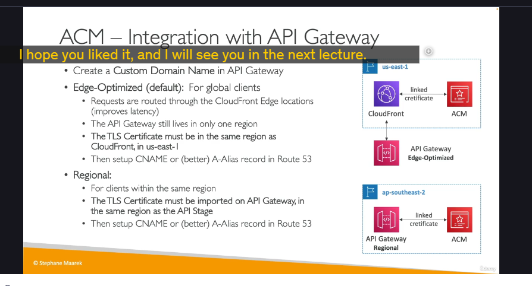

# AWS Certificate Manager (ACM)

## Tổng quan về ACM

AWS Certificate Manager (ACM) là dịch vụ cho phép bạn dễ dàng cung cấp, quản lý và triển khai các chứng chỉ TLS trên AWS. ACM giúp bạn:

- Cung cấp chứng chỉ TLS/SSL để bảo mật website
- Tích hợp với nhiều dịch vụ AWS
- Tự động gia hạn chứng chỉ
- Miễn phí khi sử dụng chứng chỉ công khai

## Chứng chỉ TLS/SSL là gì?

Chứng chỉ TLS (đôi khi gọi là SSL) được sử dụng để cung cấp mã hóa trong quá trình truyền tải dữ liệu cho các trang web. Khi bạn truy cập một trang web có giao thức HTTPS, chữ "S" đại diện cho "Secure" (Bảo mật), cho biết rằng có một chứng chỉ TLS được sử dụng trong giao dịch.

## Cách hoạt động của ACM

Khi bạn có một Application Load Balancer (ALB) kết nối với nhóm Auto Scaling và muốn cung cấp endpoint HTTPS, bạn sẽ tích hợp ALB với Certificate Manager để:

1. Cấp phát và duy trì chứng chỉ TLS trực tiếp trên bộ cân bằng tải
2. Cho phép người dùng truy cập trang web hoặc API của bạn thông qua giao thức HTTPS an toàn

## Các tính năng chính của ACM

- **Hỗ trợ chứng chỉ**: Cả chứng chỉ TLS công khai và riêng tư
- **Chi phí**: Miễn phí cho chứng chỉ công khai
- **Tự động gia hạn**: Tự động làm mới các chứng chỉ
- **Tích hợp nhiều dịch vụ AWS**:
  - Elastic Load Balancers (Classic, Application, Network)
  - CloudFront Distributions
  - API Gateway
  - **Lưu ý**: Không thể sử dụng trực tiếp với EC2 instances

> **Quan trọng**: Đối với chứng chỉ công khai, không thể trích xuất và sử dụng cho các EC2 instance thông qua ACM.

## Quy trình yêu cầu chứng chỉ công khai

### 1. Liệt kê tên miền

- Có thể sử dụng tên miền đầy đủ (FQDN) như `corp.example.com`
- Hoặc tên miền có ký tự đại diện như `*.example.com`
- Có thể bao gồm nhiều tên miền trong một chứng chỉ

### 2. Chọn phương pháp xác thực

#### Xác thực DNS

- Phương pháp ưu tiên cho tự động hóa và gia hạn tự động
- Yêu cầu tạo bản ghi CNAME trong cấu hình DNS để xác minh quyền sở hữu tên miền
- Tích hợp tự động với Route 53 nếu bạn sử dụng dịch vụ này

#### Xác thực Email

- ACM gửi email đến địa chỉ liên hệ đã đăng ký trong đăng ký tên miền
- Xác minh rằng bạn đã yêu cầu chứng chỉ

### 3. Đợi xác minh và cấp chứng chỉ

- Quá trình này có thể mất vài giờ
- Sau khi xác minh, chứng chỉ sẽ được cấp

### 4. Tự động gia hạn

- ACM tự động gia hạn các chứng chỉ do ACM tạo ra
- Gia hạn xảy ra 60 ngày trước khi hết hạn

## Nhập chứng chỉ công khai vào ACM

Nếu bạn tự tạo chứng chỉ bên ngoài ACM và nhập vào:

- Không có tính năng tự động gia hạn
- Bạn cần nhập chứng chỉ mới trước khi chứng chỉ hiện tại hết hạn

### Cách theo dõi chứng chỉ sắp hết hạn

#### 1. Sử dụng EventBridge

- ACM gửi sự kiện hết hạn hàng ngày bắt đầu từ 45 ngày trước khi hết hạn
- Số ngày có thể được cấu hình (45, 30, v.v.)
- Các sự kiện này kích hoạt các hành động trong EventBridge
- Từ EventBridge, bạn có thể kích hoạt Lambda functions, SNS topics hoặc SQS queues

#### 2. Sử dụng AWS Config

- Config có rule quản lý gọi là `ACM-certificate-expiration-check`
- Kiểm tra các chứng chỉ sắp hết hạn
- Số ngày có thể được cấu hình
- Nếu chứng chỉ không tuân thủ, sự kiện không tuân thủ sẽ được gửi đến EventBridge
- Từ đó có thể kích hoạt Lambda, SNS hoặc SQS

## Tích hợp ACM với Application Load Balancer (ALB)

ALB có thể được cấu hình với:

1. Chứng chỉ TLS từ ACM
2. Rule chuyển hướng từ HTTP sang HTTPS

Quy trình xử lý:

- Khi người dùng truy cập ALB qua giao thức HTTP, ALB sẽ trả về phản hồi chuyển hướng đến HTTPS
- Người dùng sau đó quay lại ALB thông qua HTTPS, sử dụng chứng chỉ TLS từ ACM
- Các request HTTPS sau đó được chuyển hướng đến Auto Scaling Group

## Tích hợp ACM với API Gateway

### Loại endpoint trong API Gateway

#### 1. Edge-optimized endpoints

- Dành cho khách hàng toàn cầu
- Yêu cầu được định tuyến qua CloudFront Edge locations để cải thiện độ trễ
- API Gateway vẫn nằm trong một vùng duy nhất

#### 2. Regional endpoints

- Khách hàng trong cùng vùng với API Gateway
- Không có CloudFront mặc định
- Có thể tạo phân phối CloudFront riêng nếu muốn kiểm soát chiến lược phân phối và bộ nhớ đệm

#### 3. Private API Gateway endpoints

- Chỉ có thể truy cập từ bên trong VPC
- Sử dụng interface VPC endpoint
- Yêu cầu chính sách tài nguyên để xác định quyền truy cập

### Quy trình tích hợp ACM với API Gateway

#### Bước 1: Tạo và cấu hình Custom Domain Name trong API Gateway

#### Bước 2: Cấu hình chứng chỉ TLS

- **Đối với Edge-optimized endpoints**:

  - Vì yêu cầu được định tuyến qua CloudFront, chứng chỉ TLS được gắn vào phân phối CloudFront
  - Chứng chỉ TLS phải được tạo trong cùng vùng với CloudFront (us-east-1)
  - API Gateway có thể ở một vùng khác, nhưng chứng chỉ ACM phải ở vùng us-east-1
  - Tất cả chứng chỉ cho CloudFront đều ở us-east-1

- **Đối với Regional endpoints**:

  - Chứng chỉ TLS phải được nhập vào API Gateway trong cùng vùng với API stage
  - Ví dụ: ACM có thể chỉ ở ap-southeast-2

#### Bước 3: Thiết lập bản ghi CNAME hoặc Alias trong Route 53

- Trỏ tên miền của bạn đến API Gateway

## Tổng kết

AWS Certificate Manager là một dịch vụ quan trọng giúp bảo mật các ứng dụng web trên AWS. Với khả năng cung cấp, quản lý và gia hạn tự động chứng chỉ TLS, ACM giúp đơn giản hóa quy trình bảo mật truyền thông giữa người dùng và ứng dụng của bạn. Ngoài ra, việc tích hợp liền mạch với các dịch vụ AWS khác như ALB, CloudFront và API Gateway tạo điều kiện cho việc triển khai HTTPS trên toàn bộ kiến trúc ứng dụng của bạn.
