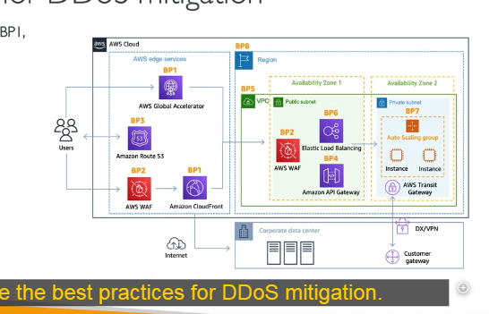

# Bảo Vệ DDoS và Các Phương Pháp Tốt Nhất

## Giới Thiệu

Bài học này tập trung vào kiến trúc giải pháp bảo vệ chống lại các cuộc tấn công [DDoS](./security-concepts/ddos-attacks.md) và các phương pháp tốt nhất để triển khai.

## Kiến Trúc Tham Khảo

Giả sử bạn có một kiến trúc như sau:

- Auto Scaling Group với các EC2 instances
- Elastic Load Balancer đứng trước các instances
- Load Balancer có thể được tiếp cận thông qua:
  - Global Accelerator cung cấp các IP cố định
  - Hoặc CloudFront
- CloudFront có thể kết nối với WAF (Web Application Firewall)
- Route 53 cho DNS routing
- Hoặc một kiến trúc khác kết hợp CloudFront với API Gateway

Chúng ta sẽ thảo luận về các phương pháp tốt nhất (Best Practice - BP) và tác động của chúng đối với khả năng phục hồi sau các cuộc tấn công DDoS.

## Các Phương Pháp Bảo Vệ DDoS Tốt Nhất

### 1. Giảm Thiểu Tại Edge Location

Khi sử dụng dịch vụ ở Edge location, ứng dụng web của bạn được phân phối tại các điểm cuối gần người dùng và được bảo vệ tốt hơn:

- **CloudFront**:

  - Cung cấp ứng dụng web tại Edge
  - Bảo vệ chống lại các cuộc tấn công DDoS phổ biến (SYN floods, UDP reflection)
  - Tích hợp với Shield

- **Global Accelerator**:

  - Cho phép truy cập ứng dụng của bạn trên toàn cầu tại Edge
  - Tích hợp với Shield để bảo vệ DDoS
  - Hữu ích khi backend không tương thích với CloudFront

- **Route 53**:

  - Phân giải tên miền toàn cầu tại Edge
  - Cơ chế bảo vệ DDoS tích hợp cho DNS

### 2. Phòng Thủ Tầng Cơ Sở Hạ Tầng (BP1, BP3, BP6)

- **Kết hợp các dịch vụ AWS**:

  - CloudFront, Global Accelerator, Route 53 và ELB giúp xử lý lưu lượng trước khi đến EC2
  - Giảm tải lên các EC2 instances của bạn

- **Auto Scaling**:

  - Tự động mở rộng để đáp ứng tải cao hơn
  - Đảm bảo duy trì khả năng phục vụ trong các cuộc tấn công

- **Elastic Load Balancing**:

  - Phân phối lưu lượng đều trên nhiều EC2 instances
  - Đảm bảo mỗi instance chỉ phải xử lý một lượng lưu lượng hợp lý

### 3. Phòng Thủ Tầng Ứng Dụng (BP1, BP2)

- **CloudFront cho nội dung tĩnh**:

  - Phân phối nội dung từ các Edge locations
  - Bảo vệ backend của bạn

- **WAF với CloudFront/ALB**:

  - Lọc và chặn các request dựa trên chữ ký request
  - Chặn IPs cụ thể và các loại request nguy hiểm
  - Quy tắc dựa trên tốc độ (rate-based rules) tự động chặn IPs của kẻ tấn công
  - Nhiều managed rules để chặn IPs dựa trên danh tiếng hoặc IPs ẩn danh

- **Chặn theo địa lý với CloudFront**:

  - Hạn chế truy cập từ các khu vực địa lý cụ thể

- **Shield Advanced**:

  - Tự động tạo các quy tắc WAF để giảm thiểu các cuộc tấn công tầng 7
  - Thêm lớp bảo vệ cho EC2 instances

### 4. Giảm Thiểu Bề Mặt Tấn Công (BP1, BP4, BP6)

- **Ẩn tài nguyên backend**:

  - Sử dụng CloudFront, API Gateway, hoặc ELB để ẩn tài nguyên backend
  - Kẻ tấn công không biết liệu backend có phải là Lambda, EC2, ECS hay dịch vụ khác

- **Bảo mật mạng**:

  - Thiết lập Security Groups và Network ACLs để lọc lưu lượng dựa trên IPs cụ thể
  - Elastic IPs có thể được bảo vệ bởi AWS Shield Advanced

- **Bảo vệ API Endpoints**:

  - Sử dụng API Gateway để ẩn backend
  - Edge-optimized mode cho phân phối toàn cầu
  - Hoặc CloudFront + Regional mode cho kiểm soát DDoS tốt hơn
  - WAF trên API Gateway để lọc các request HTTP
  - Thiết lập giới hạn burst, lọc headers, và áp dụng API keys bắt buộc

## Cách Tiếp Cận Toàn Diện

Khi kết hợp tất cả các biện pháp bảo vệ trên, bạn sẽ tạo ra một hệ thống phòng thủ nhiều lớp có khả năng chống chịu cao trước các cuộc tấn công DDoS:

1. **Phòng thủ Edge** (CloudFront, Global Accelerator, Route 53)
2. **Phòng thủ khu vực** (ELB, WAF)
3. **Phòng thủ backend** (Auto Scaling, Security Groups)

## Tóm Tắt Các Phương Pháp Tốt Nhất

| Best Practice | Mô tả                      | Dịch vụ liên quan                        |
| ------------- | -------------------------- | ---------------------------------------- |
| BP1           | Phân phối ở Edge           | CloudFront, Global Accelerator, Route 53 |
| BP2           | Lọc và giám sát request    | WAF, CloudWatch                          |
| BP3           | Khả năng mở rộng linh hoạt | Auto Scaling, ELB                        |
| BP4           | Ẩn tài nguyên backend      | CloudFront, API Gateway, ELB             |
| BP5           | Bảo mật tầng ứng dụng      | WAF rules, API Gateway throttling        |
| BP6           | Bảo mật mạng               | Security Groups, NACLs, Shield Advanced  |

## Các Trường Hợp Sử Dụng Thực Tế

### Trang Web Thương Mại Điện Tử

- CloudFront + WAF cho trang chủ và tài sản tĩnh
- ALB + Auto Scaling cho backend
- DynamoDB cho giỏ hàng (để đảm bảo khả năng mở rộng)
- Shield Advanced cho các sự kiện bán hàng lớn

### API Backend

- API Gateway với kiểm soát tốc độ
- WAF để lọc các request độc hại
- Lambda để xử lý bất đồng bộ (giảm tác động của lưu lượng đột biến)

### Game Online

- Global Accelerator cho kết nối độ trễ thấp
- Shield Advanced cho bảo vệ liên tục
- Auto Scaling để xử lý lưu lượng đột biến

## Lưu Ý Cho Kỳ Thi

Trong kỳ thi AWS Solutions Architect Associate, bạn sẽ được yêu cầu phân tích các tình huống và đề xuất các biện pháp bảo vệ DDoS phù hợp. Hãy nhớ:

- Xác định loại tấn công (tầng 3/4 hay tầng 7)
- Chọn dịch vụ AWS phù hợp để bảo vệ
- Kết hợp nhiều lớp bảo vệ (Phòng thủ theo chiều sâu)
- Cân nhắc chi phí vs mức độ bảo vệ (Shield Standard vs Shield Advanced)

Hiểu rõ các phương pháp này sẽ giúp bạn sẵn sàng trả lời các câu hỏi về bảo vệ DDoS trong kỳ thi AWS Solutions Architect Associate.
