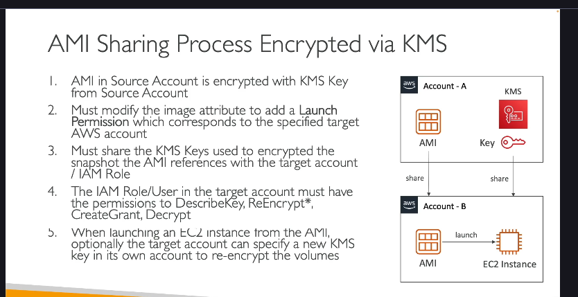

Bạn có một AMI nằm trong **Tài khoản nguồn (Account A)**. AMI này đã được mã hóa bằng một khóa KMS thuộc về **Tài khoản A**. Bạn muốn khởi chạy một phiên bản EC2 từ AMI này trong **Tài khoản đích (Account B)**.

**Quy trình thực hiện (bao gồm các bước ở cả hai tài khoản):**

Để Tài khoản B có thể khởi chạy một phiên bản EC2 từ AMI được mã hóa bằng KMS của Tài khoản A, cần thực hiện các bước sau:

**Bước 1: Chia sẻ AMI trong Tài khoản nguồn (Account A)**

- **Hành động:** Tài khoản nguồn (Account A) phải sửa đổi thuộc tính của AMI để cho phép Tài khoản đích (Account B) có quyền khởi chạy AMI đó.
- **Chi tiết:** Bạn cần thêm quyền khởi chạy (launch permission) cho AMI, chỉ định ID của Tài khoản B vào danh sách được phép.
- **Mục đích:** Bước này cho phép Tài khoản B nhìn thấy AMI và có quyền bắt đầu quá trình khởi chạy phiên bản EC2 từ nó.

**Bước 2: Chia sẻ Khóa KMS trong Tài khoản nguồn (Account A)**

- **Hành động:** Tài khoản nguồn (Account A) phải cấp quyền cho Tài khoản đích (Account B) để sử dụng khóa KMS đã mã hóa AMI.
- **Chi tiết:** Việc này thường được thực hiện bằng cách **sửa đổi Chính sách Khóa KMS (KMS Key Policy)** của khóa đã dùng để mã hóa AMI trong Tài khoản A. Bạn thêm một mục (statement) vào chính sách khóa cho phép ID của Tài khoản B (hoặc các Principal cụ thể trong Tài khoản B) thực hiện các hành động KMS cần thiết.
- **Các quyền KMS API cần thiết cho Tài khoản B:** Để có thể sử dụng AMI đã mã hóa, Tài khoản B cần có các quyền API KMS sau đối với khóa này trong Tài khoản A:
  - `DescribeKey`: Để xem thông tin chi tiết về khóa KMS.
  - `ReEncrypt`: Để mã hóa lại dữ liệu từ khóa này sang khóa khác (thường xảy ra ngầm khi AWS chuẩn bị các snapshot/volumes cho phiên bản mới).
  - `CreateGrant`: Để tạo "quyền sử dụng tạm thời" cho các dịch vụ AWS (như EC2) thay mặt người dùng.
  - `Decrypt`: Để giải mã các khối dữ liệu nhỏ (như Data Key) liên quan đến AMI và các volume đính kèm.
- **Mục đích:** Bước này cho phép AWS (thay mặt Tài khoản B khi khởi chạy phiên bản) có thể tương tác với khóa KMS nguồn để giải mã các thành phần cần thiết của AMI và các snapshot volume đính kèm.

**Bước 3: Cấu hình Quyền trong Tài khoản đích (Account B)**

- **Hành động:** Trong Tài khoản đích (Account B), bạn cần đảm bảo rằng Người dùng IAM hoặc Vai trò IAM (mà bạn sẽ sử dụng để khởi chạy phiên bản EC2) có đủ quyền.
- **Chi tiết:** IAM Principal này trong Tài khoản B cần có:
  - Quyền để sử dụng AMI (quyền này được cấp ở Bước 1 khi AMI được chia sẻ trực tiếp với Account B).
  - Quyền để sử dụng **Khóa KMS của Tài khoản A** (các quyền này được cấp ở Bước 2 thông qua Chính sách Khóa KMS của Tài khoản A). IAM Policy của người dùng/vai trò trong Tài khoản B phải cho phép họ sử dụng các quyền KMS API (`DescribeKey`, `ReEncrypt`, `CreateGrant`, `Decrypt`) trên Khóa KMS cụ thể trong Tài khoản A.
- **Mục đích:** Đảm bảo rằng thực thể (người dùng/vai trò) thực hiện lệnh khởi chạy trong Tài khoản B có đủ cả hai loại quyền: quyền sử dụng AMI và quyền sử dụng khóa KMS liên quan.

**Bước 4: Khởi chạy Phiên bản EC2 trong Tài khoản đích (Account B)**

- **Hành động:** Sau khi hoàn thành tất cả các bước chia sẻ AMI và khóa KMS ở Tài khoản A, cùng với việc cấu hình quyền IAM ở Tài khoản B, bạn có thể tiến hành khởi chạy phiên bản EC2.
- **Chi tiết:** Từ console EC2 trong Tài khoản B, bạn chọn "Launch an instance", sau đó chọn tab "My AMIs" và tìm AMI đã được chia sẻ với bạn từ Tài khoản A.
- **Mục đích:** Hoàn thành quá trình khởi chạy phiên bản EC2 từ AMI đã chia sẻ.

**Bước Tùy chọn: Mã hóa lại Volume trong Tài khoản đích (Account B)**

- **Hành động:** Sau khi phiên bản EC2 được khởi chạy thành công trong Tài khoản B, Tài khoản B **có thể chọn** mã hóa lại các volume EBS được tạo ra từ các snapshot của AMI.
- **Chi tiết:** Việc này được thực hiện bằng cách sử dụng một **Khóa KMS KHÁC**, thuộc sở hữu của chính Tài khoản B. Quá trình này thường diễn ra tự động hoặc được cấu hình trong quá trình khởi chạy hoặc sau đó.
- **Mục đích:** Giúp Tài khoản B có toàn quyền kiểm soát khóa mã hóa cho các volume của mình mà không còn phụ thuộc vào khóa KMS của Tài khoản A cho việc sử dụng volume sau này.

**Tóm lại:**

Cần chỉnh quyền ở **cả hai** tài khoản:

1.  **Tài khoản A (Nguồn):** Chỉnh quyền để **cho phép** Tài khoản B truy cập tài nguyên của mình (AMI và Khóa KMS) - thông qua **Launch Permission của AMI** và **KMS Key Policy**.
2.  **Tài khoản B (Đích):** Chỉnh quyền để **cho phép** các người dùng/vai trò IAM trong Tài khoản B **sử dụng** tài nguyên mà Tài khoản A đã chia sẻ - thông qua **IAM Policy** trong Tài khoản B, cấp quyền sử dụng AMI và Khóa KMS của Tài khoản A.
