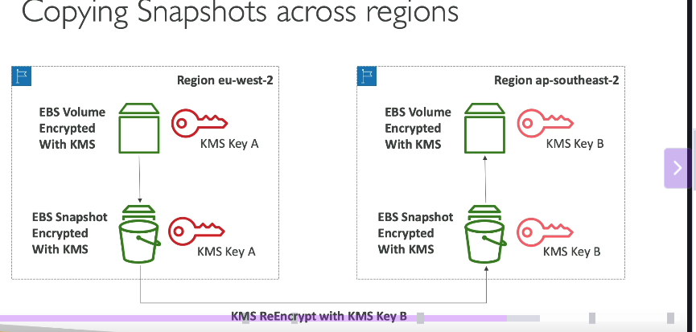
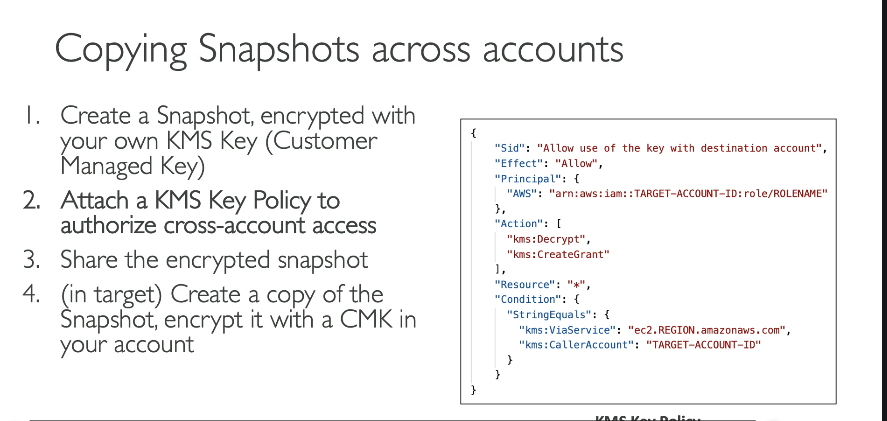

**AWS KMS (Key Management Service) là gì?**

- KMS là dịch vụ quản lý khóa mã hóa của AWS.
- Khi bạn nghe về mã hóa trong các dịch vụ AWS, rất có thể đang sử dụng mã hóa qua KMS.
- Mục tiêu chính là AWS sẽ quản lý các khóa mã hóa giúp bạn, giúp bạn giảm bớt công việc.

**Tại sao nên sử dụng AWS KMS?**

- **Tích hợp chặt chẽ:** Tích hợp đầy đủ với IAM để quản lý quyền truy cập.
- **Kiểm soát truy cập dễ dàng:** Giúp dễ dàng kiểm soát quyền truy cập vào dữ liệu đã được mã hóa bằng KMS.
- [**Kiểm tra (Audit):**](./lý-thuyết-ngoài-lề/audit-kms-cloudtrail.md) Bạn có thể kiểm tra mọi lệnh gọi API được thực hiện để sử dụng khóa của bạn thông qua CloudTrail (điểm quan trọng trong bài thi).
- **Tích hợp liền mạch:** Sử dụng dễ dàng với hầu hết các dịch vụ AWS khác yêu cầu mã hóa (ví dụ: EBS, S3, RDS, SSM, v.v.).
- **Sử dụng cho dữ liệu bí mật của riêng bạn:** Bạn có thể dùng API, CLI hoặc SDK của AWS để mã hóa các dữ liệu bí mật của riêng mình (ví dụ: mật khẩu, khóa API) thay vì lưu trữ dưới dạng văn bản thuần (plain text). Sau đó, bạn có thể lưu trữ các dữ liệu bí mật đã được mã hóa này trong code hoặc biến môi trường một cách an toàn hơn.

**Các loại Khóa KMS (KMS Keys)**

Trước đây gọi là Customer Master Key (CMK), nhưng hiện tại chỉ gọi là KMS Key để bớt nhầm lẫn. Có hai loại chính:

1. **Khóa đối xứng (Symmetric KMS Keys):**

   - Chỉ có một khóa duy nhất dùng để mã hóa và giải mã dữ liệu.
   - Mọi dịch vụ AWS tích hợp với KMS đều sử dụng khóa đối xứng.
   - Bạn KHÔNG BAO GIỜ TRUY CẬP TRỰC TIẾP vào khóa, chỉ sử dụng các lệnh gọi API của KMS để sử dụng khóa đó.

2. **Khóa bất đối xứng (Asymmetric KMS Keys):**

   - Có hai khóa: khóa công khai (public key) và khóa riêng tư (private key).
   - Khóa công khai dùng để mã hóa (bạn có thể tải xuống khóa này).
   - Khóa riêng tư dùng để giải mã (chỉ truy cập được qua lệnh gọi API của KMS).
   - Sử dụng cho các hoạt động mã hóa/giải mã hoặc ký/xác minh.
   - Trường hợp sử dụng điển hình là khi bạn muốn mã hóa được thực hiện bên ngoài AWS bởi những người không có quyền truy cập API KMS. Họ dùng khóa công khai để mã hóa và gửi cho bạn, sau đó bạn dùng khóa riêng tư trong tài khoản AWS để giải mã.

**Các loại Khóa KMS dựa trên Quyền sở hữu/Quản lý:**

Trong các loại KMS Key (đối xứng/bất đối xứng), có các loại dựa trên ai sở hữu/quản lý:

1. **Khóa do AWS sở hữu (AWS owned keys):**

   - Miễn phí.
   - Được sử dụng khi bạn chọn các tùy chọn mã hóa mặc định như SSE-S3 (khi AWS quản lý khóa) hoặc DynamoDB SSE (khi bạn chọn khóa do DynamoDB sở hữu).
   - Bạn không thực sự "thấy" hoặc quản lý chúng trực tiếp.

2. **Khóa do AWS quản lý (AWS managed keys):**

   - Miễn phí.
   - Dễ nhận biết vì tên bắt đầu bằng `aws/` theo sau là tên dịch vụ (ví dụ: `aws/RDS`, `aws/EBS`).
   - Chỉ có thể sử dụng trong dịch vụ mà chúng được chỉ định.
   - Tự động xoay vòng khóa (key rotation) mỗi năm.

3. **Khóa do khách hàng quản lý (Customer managed keys):**

   - Đây là khóa tùy chỉnh của riêng bạn.
   - Có phí: $1 mỗi tháng.
   - Bạn có thể tạo khóa mới hoặc nhập khóa của riêng bạn vào KMS.
   - Bạn có thể bật tính năng xoay vòng khóa tự động và thiết lập chu kỳ, hoặc xoay vòng theo yêu cầu.

4. **Khóa KMS được nhập (Imported KMS key):**

   - Là một dạng của Customer managed key mà bạn nhập khóa của mình vào.
   - Có phí: $1 mỗi tháng.
   - Chỉ có thể xoay vòng thủ công (manual rotation) và cần sử dụng alias (bí danh).

**Chi phí KMS:**

- $1 mỗi tháng cho mỗi Customer managed key (bao gồm cả khóa được nhập).
- Chi phí cho các lệnh gọi API đến dịch vụ KMS (khoảng 3 cent cho mỗi 10,000 lệnh gọi API).

**Phạm vi theo Vùng (Region Scope):**

- KMS keys có phạm vi theo từng vùng (region).
- Nếu bạn có một Volume EBS được mã hóa bằng KMS key A ở vùng `EUS2`, để sao chép Volume này sang vùng `AP southeast two`, bạn cần thực hiện các bước:

  

  1. Tạo snapshot từ Volume EBS đã mã hóa (snapshot này cũng sẽ được mã hóa bằng KMS key A).
  2. Sao chép snapshot sang vùng `AP southeast two`. Quá trình sao chép này yêu cầu bạn mã hóa lại snapshot bằng một KMS key B khác trong vùng đích (`AP southeast two`).
  3. Từ snapshot đã được mã hóa lại bằng KMS key B trong vùng đích, bạn có thể tạo Volume EBS mới ở vùng đó.

  - Lý do là cùng một KMS key không thể tồn tại ở hai vùng khác nhau cùng lúc.

**Chính sách Khóa KMS (KMS Key Policies):**

- Đây là cách để kiểm soát quyền truy cập vào các KMS key của bạn, tương tự như S3 Bucket Policy.
- **Điểm khác biệt quan trọng:** Nếu không có Key Policy trên KMS key, KHÔNG AI có thể truy cập nó, kể cả tài khoản root (ngoại trừ các khóa do AWS sở hữu).
- Có hai loại Key Policy:
  1. **Chính sách mặc định (Default Policy):** Được tạo tự động nếu bạn không cung cấp chính sách tùy chỉnh. Chính sách này cho phép tài khoản root và những người dùng/vai trò IAM được cấp quyền truy cập thông qua IAM Policy có thể sử dụng khóa này.
  2. **Chính sách tùy chỉnh (Custom Policy):** Bạn tự định nghĩa chi tiết người dùng, vai trò, hoặc thậm chí các tài khoản khác có thể truy cập hoặc quản trị khóa KMS của bạn. Điều này đặc biệt hữu ích khi bạn muốn chia sẻ quyền truy cập KMS key giữa các tài khoản (cross-account access).

**Ví dụ về truy cập giữa các tài khoản (Cross-Account Access):**

- Ví dụ: Sao chép snapshot đã mã hóa giữa các tài khoản AWS.
- Các bước thực hiện:
  1. Tạo snapshot từ Volume và mã hóa nó bằng **Customer managed key** của bạn (bắt buộc phải là Customer managed key để có thể đính kèm chính sách tùy chỉnh).
  2. Đính kèm **Chính sách Khóa KMS tùy chỉnh** (Custom KMS Key Policy) cho phép tài khoản đích có quyền truy cập vào khóa này.
  3. Chia sẻ snapshot đã mã hóa với tài khoản đích.
  4. Trong tài khoản đích, tạo bản sao của snapshot đã chia sẻ và **mã hóa lại** nó bằng một **Customer managed key khác** trong tài khoản đích đó.
  5. Từ bản sao snapshot đã được mã hóa lại, bạn có thể tạo Volume trong tài khoản đích.
