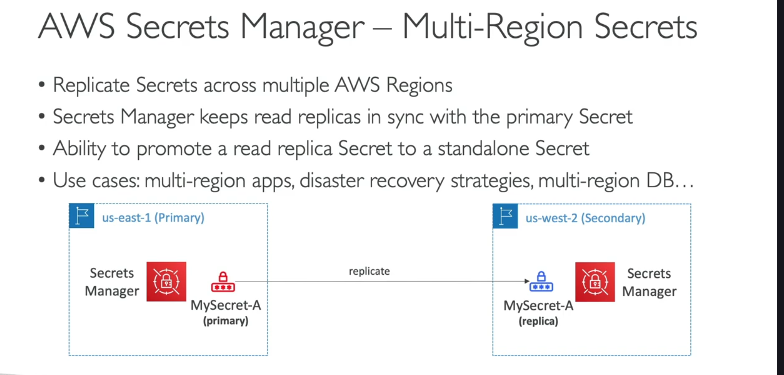

**AWS Secrets Manager là gì?**

- AWS Secrets Manager là một dịch vụ được thiết kế đặc biệt để **lưu trữ và quản lý các Secrets (secrets)**, như mật khẩu cơ sở dữ liệu, khóa API và thông tin xác thực khác.

**Sự khác biệt chính với SSM Parameter Store:**

- Điểm khác biệt nổi bật nhất so với SSM Parameter Store là **khả năng tích hợp sẵn để TỰ ĐỘNG xoay vòng Secrets (automatic secret rotation)**.

**Xoay vòng Secrets Tự động (Automatic Secret Rotation):**

- Secrets Manager cho phép bạn thiết lập để **buộc và tự động xoay vòng (thay đổi) giá trị của Secrets sau mỗi X ngày**. Điều này giúp tăng cường bảo mật bằng cách giới hạn thời gian tồn tại của một giá trị Secrets.
- Để thực hiện xoay vòng tự động, bạn cần định nghĩa một **Lambda function**. Hàm Lambda này chứa logic để kết nối đến dịch vụ tương ứng (ví dụ: cơ sở dữ liệu) và thực hiện việc thay đổi mật khẩu/Secrets tại nguồn đó, sau đó cập nhật giá trị mới vào Secrets Manager.
- Tính năng này cung cấp một **lịch trình quản lý Secrets tốt hơn**, giảm thiểu rủi ro từ việc sử dụng các Secrets cũ, tồn tại lâu dài.

**Tích hợp với các Dịch vụ AWS:**

- Secrets Manager được tích hợp rất tốt với nhiều dịch vụ AWS khác, đặc biệt là các dịch vụ cơ sở dữ liệu như **Amazon RDS** (hỗ trợ MySQL, PostgreSQL, SQL Server, Aurora) và các cơ sở dữ liệu khác.
- Việc tích hợp này có nghĩa là tên người dùng và mật khẩu để truy cập cơ sở dữ liệu có thể được **lưu trữ trực tiếp trong Secrets Manager**, và quan trọng là có thể được **xoay vòng tự động** thông qua Secrets Manager.

**Mã hóa Secrets:**

- Các Secrets được lưu trữ trong Secrets Manager luôn được **mã hóa bằng dịch vụ AWS KMS**.
- **Gợi ý cho bài thi:** Khi bạn thấy câu hỏi trong kỳ thi đề cập đến "Secrets", hoặc tích hợp quản lý Secrets cho "RDS", "Aurora", hãy nghĩ ngay đến **AWS Secrets Manager**.

**Secrets Đa Vùng (Multi-Region Secrets):**

- Secrets Manager có một tính năng gọi là Secrets Đa Vùng, cho phép bạn **sao chép (replicate) Secrets của mình qua nhiều Vùng AWS khác nhau**.
- Khi bạn tạo một Secrets ở Vùng chính (primary Region) và bật tính năng sao chép đa vùng, Secrets Manager sẽ tạo các bản sao của Secrets đó ở các Vùng phụ (secondary Regions) bạn chọn.
- Dịch vụ Secrets Manager sẽ **giữ cho các bản sao này đồng bộ (in sync)** với Secrets gốc ở Vùng chính.

**Tại sao sử dụng Secrets Đa Vùng? (Các Trường hợp Sử dụng):**

- **Khả năng phục hồi/Chuyển đổi dự phòng (Resiliency/Failover):** Trong trường hợp Vùng chính gặp sự cố, bạn có thể **thăng cấp (promote) một bản sao** của Secrets ở Vùng khác trở thành một Secrets độc lập, cho phép ứng dụng tiếp tục hoạt động.
- **Xây dựng Ứng dụng Đa Vùng (Multi-Region Apps):** Cho phép các thành phần ứng dụng của bạn triển khai ở các Vùng khác nhau có thể truy cập cùng một giá trị Secrets bằng cách đọc Secrets ở Vùng cục bộ của chúng.
- **Chiến lược Phục hồi Thảm họa (Disaster Recovery - DR):** Hỗ trợ các chiến lược DR bằng cách đảm bảo các Secrets quan trọng có sẵn ở Vùng DR.
- **Truy cập Cơ sở dữ liệu Đa Vùng:** Nếu bạn có một cơ sở dữ liệu đa vùng (ví dụ: RDS được sao chép giữa các Vùng), bạn có thể sử dụng cùng một Secrets đa vùng để truy cập phiên bản cơ sở dữ liệu tương ứng trong từng Vùng.

Tóm lại, AWS Secrets Manager là dịch vụ chuyên dụng để quản lý Secrets, nổi bật với khả năng xoay vòng tự động và tích hợp sâu rộng với các dịch vụ cơ sở dữ liệu. Tính năng Secrets Đa Vùng của nó đặc biệt hữu ích cho các kiến trúc cần khả năng phục hồi, hoạt động trên nhiều Vùng hoặc chiến lược DR.
