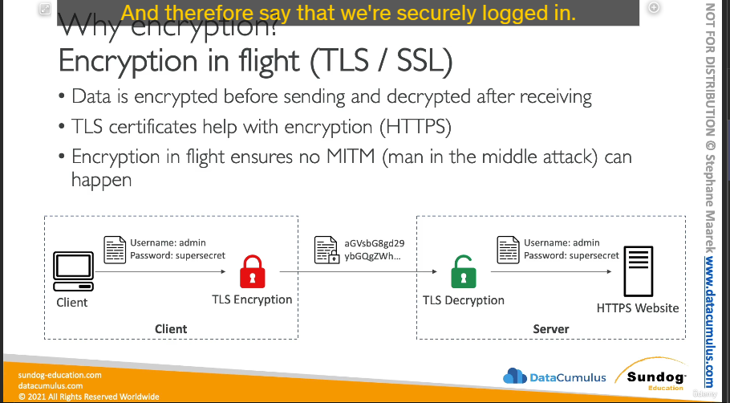
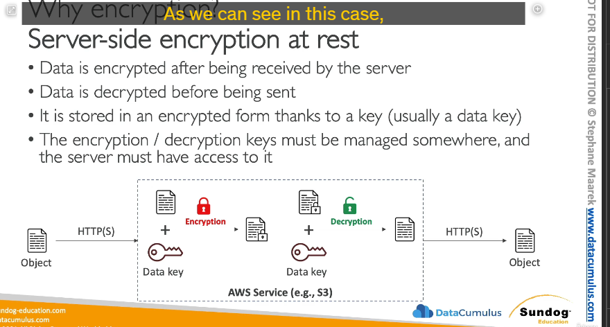
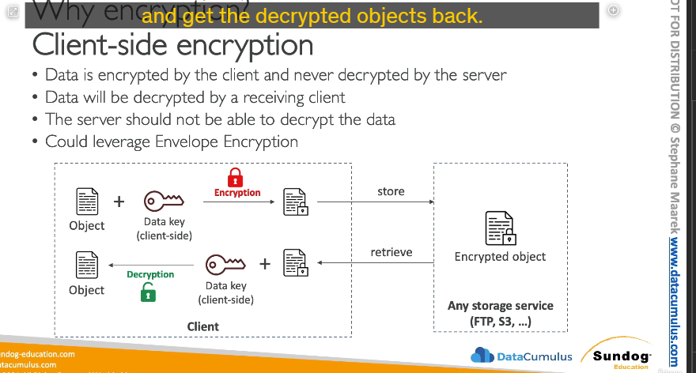

Dưới đây là bản tóm tắt chi tiết kiến thức **Associate-level** về ba cơ chế mã hóa phổ biến trong điện toán đám mây, theo nội dung bài giảng bạn cung cấp:

---

## 🔐 **Tổng quan về Mã hóa (Encryption)**

Mã hóa là quá trình biến đổi dữ liệu sang một định dạng không thể đọc được nếu không có khóa giải mã. Trong môi trường điện toán đám mây, có **ba loại mã hóa chính**:

---

## 1. 📡 **Encryption In-Flight (Mã hóa khi truyền dữ liệu)**

### 🔸 **Là gì?**

Dữ liệu được mã hóa **trước khi gửi đi** và **giải mã sau khi được nhận**. Mục tiêu là bảo vệ dữ liệu khi đang truyền qua mạng, đặc biệt là mạng công cộng.

### 🔸 **Công nghệ sử dụng:**

- **TLS (Transport Layer Security)** – phiên bản mới của SSL.
- Được sử dụng trong kết nối **HTTPS** (khi truy cập các website an toàn).

### 🔸 **Cách hoạt động:**

1. Client (người dùng) muốn gửi dữ liệu đến server (ví dụ: username và password).
2. Trình duyệt tự động mã hóa dữ liệu bằng chứng chỉ TLS.
3. Dữ liệu được truyền đi trong trạng thái mã hóa.
4. **Chỉ server đích** có thể giải mã được nhờ chứng chỉ TLS.
5. Ngăn chặn **man-in-the-middle attacks** – kẻ tấn công không thể đọc gói tin khi đang truyền.

---

## 2. 🗃️ **Server side Encryption At-Rest (Mã hóa khi lưu trữ dữ liệu)**

### 🔸 **Là gì?**

Dữ liệu sẽ được mã hóa **khi server nhận , trước khi lưu trữ**, và sẽ được giải mã **trước khi gửi trả lại cho client**.

### 🔸 **Ứng dụng tiêu biểu:**

- Amazon S3, RDS, EBS, DynamoDB, v.v.

### 🔸 **Cách hoạt động:**

1. Client gửi dữ liệu đến server (qua HTTPS có thể).
2. Server **lưu trữ dữ liệu dưới dạng đã mã hóa**, sử dụng một **data key**.
3. Khi cần trả dữ liệu lại cho client:
   - Server sử dụng **data key để giải mã**.
   - Sau đó gửi dữ liệu trở lại cho client qua HTTPS.

📌 **Tất cả việc mã hóa/giải mã diễn ra ở phía server** ⇒ gọi là **server-side encryption**.

---

## 3. 🧑‍💻 **Client-Side Encryption (Mã hóa phía người dùng)**

### 🔸 **Là gì?**

Client **mã hóa dữ liệu trước khi gửi lên server**, và server **không bao giờ có quyền giải mã dữ liệu**.

### 🔸 **Khi nào dùng?**

- Khi không **tin tưởng hoàn toàn vào server**.
- Khi bạn muốn giữ quyền kiểm soát hoàn toàn dữ liệu và khóa mã hóa.

### 🔸 **Cách hoạt động:**

1. Client sử dụng **data key riêng** để mã hóa dữ liệu.
2. Gửi dữ liệu đã mã hóa lên một dịch vụ lưu trữ (S3, EBS, FTP, v.v.).
3. Server **chỉ lưu trữ dữ liệu đã mã hóa**, không có khả năng giải mã.
4. Khi cần, client tải dữ liệu về và dùng **data key gốc** để giải mã.

---

## 🔁 **Tóm tắt So sánh:**

| Cơ chế                    | Ai mã hóa? | Ai giải mã? | Server có thể đọc dữ liệu? |
| ------------------------- | ---------- | ----------- | -------------------------- |
| Encryption In-Flight      | Client     | Server      | ✅ Có (sau khi giải mã)    |
| Server Encryption At-Rest | Server     | Server      | ✅ Có                      |
| Client-Side Encryption    | Client     | Client      | ❌ Không                   |

---
