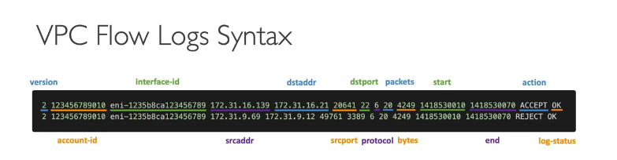
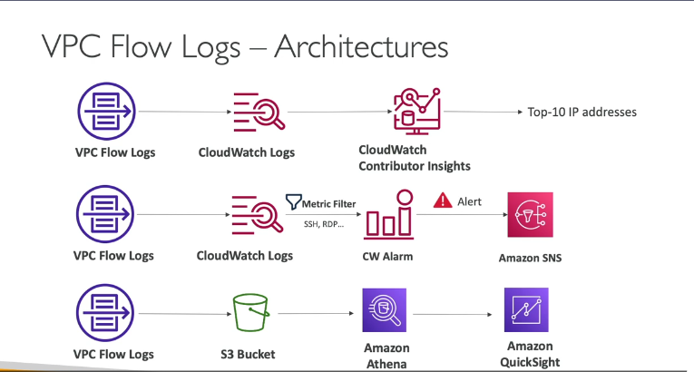

### Tổng quan về VPC Flow Logs

**VPC Flow Logs** là một tính năng của AWS cho phép bạn ghi lại (capture) thông tin về **luồng traffic IP** đi vào và đi ra khỏi các network interface (giao diện mạng) trong VPC của bạn. Đây là công cụ không thể thiếu để **giám sát và gỡ lỗi các vấn đề kết nối mạng**.

Bạn có thể bật Flow Logs ở 3 cấp độ:

1. **VPC level:** Ghi lại log cho tất cả các network interface trong toàn bộ VPC.
2. **Subnet level:** Ghi lại log cho tất cả các network interface trong một subnet cụ thể.
3. **Elastic Network Interface (ENI) level:** Ghi lại log cho một network interface duy nhất.

VPC Flow Logs có thể ghi lại thông tin từ cả các interface do AWS quản lý, ví dụ như:

- Elastic Load Balancers (ELB)
- Amazon RDS
- Amazon ElastiCache
- Amazon Redshift
- Amazon WorkSpaces
- NAT Gateway
- Transit Gateway

---

### Đích đến và Cấu trúc của Flow Logs

#### 1. Đích đến (Destination)

Log sau khi được thu thập có thể được đẩy đến 3 dịch vụ chính:

- **Amazon S3:** Lưu trữ lâu dài, phù hợp cho việc phân tích dữ liệu lớn (big data analytics) và tuân thủ (compliance).
- **Amazon CloudWatch Logs:** Phân tích và giám sát gần thời gian thực (near real-time), thiết lập cảnh báo (alarms).
- **Amazon Kinesis Data Firehose:** Dành cho việc streaming dữ liệu log đến các đích khác như Amazon S3, Redshift, hoặc các công cụ của bên thứ ba để phân tích chuyên sâu.

#### 2. Cấu trúc một bản ghi Log (Log Record Format)

Mỗi bản ghi trong Flow Log chứa các metadata về một gói tin mạng. Mặc dù bạn không cần nhớ chính xác từng trường, nhưng việc hiểu các trường quan trọng là **cực kỳ cần thiết** khi đi phỏng vấn và làm việc thực tế.

`version | account-id | interface-id | srcaddr | dstaddr | srcport | dstport | protocol | packets | bytes | start | end | action | log-status`

Các trường **quan trọng nhất** cần nắm:

- `srcaddr` & `dstaddr`: Địa chỉ IP nguồn và đích. Giúp xác định các IP có vấn đề (ví dụ: IP đang cố gắng tấn công hoặc bị từ chối liên tục).
- `srcport` & `dstport`: Cổng nguồn và đích. Giúp xác định các port đang gặp sự cố.
- `protocol`: Giao thức mạng (ví dụ: `6` cho TCP, `17` cho UDP).
- `action`: **ACCEPT** (Chấp nhận) hoặc **REJECT** (Từ chối). Đây là trường **then chốt** để gỡ lỗi. Nó cho biết liệu traffic có được Security Group hoặc Network ACL cho phép hay không.
- `log-status`: Trạng thái của việc ghi log (OK, NODATA, SKIPDATA).

---

### Ứng dụng thực tế: Gỡ lỗi Security Group (SG) và Network ACL (NACL) 🕵️‍♂️

Đây là một kịch bản kinh điển trong các cuộc phỏng vấn DevOps. Flow Logs là công cụ chính để phân biệt vấn đề nằm ở SG hay NACL. Nguyên tắc cốt lõi cần nhớ:

- **Security Groups (SG) là stateful:** Nếu traffic đi vào (inbound) được cho phép, traffic trả về (outbound) tương ứng sẽ tự động được cho phép, và ngược lại.
- **Network ACLs (NACL) là stateless:** Bạn phải định nghĩa luật cho cả chiều đi vào (inbound) và chiều đi ra (outbound) một cách riêng biệt.

Dựa vào trường `action` trong Flow Logs, ta có thể suy luận:

#### Kịch bản 1: Traffic đi vào (Inbound Traffic)

- **`action` = REJECT:** Vấn đề có thể do **NACL hoặc SG**. Cả hai đều có thể chặn traffic đi vào.
- **`action` = ACCEPT `(cho chiều vào) nhưng lại có`REJECT` cho chiều trả về (outbound):** Vấn đề **chắc chắn là do NACL**.
  - **Giải thích:** Vì SG là stateful, nếu nó đã `ACCEPT` chiều vào thì nó sẽ tự động cho phép chiều trả về. Việc chiều trả về bị `REJECT` chỉ có thể xảy ra khi luật outbound của NACL (là stateless) đã chặn nó.

#### Kịch bản 2: Traffic đi ra (Outbound Traffic)

- **`action` = REJECT:** Vấn đề có thể do **NACL hoặc SG**. Cả hai đều có thể chặn traffic đi ra.
- **`action` = ACCEPT `(cho chiều ra) nhưng lại có`REJECT` cho chiều trả về (inbound):** Vấn đề **chắc chắn là do NACL**.
  - **Giải thích:** Tương tự, SG là stateful nên nếu nó đã `ACCEPT` chiều ra thì sẽ cho phép chiều trả về. Việc chiều trả về bị `REJECT` chỉ có thể do luật inbound của NACL chặn.

> **Mẹo phỏng vấn:** Khi được hỏi cách debug một EC2 instance không thể kết nối ra ngoài hoặc không thể truy cập từ bên ngoài, hãy trả lời rằng bạn sẽ bắt đầu bằng việc kiểm tra VPC Flow Logs, tập trung vào trường `action` để xác định traffic bị `REJECT` ở đâu, sau đó áp dụng logic stateful/stateless để khoanh vùng vấn đề là SG hay NACL.

---

### Các Kiến Trúc Phân Tích Flow Logs 🚀

Việc chỉ thu thập log là chưa đủ. Là một DevOps Engineer, bạn cần biết cách phân tích chúng để rút ra thông tin hữu ích.

#### 1. Kiến trúc CloudWatch: Giám sát & Cảnh báo thời gian thực

- **Luồng:** VPC Flow Logs → CloudWatch Logs.
- **Phân tích:**
  - **CloudWatch Logs Insights:** Sử dụng ngôn ngữ truy vấn giống SQL để tìm kiếm và phân tích log một cách nhanh chóng. Ví dụ: tìm các IP bị từ chối nhiều nhất.
  - **CloudWatch Contributor Insights:** Tự động tìm ra các "tác nhân" đóng góp nhiều nhất vào traffic mạng (ví dụ: top 10 IP gửi nhiều dữ liệu nhất).
  - **Metric Filters & Alarms:** Tạo bộ lọc để đếm số lần xuất hiện của một mẫu cụ thể (ví dụ: traffic SSH/RDP bất thường) và chuyển nó thành một CloudWatch Metric. Sau đó, đặt CloudWatch Alarm trên metric này để gửi thông báo qua **SNS** (email, SMS, aLambda,...) khi có dấu hiệu đáng ngờ.

#### 2. Kiến trúc S3 + Athena: Phân tích SQL & Trực quan hóa

- **Luồng:** VPC Flow Logs → S3 Bucket → Amazon Athena → Amazon QuickSight.
- **Phân tích:**
  - **S3:** Lưu trữ log gốc một cách bền vững và chi phí thấp.
  - **Amazon Athena:** Dịch vụ truy vấn không server (serverless), cho phép bạn chạy các câu lệnh **SQL** tiêu chuẩn trực tiếp trên các file log lưu trong S3. Rất mạnh mẽ cho việc phân tích ad-hoc, điều tra các sự cố bảo mật trong quá khứ.
  - **Amazon QuickSight:** Dịch vụ BI (Business Intelligence) giúp trực quan hóa dữ liệu từ Athena thành các biểu đồ, dashboard đẹp mắt, dễ hiểu. Ví dụ: vẽ bản đồ các IP tấn công, biểu đồ traffic theo thời gian.
