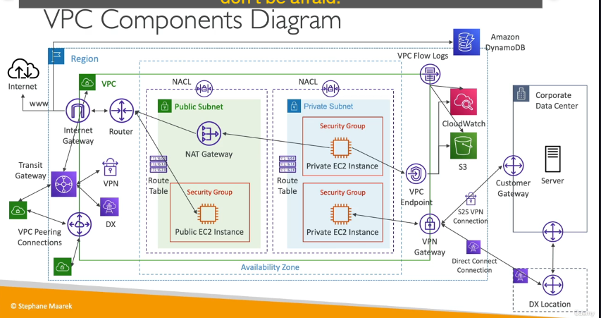

Tuyệt vời! Đây là bản tổng hợp chi tiết các kiến thức cốt lõi về VPC và mạng trên AWS từ nội dung bạn cung cấp. Thông tin này đã được cấu trúc lại để bạn dễ dàng ôn tập, ghi nhớ và tự tin hơn khi đi phỏng vấn cho vị trí DevOps/AWS.

---

## 1. CIDR (Classless Inter-Domain Routing) 📏

- **Khái niệm:** Là một cách để biểu diễn một dải địa chỉ IP. Ví dụ: `10.0.0.0/16`.
- **Trong AWS:** Dùng để xác định dải IP cho VPC và các Subnet.

---

## 2. VPC (Virtual Private Cloud) ☁️

- **Khái niệm:** Là một mạng riêng ảo, cô lập logic trên đám mây AWS.
- **Hỗ trợ:** Cả IPv4 và IPv6 (ở chế độ dual-stack).

---

## 3. Subnets (Mạng con) subdivide

- **Khái niệm:** Là một phân đoạn của dải IP trong VPC, được gắn với một **Availability Zone (AZ)** cụ thể.
- **Phân loại:**
  - **Public Subnet:** Có route trực tiếp ra Internet thông qua Internet Gateway.
  - **Private Subnet:** Không có route trực tiếp ra Internet.

---

## 4. Internet Gateway (IGW) 🌐

- **Khái niệm:** Là một thành phần cho phép giao tiếp giữa VPC và Internet.
- **Cách hoạt động:** Gắn IGW vào VPC và tạo một route trong Route Table của public subnet trỏ đến IGW (`0.0.0.0/0` cho IPv4, `::/0` cho IPv6).
- **Hỗ trợ:** Cung cấp truy cập Internet cho cả IPv4 và IPv6 (nếu IPv6 được kích hoạt).

---

## 5. Route Tables (Bảng định tuyến) 🗺️

- **Khái niệm:** Chứa các quy tắc (routes) để xác định nơi traffic mạng được chuyển hướng đến.
- **Ứng dụng:** Định tuyến traffic đến Internet Gateway, VPC Peering connections, VPC Endpoints, NAT Gateway, v.v. Đây là thành phần **then chốt** để kiểm soát luồng traffic trong VPC.

---

## 6. Bastion Host (Jump Box) 🏰

- **Khái niệm:** Là một EC2 instance được đặt trong **public subnet**.
- **Mục đích:** Dùng làm "trạm trung chuyển" an toàn để bạn SSH vào, từ đó SSH tiếp vào các EC2 instance khác nằm trong **private subnet** (không có IP public).

---

## 7. NAT Instances (Network Address Translation Instances) 📜

- **Khái niệm:** Là một EC2 instance được triển khai trong public subnet để cung cấp truy cập Internet cho các EC2 instance trong private subnet (chỉ cho chiều đi ra).
- **Trạng thái:** **Cũ, đang dần bị loại bỏ (deprecated)**.
- **Lưu ý khi dùng:** Cần vô hiệu hóa cờ `Source/Destination Check` và cấu hình Security Group phù hợp.
- **Thay thế:** Nên sử dụng NAT Gateway.

---

## 8. NAT Gateway (Network Address Translation Gateway) ✨

- **Khái niệm:** Dịch vụ do AWS quản lý, cung cấp khả năng truy cập Internet có thể mở rộng (scalable) cho các EC2 instance trong private subnet.
- **Phạm vi:** Chỉ dành cho traffic **IPv4** đi ra Internet.
- **Ưu điểm:** Tốt hơn nhiều so với NAT Instance (quản lý, khả năng mở rộng, tính sẵn sàng cao).

---

## 9. NACL (Network Access Control Lists) 🛡️

- **Khái niệm:** Là một lớp firewall hoạt động ở cấp độ **Subnet**.
- **Đặc điểm:**
  - **Stateless (Không trạng thái):** Các luật inbound và outbound được đánh giá riêng biệt. Nếu bạn cho phép traffic vào, bạn cũng phải cho phép traffic trả về ra ngoài.
  - Xác định quyền truy cập inbound và outbound cho subnet.
  - **Ephemeral Ports:** Cần chú ý cấu hình cho các cổng tạm thời khi định nghĩa luật outbound để cho phép traffic trả về.

---

## 10. Security Groups (SG) 🧱

- **Khái niệm:** Là một lớp firewall hoạt động ở cấp độ **EC2 Instance** (chính xác hơn là ở cấp độ ENI).
- **Đặc điểm:**
  - **Stateful (Có trạng thái):** Nếu traffic inbound được cho phép, traffic outbound tương ứng sẽ tự động được cho phép (và ngược lại). Bạn không cần định nghĩa luật outbound cho traffic trả về.

---

## 11. VPC Peering (Kết nối ngang hàng VPC) 🤝

- **Khái niệm:** Cho phép kết nối hai VPC với nhau để chúng có thể giao tiếp như thể đang ở trong cùng một mạng.
- **Điều kiện:** Các VPC phải có dải CIDR **không trùng lặp (non-overlapping)**.
- **Tính chất:** **Non-transitive (Không bắc cầu).** Nếu VPC A kết nối với VPC B, và VPC B kết nối với VPC C, thì VPC A không thể tự động kết nối với VPC C. Bạn cần tạo một kết nối peering riêng giữa A và C.

---

## 12. VPC Endpoints (Điểm cuối VPC) 🚪

- **Khái niệm:** Cho phép bạn kết nối **riêng tư** từ VPC của mình đến các dịch vụ AWS được hỗ trợ (như S3, DynamoDB, CloudFormation, SSM) mà không cần đi qua Internet, NAT Gateway, VPN hay Direct Connect.
- **Phân loại:**
  - **Gateway Endpoints:** Dành riêng cho Amazon S3 và DynamoDB.
  - **Interface Endpoints:** Dành cho hầu hết các dịch vụ khác. Chúng sử dụng một ENI trong subnet của bạn.

---

## 13. VPC Flow Logs 📊

- **Khái niệm:** Ghi lại metadata về traffic IP đi vào và đi ra khỏi các network interface trong VPC.
- **Thông tin:** Bao gồm trạng thái `ACCEPT` (chấp nhận) hoặc `REJECT` (từ chối) của traffic.
- **Cấp độ:** Có thể tạo ở cấp độ VPC, Subnet, hoặc ENI.
- **Phân tích:**
  - Gửi đến **Amazon S3** và phân tích bằng **Amazon Athena**.
  - Gửi đến **CloudWatch Logs** và phân tích bằng **CloudWatch Logs Insights**.

---

## 14. Kết nối On-Premises về AWS

Có hai giải pháp chính:

#### a. Site-to-Site VPN 🔗

- **Khái niệm:** Tạo một kết nối VPN được mã hóa qua **Internet công cộng**.
- **Thành phần:**
  - **Virtual Private Gateway (VGW):** Phía AWS, gắn vào VPC.
  - **Customer Gateway (CGW):** Phía trung tâm dữ liệu của bạn.
  - có 2 tunnel , 1 đi 1 về , nhưng nếu đi với TGW thì cả 2 đều đi và về
- **VPN CloudHub:** Nếu bạn thiết lập nhiều kết nối VPN đến cùng một VGW, bạn có thể sử dụng kiến trúc này để tạo mô hình hub-and-spoke, cho phép các site on-premises kết nối với nhau thông qua VGW.

#### b. AWS Direct Connect (DX) 🛣️

- **Khái niệm:** Tạo một kết nối mạng **vật lý, chuyên dụng và hoàn toàn riêng tư** (không qua Internet) từ trung tâm dữ liệu của bạn đến một Direct Connect Location.
- **Đặc điểm:**
  - **Thời gian thiết lập lâu** (có thể hơn 1 tháng).
  - Bảo mật và ổn định hơn VPN.
- **Direct Connect Gateway:** Cho phép sử dụng một kết nối Direct Connect để kết nối đến nhiều VPC trong các AWS Region khác nhau.

---

## 15. AWS PrivateLink (VPC Endpoint Services) 💼

- **Khái niệm:** Cho phép bạn cung cấp các dịch vụ (ứng dụng) đang chạy trong VPC của mình cho các VPC khác (của khách hàng hoặc các VPC khác trong tổ chức) một cách **riêng tư**.
- **Hoạt động:** Sử dụng Network Load Balancer (NLB) và ENI. Khách hàng sẽ tạo một Interface Endpoint trong VPC của họ để kết nối đến dịch vụ của bạn.
- **Ưu điểm:** Không cần VPC Peering, Internet công cộng, NAT Gateway. Rất an toàn và có khả năng mở rộng để kết nối tới hàng ngàn VPC khách hàng mà không để lộ mạng của bạn.

---

## 16. ClassicLink (Kết nối EC2-Classic) ⏳

- **Khái niệm:** Cho phép các instance EC2-Classic (nền tảng cũ của EC2) kết nối riêng tư với VPC.
- **Trạng thái:** **Sắp bị loại bỏ hoàn toàn (deprecated).**

---

## 17. AWS Transit Gateway (TGW) 🌟

- **Khái niệm:** Hoạt động như một "trung tâm mạng" (network hub), đơn giản hóa việc kết nối giữa nhiều VPC, VPN và Direct Connect.
- **Tính chất:** Hỗ trợ **transitive peering** (kết nối bắc cầu). Nếu A kết nối TGW, B kết nối TGW thì A và B có thể nói chuyện với nhau qua TGW. Đây là ưu điểm vượt trội so với VPC Peering.

---

## 18. VPC Traffic Mirroring 🔍

- **Khái niệm:** Sao chép (copy) traffic mạng từ các ENI và gửi bản sao đến một đích khác (ví dụ: một EC2 instance cài công cụ phân tích hoặc một Network Load Balancer) để phân tích, giám sát mà không ảnh hưởng đến luồng traffic chính.

---

## 19. IPv6 trong VPC 🔢

- **Kích hoạt:** Bạn có thể bật hỗ trợ IPv6 cho VPC để hoạt động ở chế độ dual-stack (cả IPv4 và IPv6).
- **Egress-Only Internet Gateway:** Tương tự như NAT Gateway nhưng dành riêng cho traffic **IPv6 đi ra** Internet từ các private subnet. Nó cho phép instance đi ra nhưng chặn kết nối từ Internet đi vào.
