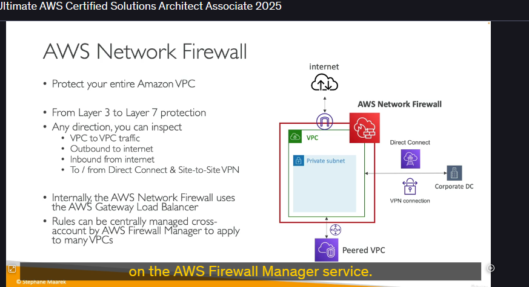

# AWS Network Firewall

## Tổng quan các giải pháp bảo vệ mạng AWS

Trước khi tìm hiểu về AWS Network Firewall, hãy tóm tắt các cách bảo vệ mạng trên AWS mà chúng ta đã biết:

### Các giải pháp hiện có:

- **Network Access Control Lists (NACLs)**: Kiểm soát truy cập ở mức subnet
- **Amazon VPC Security Groups**: Tường lửa ở mức instance
- **AWS WAF**: Bảo vệ chống lại các request độc hại qua HTTP
- **AWS Shield & Shield Advanced**: Bảo vệ chống DDoS
- **AWS Firewall Manager**: Quản lý tập trung các rules cho WAF, Shield, v.v. trên nhiều accounts

## Giới thiệu AWS Network Firewall

### Mục đích

AWS Network Firewall được sử dụng để **bảo vệ toàn bộ VPC** bằng một tường lửa tinh vi.

### Kiến trúc



## Tính năng và khả năng

### Bảo vệ đa lớp

- **Layer 3 đến Layer 7**: Kiểm tra mọi loại traffic theo mọi hướng
- **Bidirectional inspection**: Kiểm tra traffic đi vào và đi ra

### Các loại traffic được bảo vệ

- **VPC to VPC traffic**: Giữa các VPC được peering
- **Outbound to internet**: Từ VPC ra internet
- **Inbound from internet**: Từ internet vào VPC
- **Direct Connect traffic**: Qua kết nối Direct Connect
- **Site-to-Site VPN traffic**: Qua VPN connections

### Công nghệ nền tảng

- **AWS Gateway Load Balancer**: Sử dụng nội bộ
- **AWS Managed Appliances**: Thay vì thiết lập third-party appliances
- **Centralized Management**: Quản lý tập trung qua AWS Firewall Manager

## Khả năng kiểm soát chi tiết

### 1. Filtering theo IP và Port

- **Hỗ trợ**: Hàng nghìn rules ở mức VPC
- **Capacity**: Tens of thousands IPs
- Fine-grained access control: Kiểm soát từng IP và port cụ thể

### 2. Filtering theo Protocol

- **Ví dụ**: Disable SMB protocol cho outbound communication
- **Flexibility**: Cho phép/chặn các protocols cụ thể

### 3. Domain-level Filtering

```
Allowed domains:
✅ *.mycorp.com
✅ github.com (software repository)
❌ All other domains
```

### 4. Pattern Matching

- **Regex support**: Matching patterns phức tạp
- **Flexible rules**: Tạo rules theo patterns tùy chỉnh

## Hành động có thể thực hiện

### Rule Actions

- **Allow**: Cho phép traffic
- **Drop**: Chặn traffic (silent drop)
- **Alert**: Cảnh báo khi match rule

### Active Flow Inspection

- **Intrusion Prevention**: Khả năng ngăn chặn xâm nhập
- **Real-time monitoring**: Giám sát traffic real-time
- **AWS Managed**: Hoàn toàn được AWS quản lý

## Logging và Monitoring

### Destination Options

- **Amazon S3**: Lưu trữ logs dài hạn
- **CloudWatch Logs**: Real-time monitoring
- **Kinesis Data Firehose**: Streaming analytics

### Log Content

- **Rule matches**: Các rules được kích hoạt
- **Traffic patterns**: Patterns của network traffic
- **Security events**: Các sự kiện bảo mật

## Tích hợp với AWS Firewall Manager

### Centralized Management

- **Multi-account support**: Quản lý trên nhiều AWS accounts
- **Multiple VPCs**: Áp dụng rules cho nhiều VPCs
- **Consistent policies**: Đảm bảo policies nhất quán

### Benefits

- **Simplified management**: Đơn giản hóa việc quản lý
- **Compliance**: Đảm bảo tuân thủ quy định
- **Scalability**: Mở rộng dễ dàng

## Key Points cho kỳ thi

### Nhớ các điểm quan trọng:

1. **VPC-level firewall**: Bảo vệ ở mức VPC, không phải instance
2. **Layer 3-7 protection**: Bảo vệ từ layer 3 đến layer 7
3. **Bidirectional traffic**: Kiểm tra traffic theo mọi hướng
4. **AWS Gateway Load Balancer**: Sử dụng GLB làm nền tảng
5. **Centralized management**: Quản lý tập trung qua Firewall Manager

### Use Cases phổ biến:

- **Enterprise security**: Bảo mật cấp doanh nghiệp
- **Compliance requirements**: Đáp ứng yêu cầu tuân thủ
- **Advanced threat protection**: Bảo vệ chống threats nâng cao
- **Network segmentation**: Phân đoạn mạng

## Tóm tắt

AWS Network Firewall là giải pháp tường lửa **cấp VPC** cho phép:

- **Traffic filtering**: Lọc traffic theo nhiều tiêu chí
- **Flow inspection**: Kiểm tra luồng traffic chi tiết
- **Centralized management**: Quản lý tập trung
- **AWS managed**: Hoàn toàn được AWS quản lý
