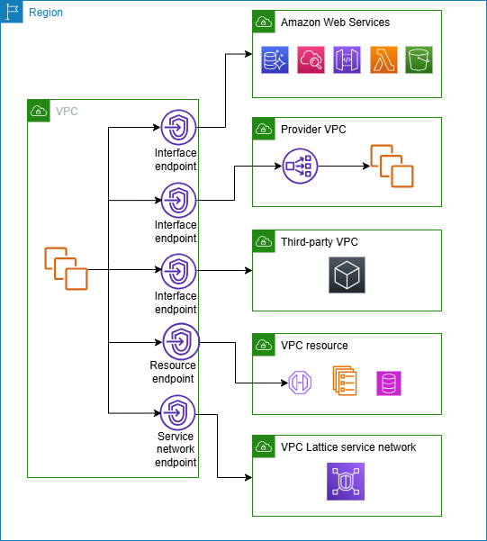

Tuyệt vời! Để hiểu rõ về AWS PrivateLink, hãy cùng đi sâu vào các khía cạnh của nó, đặc biệt là những điểm quan trọng bạn cần nắm cho công việc và phỏng vấn.

**AWS PrivateLink là gì?**

AWS PrivateLink là một công nghệ cho phép bạn tạo ra các kết nối **riêng tư và an toàn** giữa các Virtual Private Clouds (VPCs), các dịch vụ của AWS, và cả mạng on-premises của bạn mà **không cần đưa traffic ra ngoài Internet công cộng**. Điều này giúp tăng cường bảo mật và đơn giản hóa kiến trúc mạng.

Hãy tưởng tượng bạn có một dịch vụ (ví dụ: một ứng dụng, một database) đang chạy trong VPC của mình và bạn muốn các VPC khác (có thể là của khách hàng, hoặc của các team khác trong tổ chức) sử dụng dịch vụ đó. Trước đây, bạn có thể dùng VPC Peering, Internet Gateway, hoặc NAT Gateway. Tuy nhiên, PrivateLink cung cấp một giải pháp an toàn và hiệu quả hơn nhiều.

**Cách hoạt động của AWS PrivateLink**

PrivateLink hoạt động dựa trên hai thành phần chính:

1.  **VPC Endpoint Services (Dịch vụ Điểm cuối VPC - Dành cho Nhà cung cấp Dịch vụ):**

    - Nếu bạn là người cung cấp dịch vụ (ví dụ: bạn có một ứng dụng SaaS chạy trên AWS), bạn sẽ tạo một "Endpoint Service" cho ứng dụng của mình.
    - Dịch vụ này sẽ được "đặt" phía sau một **Network Load Balancer (NLB)**. NLB sẽ nhận traffic từ người dùng dịch vụ và chuyển đến ứng dụng của bạn.
    - Bạn có thể kiểm soát ai được phép kết nối đến Endpoint Service của mình thông qua danh sách trắng (whitelisting) các AWS Account ID.

2.  **Interface VPC Endpoints (Điểm cuối VPC dạng Giao diện - Dành cho Người tiêu dùng Dịch vụ):**
    - Nếu bạn là người muốn sử dụng một dịch vụ được cung cấp qua PrivateLink (ví dụ: một dịch vụ AWS như S3, Kinesis, hoặc một dịch vụ của bên thứ ba), bạn sẽ tạo một "Interface Endpoint" trong VPC của mình.
    - Interface Endpoint này thực chất là một hoặc nhiều **Elastic Network Interfaces (ENIs)** được đặt trong các subnet của bạn. Mỗi ENI sẽ có một **địa chỉ IP riêng tư** từ dải IP của subnet đó.
    - Khi các ứng dụng trong VPC của bạn muốn truy cập dịch vụ, chúng chỉ cần gửi traffic đến địa chỉ IP riêng tư của ENI này.
    - Toàn bộ traffic sẽ đi qua mạng lưới nội bộ của AWS một cách an toàn, không bao giờ lộ ra Internet.

**Sơ đồ minh họa đơn giản:**

```
[VPC của Người tiêu dùng Dịch vụ]                           [VPC của Nhà cung cấp Dịch vụ]
-----------------------------------                           -----------------------------------
|                                 |                           |                                 |
| [Ứng dụng của bạn]              |                           | [Ứng dụng/Dịch vụ của Nhà CC]   |
|       |                         |                           |             ^                   |
|       v                         |      AWS PrivateLink      |             |                   |
| [Interface Endpoint ENI] <------Không-qua-Internet------> [Network Load Balancer]         |
|   (IP riêng tư)                 |                           |                                 |
|                                 |                           |                                 |
-----------------------------------                           -----------------------------------
```

**Lợi ích chính của AWS PrivateLink:**

1.  **Tăng cường Bảo mật (Enhanced Security):**

    - **Không lộ traffic ra Internet:** Đây là lợi ích lớn nhất. Dữ liệu của bạn luôn được giữ trong mạng riêng của AWS, giảm thiểu nguy cơ bị tấn công từ bên ngoài.
    - **Không cần Internet Gateway, NAT Gateway, hay Public IP:** Đơn giản hóa cấu hình và giảm bề mặt tấn công.
    - **Kiểm soát truy cập chi tiết:** Nhà cung cấp dịch vụ có thể kiểm soát chính xác những tài khoản AWS nào được phép kết nối.

2.  **Đơn giản hóa Kiến trúc Mạng (Simplified Network Architecture):**

    - **Không chồng chéo IP (No IP Overlapping):** Khác với VPC Peering, bạn không cần lo lắng về việc các dải IP của các VPC kết nối với nhau bị trùng lặp. Mỗi bên giữ nguyên không gian IP của mình.
    - **Kết nối một chiều:** Người tiêu dùng khởi tạo kết nối đến dịch vụ. Dịch vụ không thể tự ý khởi tạo kết nối ngược lại vào VPC của người tiêu dùng.
    - **Không cần cấu hình định tuyến phức tạp:** Việc định tuyến được AWS xử lý tự động.

3.  **Tuân thủ Quy định Dễ dàng hơn (Easier Compliance):**
    - Việc giữ dữ liệu trong một mạng riêng tư giúp đáp ứng các yêu cầu tuân thủ nghiêm ngặt về bảo vệ dữ liệu (ví dụ: GDPR, HIPAA).

**Các trường hợp sử dụng phổ biến:**

- **Truy cập riêng tư đến các dịch vụ AWS:** Kết nối đến S3, Kinesis, EC2 Systems Manager, ELB, API Gateway... mà không cần đi qua Internet.
- **Xây dựng dịch vụ SaaS trên AWS:** Cung cấp ứng dụng của bạn cho khách hàng một cách an toàn, nơi khách hàng có thể truy cập dịch vụ của bạn như thể nó đang chạy trong VPC của chính họ.
- **Kết nối giữa các VPC trong cùng tổ chức:** Các phòng ban khác nhau có thể chia sẻ dịch vụ một cách an toàn mà không cần lo lắng về IP conflict hay các vấn đề bảo mật của VPC Peering.
- **Kết nối với mạng on-premises:** Kết hợp với AWS Direct Connect hoặc VPN, bạn có thể cho phép các ứng dụng on-premises truy cập các dịch vụ trên AWS (hoặc ngược lại) qua PrivateLink.

**So sánh nhanh với các giải pháp khác:**

- **PrivateLink vs. VPC Peering:**
  - **Peering:** Kết nối hai chiều, yêu cầu IP không trùng lặp, có thể phức tạp khi số lượng VPC lớn.
  - **PrivateLink:** Kết nối một chiều (từ người dùng đến dịch vụ), không quan tâm IP trùng lặp, đơn giản hơn cho việc chia sẻ dịch vụ.
- **PrivateLink vs. VPC Endpoints (Gateway & Interface):**
  - PrivateLink _sử dụng_ Interface VPC Endpoints để người tiêu dùng kết nối.
  - **Gateway Endpoints** (chỉ cho S3 và DynamoDB) không sử dụng ENI và hoạt động ở tầng định tuyến.
  - **Interface Endpoints** (sử dụng công nghệ PrivateLink) tạo ra ENI trong VPC của bạn, cho phép truy cập dịch vụ bằng IP riêng.

**Điểm cần nhớ cho phỏng vấn:**

- PrivateLink đảm bảo traffic **không đi ra Internet**.
- Nó giải quyết vấn đề **IP overlapping** mà VPC Peering gặp phải.
- Hoạt động dựa trên **Network Load Balancer** ở phía nhà cung cấp và **ENI (Interface Endpoint)** ở phía người tiêu dùng.
- Cung cấp kết nối **một chiều** an toàn từ người tiêu dùng đến dịch vụ.
- Rất hữu ích cho việc xây dựng các dịch vụ SaaS và truy cập riêng tư đến các dịch vụ của AWS.
