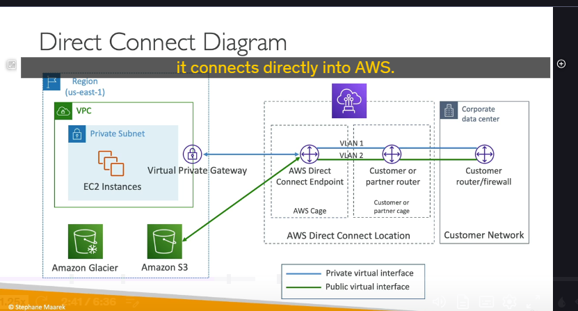
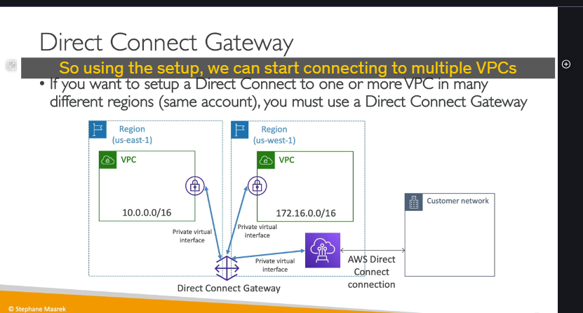
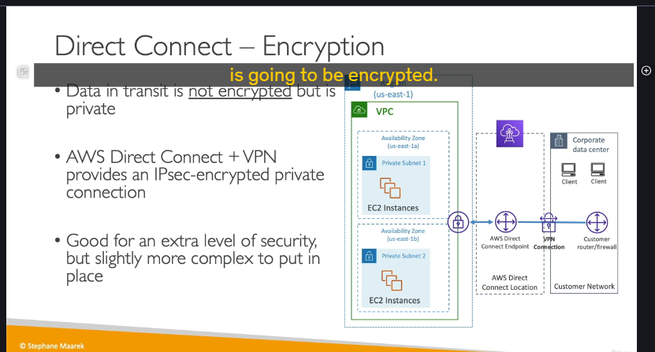
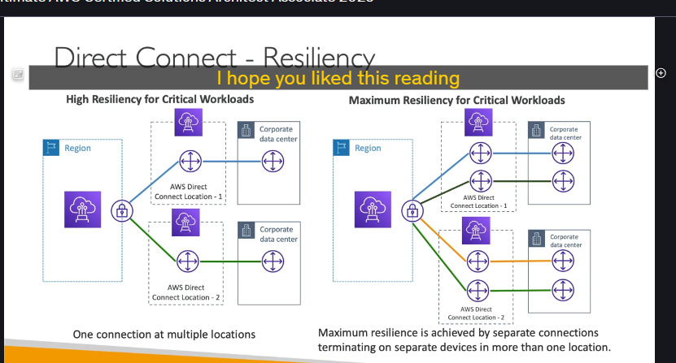
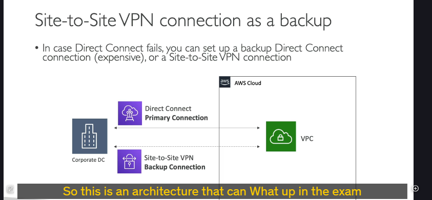

### **AWS Direct Connect (DX) là gì?**

**AWS Direct Connect (DX)** là dịch vụ tạo ra một **kết nối mạng vật lý, chuyên dụng và hoàn toàn riêng tư** từ trung tâm dữ liệu on-premises của bạn đến AWS. Khác với Site-to-Site VPN đi qua Internet công cộng, Direct Connect là một đường truyền riêng, không đi qua Internet, mang lại hiệu năng và độ ổn định vượt trội.

---

### **Trường hợp sử dụng và Lợi ích** 📈

Việc sử dụng Direct Connect mang lại nhiều lợi ích quan trọng:

- **Tăng thông lượng băng thông (Increased Bandwidth):** Lý tưởng cho việc truyền các bộ dữ liệu cực lớn, nhanh hơn nhiều so với Internet.
- **Trải nghiệm mạng nhất quán (Consistent Network Experience):** Vì là đường truyền riêng, nó loại bỏ các vấn đề về tắc nghẽn của Internet công cộng, rất quan trọng cho các ứng dụng yêu cầu dữ liệu thời gian thực (real-time data feeds).
- **Chi phí thấp hơn cho lượng dữ liệu lớn:** Giảm chi phí truyền dữ liệu ra khỏi AWS so với qua Internet.
- **Hỗ trợ môi trường Hybrid:** Tạo ra một kết nối liền mạch, hiệu năng cao giữa on-premises và cloud, hỗ trợ cả IPv4 và IPv6.

---

### **Kiến trúc và các Thành phần chính**

Để thiết lập một kết nối Direct Connect, bạn cần hiểu các thành phần sau:

1. **On-Premises:** Bạn cần có router và firewall tại trung tâm dữ liệu của mình.
2. **AWS Direct Connect Location:** Đây là một địa điểm vật lý (trung tâm dữ liệu của đối tác AWS) nơi bạn sẽ đặt thiết bị của mình để kết nối vào mạng lưới của AWS.
3. **Cross Connect:** Một đoạn cáp vật lý kết nối router của bạn với router của AWS tại Direct Connect Location.

Về mặt logic, kết nối được chia thành các **Virtual Interfaces (VIFs)**:

- 🌐 **Public VIF (Giao diện ảo công cộng):** Dùng để truy cập các **tài nguyên công cộng** của AWS như Amazon S3, Glacier, DynamoDB... qua một đường truyền riêng, mà không cần đi qua Internet.
- 🔒 **Private VIF (Giao diện ảo riêng tư):** Dùng để truy cập các **tài nguyên riêng tư** bên trong VPC của bạn (ví dụ: EC2 instances, RDS). Kết nối này sẽ đi đến một **Virtual Private Gateway (VGW)** được gắn vào VPC của bạn.

---

### **Direct Connect Gateway**

Nếu bạn muốn sử dụng một kết nối Direct Connect duy nhất để kết nối đến **nhiều VPC trong nhiều Region khác nhau**, bạn phải sử dụng **Direct Connect Gateway**.

- **Cách hoạt động:** Kết nối Private VIF của bạn sẽ đi đến Direct Connect Gateway. Từ đó, Direct Connect Gateway sẽ thiết lập kết nối đến các Virtual Private Gateway (VGW) của từng VPC trong các Region khác nhau.
- **Lợi ích:** Đây là giải pháp tập trung, giúp quản lý và mở rộng kết nối đến nhiều môi trường AWS một cách đơn giản.

---

### **Các loại kết nối và Thời gian thiết lập**

Có hai loại kết nối Direct Connect chính:

1. **Dedicated Connection (Kết nối chuyên dụng):**
   - Tốc độ: **1, 10, hoặc 100 Gbps**.
   - Bạn nhận được một cổng Ethernet vật lý dành riêng cho mình.
   - liên hệ, yêu cầu lên aws trước sau đó được hoàn thành bởi Đối tác của AWS (AWS Direct Connect Partner).
2. **Hosted Connection (Kết nối được lưu trữ):**
   - Tốc độ: Linh hoạt từ 50 Mbps đến 10 Gbps.
   - Kết nối được cung cấp thông qua một Đối tác của AWS (AWS Direct Connect Partner).
   - Cho phép bạn thêm hoặc bớt dung lượng theo yêu cầu, linh hoạt hơn.

> ❗️ **Điểm Cực kỳ Quan trọng cho Phỏng vấn/Thi cử:**
> Thời gian để thiết lập một kết nối Direct Connect mới thường **kéo dài hơn một tháng**. Nếu một câu hỏi tình huống yêu cầu "cần một kết nối băng thông cao để chuyển dữ liệu trong vòng một tuần", thì Direct Connect **KHÔNG** phải là câu trả lời đúng (trừ khi đề bài nói rằng kết nối đã được thiết lập sẵn).

---

### **Bảo mật: Mã hóa trên Direct Connect**

- **Mặc định:** Direct Connect là một kết nối **riêng tư (private)** nhưng **KHÔNG được mã hóa (not encrypted)**.
- **Giải pháp mã hóa:** Nếu bạn yêu cầu mã hóa đầu cuối (ví dụ: vì lý do tuân thủ), bạn phải thiết lập một kết nối **Site-to-Site VPN chạy trên đường truyền Direct Connect**.
- **Kiến trúc:** Bạn kết hợp cả hai: Direct Connect cung cấp đường truyền vật lý riêng và ổn định, trong khi VPN cung cấp lớp mã hóa IPsec cho dữ liệu truyền trên đường truyền đó.

---

### **Các mô hình chịu lỗi (Resiliency Models)** 🚨

Đây là một chủ đề nâng cao và thường xuất hiện trong các câu hỏi tình huống về thiết kế hệ thống.

#### **1. High Resiliency (Độ chịu lỗi cao)**

- **Kiến trúc:** Thiết lập ít nhất hai kết nối Direct Connect, mỗi kết nối đi qua một **Direct Connect Location khác nhau**.
- **Mục đích:** Nếu một trong các Direct Connect Location gặp sự cố, hệ thống vẫn có thể hoạt động qua kết nối còn lại. Đây là lựa chọn tốt cho các workload quan trọng (critical workloads).

#### **2. Maximum Resiliency (Độ chịu lỗi tối đa)**

- **Từ khóa nhận biết:** "Maximum Resiliency".
- **Kiến trúc:** Thiết lập nhiều kết nối (tối thiểu là 4) đi qua nhiều Direct Connect Location (tối thiểu là 2), và các kết nối này phải được kết cuối trên các thiết bị riêng biệt ở cả hai phía.
- **Mục đích:** Đây là kiến trúc mạnh mẽ nhất, bảo vệ hệ thống khỏi cả sự cố của một thiết bị riêng lẻ và sự cố của cả một Direct Connect Location.

---

ở dưới mô tả một giải pháp kết nối lai (hybrid) có khả năng chịu lỗi cao, kết hợp **AWS Direct Connect** và **Site-to-Site VPN** để đảm bảo kết nối giữa trung tâm dữ liệu on-premises và VPC luôn được duy trì.

### ## Kiến trúc kết nối chính-phụ (Primary/Backup)

Ý tưởng cốt lõi là thiết lập một cơ chế chuyển đổi dự phòng tự động (failover) để tối ưu giữa chi phí và độ tin cậy.

- **Kết nối chính (Primary Connection): 🚀 AWS Direct Connect**

  - Đây là đường truyền **chính**, cung cấp băng thông cao, độ trễ thấp và kết nối riêng tư.
  - Tuy nhiên, nó có chi phí cao hơn và có thể gặp sự cố.

- **Kết nối dự phòng (Backup Connection): 🌐 Site-to-Site VPN**

  - Đây là đường truyền **phụ**, chạy trên nền tảng Internet công cộng.
  - Chi phí thiết lập và vận hành thấp hơn nhiều so với việc dùng một đường Direct Connect thứ hai để dự phòng.
  - Khi kết nối Direct Connect gặp sự cố và bị gián đoạn, hệ thống sẽ tự động chuyển hướng (failover) traffic qua kết nối VPN này.

### ## Tại sao kiến trúc này quan trọng?

Đây là một mẫu kiến trúc rất phổ biến trong các bài thi chứng chỉ và phỏng vấn vì nó thể hiện sự hiểu biết về:

- **Tính sẵn sàng cao (High Availability):** Đảm bảo không bị mất kết nối hoàn toàn khi một đường truyền lỗi.
- **Tối ưu chi phí (Cost Optimization):** Sử dụng giải pháp chi phí thấp hơn (VPN) làm dự phòng thay vì nhân đôi một giải pháp đắt tiền (Direct Connect).
- **Thực tiễn Hybrid Cloud:** Đây là cách tiếp cận thực tế mà nhiều doanh nghiệp áp dụng để kết nối an toàn và tin cậy tới AWS.
