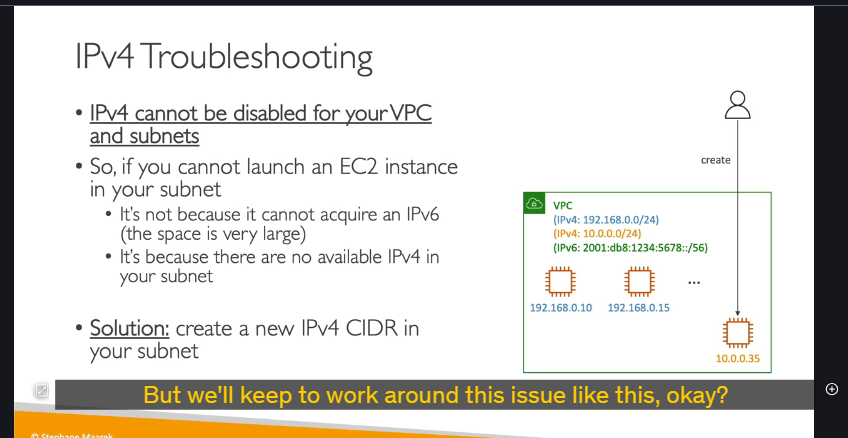

### Tại sao lại cần IPv6?

Giao thức **IPv4**, được tạo ra từ những ngày đầu của Internet, chỉ cung cấp khoảng 4.3 tỷ địa chỉ. Tại thời điểm đó, các kỹ sư không thể ngờ rằng con số này sẽ sớm bị cạn kiệt.

**IPv6** ra đời để giải quyết vấn đề này. Nó cung cấp một không gian địa chỉ khổng lồ, lên tới $3.4  x  10^{38}$ địa chỉ IP duy nhất. Con số này lớn đến mức có thể cung cấp địa chỉ cho mọi thiết bị trên hành tinh trong nhiều thế kỷ tới.

Một điểm quan trọng cần nhớ: trong môi trường AWS, mọi địa chỉ IPv6 được cấp phát đều là địa chỉ **public** và có thể định tuyến trên Internet.

---

### IPv6 trong AWS VPC: Chế độ "Dual-Stack"

Khi làm việc với VPC trên AWS, bạn không thể "tắt" IPv4. Thay vào đó, bạn có thể **kích hoạt IPv6** để VPC hoạt động ở chế độ **dual-stack** (ngăn xếp kép).

**Chế độ dual-stack có nghĩa là:**

- VPC và các tài nguyên trong đó (như EC2 instance) sẽ có **cả hai loại địa chỉ IPv4 và IPv6** cùng một lúc.
- Một EC2 instance được khởi chạy trong subnet dual-stack sẽ nhận được:
  - Ít nhất một địa chỉ **IPv4 private** (như bình thường).
  - Một địa chỉ **IPv6 public**.
- Các instance này có thể giao tiếp với Internet bằng cả IPv4 hoặc IPv6 thông qua **Internet Gateway**. Internet Gateway của AWS hỗ trợ cả hai giao thức.

---

### Tình huống Gỡ lỗi Kinh điển (Quan trọng cho Phỏng vấn) 🕵️‍♂️

Đây là một kịch bản rất hay được dùng trong các bài thi chứng chỉ và phỏng vấn để kiểm tra sự hiểu biết sâu sắc của bạn.

- **Tình huống:** Bạn có một VPC đã được kích hoạt IPv6 (dual-stack). Khi bạn cố gắng khởi chạy một EC2 instance mới, bạn nhận được lỗi và không thể khởi chạy được.
- **Suy nghĩ sai lầm:** Nhiều người sẽ nghĩ rằng VPC đã hết địa chỉ IPv6. Điều này là **SAI**. Không gian địa chỉ IPv6 gần như là vô hạn trong phạm vi một VPC, nên không thể xảy ra chuyện hết địa chỉ IPv6.
- **Nguyên nhân thực sự:** Vấn đề nằm ở chỗ VPC đã **cạn kiệt địa chỉ IPv4 private** có sẵn trong dải CIDR của subnet. Vì mỗi instance **bắt buộc** phải có một địa chỉ IPv4, nên khi không thể cấp phát được IPv4 nữa, quá trình khởi chạy sẽ thất bại.
- **Giải pháp:** Để khắc phục, bạn cần mở rộng không gian địa chỉ IPv4 cho VPC. Cách làm là **thêm một dải CIDR IPv4 phụ (secondary CIDR block)** vào VPC của bạn. Sau đó, bạn có thể tạo các subnet mới từ dải CIDR này và tiếp tục khởi chạy các instance mới.

**Ví dụ minh họa:**

1. VPC của bạn ban đầu có dải CIDR `10.0.1.0/24`.
2. Bạn liên tục khởi chạy các EC2 instance cho đến khi hết 251 địa chỉ IPv4 khả dụng trong dải này.
3. Lần khởi chạy tiếp theo sẽ thất bại.
4. **Hành động:** Bạn thêm một dải CIDR phụ, ví dụ `10.0.2.0/24`, vào VPC.
5. Bạn tạo một subnet mới với dải `10.0.2.0/24`.
6. Bây giờ, bạn có thể khởi chạy các instance mới thành công trong subnet mới này.

## Chắc chắn rồi! Dưới đây là phân tích chi tiết từng bước của bài thực hành (demo) về cách cấu hình và sử dụng IPv6 trong AWS.

### ## Mục tiêu của bài thực hành

Bài thực hành này hướng dẫn bạn cách:

1.  Kích hoạt IPv6 cho một VPC đã có.
2.  Cấu hình một subnet để sử dụng IPv6.
3.  Gán một địa chỉ IPv6 cho một EC2 instance đang chạy.
4.  Hiểu những thay đổi tự động trong Route Table và Security Group để cho phép kết nối IPv6.

---

### ## Bước 1: Kích hoạt IPv6 cho VPC

Hành động đầu tiên là bật chế độ dual-stack cho VPC của bạn.

- **Hành động:**
  1.  Vào `VPC Dashboard`, chọn VPC của bạn.
  2.  Chuột phải > `Edit CIDRs`.
  3.  Nhấn vào nút `Add new IPv6 CIDR`.
- **Lựa chọn:** Chọn `Amazon-provided IPv6 CIDR block`. AWS sẽ tự động gán cho VPC của bạn một dải địa chỉ IPv6 `/56` duy nhất trên toàn cầu.
- **Kết quả:** VPC của bạn bây giờ đã có cả dải địa chỉ IPv4 và IPv6.

---

### ## Bước 2: Cấu hình Subnet để sử dụng IPv6

Sau khi VPC đã có IPv6, bạn cần "chia sẻ" một phần của dải địa chỉ đó cho các subnet.

- **Hành động 1: Gán dải IPv6 cho Subnet**
  1.  Chọn một subnet (ví dụ: `public-subnet-a`).
  2.  `Actions` > `Edit IPv6 CIDRs`.
  3.  Bạn sẽ gán một dải `/64` từ dải `/56` của VPC cho subnet này. Trong demo, người hướng dẫn nhập `00` làm định danh, hệ thống sẽ tự động tạo ra dải CIDR `/64` tương ứng.
- **Hành động 2: Bật tự động gán địa chỉ IPv6**
  1.  Vẫn trên subnet đó, `Actions` > `Edit subnet settings`.
  2.  Tích vào ô `Enable auto-assign IPv6 address`.
- **Giải thích:** Tương tự như việc tự động gán IPv4 public, tùy chọn này sẽ khiến mọi Network Interface (ENI) được tạo ra trong subnet này sẽ tự động nhận một địa chỉ IPv6 public.

---

### ## Bước 3: Gán địa chỉ IPv6 cho EC2 Instance đang chạy

- **Hành động:**
  1.  Vào `EC2 Dashboard`, chọn instance của bạn (ví dụ: `BastionHost`).
  2.  `Networking` > `Manage IP Addresses`.
  3.  Trong phần `IPv6 addresses`, nhấn `Assign new IP address`. Bạn có thể để AWS tự động chọn một địa chỉ.
- **Kết quả:** EC2 instance bây giờ sẽ có cả địa chỉ IPv4 private và một địa chỉ IPv6 public.

---

### ## Bước 4: Cập nhật Cấu hình Mạng để cho phép kết nối

Để có thể kết nối đến instance qua IPv6, bạn cần thực hiện hai việc:

1.  **Cập nhật Security Group:**

    - **Vấn đề:** Mặc định, Security Group chỉ cho phép traffic ssh từ các dải IPv4 (ví dụ `0.0.0.0/0`).
    - **Hành động:** Vào Security Group của instance, `Edit inbound rules`. Thêm một rule mới cho SSH (Port 22), nhưng ở phần `Source`, bạn chọn `Anywhere - IPv6` (tương ứng với dải `::/0`).
    - **Kết quả:** Bây giờ, bạn có thể SSH vào instance từ bất kỳ địa chỉ IPv6 nào.

2.  **Kiểm tra kết nối IPv6 của máy bạn:**
    - Bạn chỉ có thể kết nối đến một địa chỉ IPv6 nếu máy tính của bạn cũng có kết nối IPv6.
    - Trong demo, người hướng dẫn sử dụng trang web `Test-IPv6.com` để kiểm tra. Nếu nhà cung cấp dịch vụ Internet (ISP) của bạn chưa hỗ trợ IPv6, bạn sẽ không thể thực hiện kết nối này.

---

### ## Bước 5: Phân tích sự thay đổi trong Route Table (Rất quan trọng)

Đây là một thay đổi tự động nhưng cực kỳ quan trọng cần hiểu.

- **Hành động:** Vào Route Table của subnet public.
- **Quan sát:** Một route mới đã được tự động thêm vào:
  - **Destination (Đích đến):** Dải IPv6 `/56` của toàn bộ VPC.
  - **Target (Mục tiêu):** `local`.
- **Ý nghĩa:** Route này đảm bảo rằng mọi traffic sử dụng địa chỉ IPv6 giữa các instance **bên trong cùng một VPC** sẽ được coi là traffic nội bộ (`local`). Nó sẽ đi trực tiếp giữa các instance mà không bị định tuyến ra Internet Gateway, giúp tối ưu hiệu năng và bảo mật cho giao tiếp nội bộ. mặc định giống cái route local của ipv4
