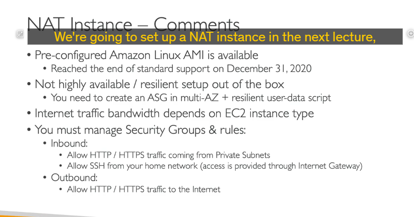

# lỗi thời

**NAT Instance (Phiên bản NAT) là gì?**

- NAT Instance là một **phiên bản EC2** (một máy chủ ảo thông thường) mà bạn tự cấu hình để hoạt động như một thiết bị **Network Address Translation (NAT)**.
- **Mục đích:** Cho phép các phiên bản EC2 trong **Private Subnet** (không có IP công khai và không kết nối trực tiếp Internet) có thể kết nối **ra ngoài Internet** (ví dụ: để tải cập nhật, gửi log), nhưng **không cho phép kết nối từ Internet đi vào** trực tiếp đến chúng.

**Cách Hoạt động (Tóm gọn):**

- Khi một phiên bản trong Private Subnet gửi lưu lượng ra Internet, lưu lượng này sẽ được định tuyến đi qua NAT Instance.
- NAT Instance sẽ **thay đổi địa chỉ IP nguồn** của gói tin từ IP riêng tư của phiên bản Private thành **địa chỉ IP công khai (Elastic IP)** của chính NAT Instance.
- Máy chủ đích trên Internet trả lời về địa chỉ IP công khai của NAT Instance.
- NAT Instance nhận gói tin trả lời và **thay đổi địa chỉ IP đích** trở lại thành IP riêng tư của phiên bản Private ban đầu, rồi chuyển gói tin đó về đúng phiên bản đó.

**Cấu hình chính (Tóm gọn):**

1. Khởi chạy một phiên bản EC2 (sử dụng AMI được cấu hình sẵn cho NAT nếu có) trong một **Public Subnet**.
2. Gán một **Elastic IP (EIP)** cho phiên bản NAT này để nó có một địa chỉ IP công khai tĩnh.
3. **Vô hiệu hóa (Disable) "Source/Destination Check"** trên NAT Instance. **Lý do:** Tính năng kiểm tra này mặc định yêu cầu gói tin phải có IP nguồn hoặc đích là của chính phiên bản đó. Với NAT Instance, nó xử lý các gói tin mà IP nguồn/đích không phải của nó, nên cần tắt kiểm tra này. nói chung là nó ghi đè source ip nên cần tắt thế thôi
   
4. Cấu hình **Bảng Định tuyến (Route Table)** của **Private Subnet**: Thêm một quy tắc định tuyến cho toàn bộ lưu lượng ra Internet (`0.0.0.0/0`) trỏ đến **ID của NAT Instance**.

**Nhược điểm chính (Tại sao lỗi thời):**

- **Không có sẵn tính sẵn sàng cao (HA):** NAT Instance là một điểm lỗi duy nhất. Để có HA, bạn phải tự thiết lập phức tạp (ví dụ: chạy nhiều NAT Instance ở các AZ khác nhau, sử dụng Auto Scaling Group và Script tùy chỉnh).
- **Hiệu suất giới hạn:** Năng lực xử lý và băng thông phụ thuộc vào kích thước (instance type) của phiên bản EC2 bạn chọn làm NAT Instance.
- **Cần quản lý thủ công:** Bạn phải tự quản lý phiên bản EC2 này (cập nhật hệ điều hành, vá lỗi, cấu hình Security Group cho NAT Instance).
- **Lỗi thời:** AMI cấu hình sẵn cho NAT Instance đã hết hỗ trợ tiêu chuẩn.

**Thay thế được khuyến nghị:**

- **NAT Gateway** là giải pháp thay thế được AWS quản lý hoàn toàn, có sẵn tính sẵn sàng cao và khả năng mở rộng tự động, không yêu cầu bạn quản lý phiên bản EC2. (Đây là giải pháp hiện tại và được ưu tiên trong các kỳ thi).

**Mục đích học về NAT Instance:**

Dù lỗi thời, việc tìm hiểu về NAT Instance giúp bạn hiểu rõ hơn **nguyên lý cơ bản của NAT** và cách cấu hình **định tuyến** để lưu lượng từ Private Subnet có thể đi ra ngoài thông qua một điểm trung gian.
