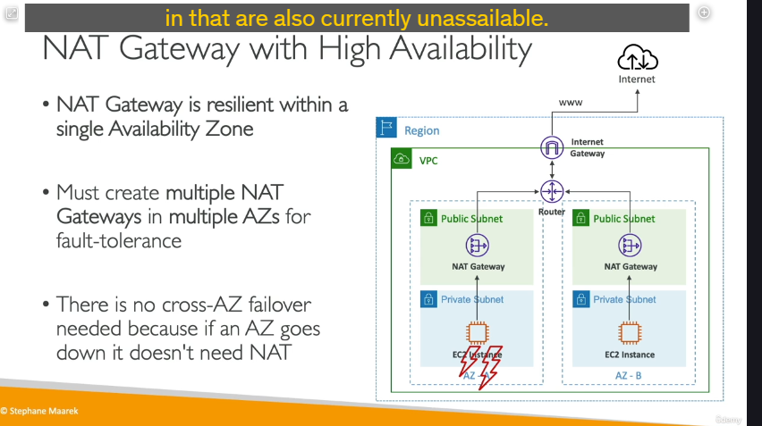
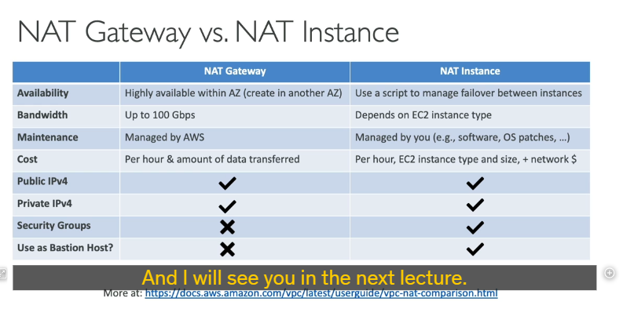

**Amazon NAT Gateway là gì?**

- NAT Gateway là một dịch vụ **được quản lý hoàn toàn (managed service)** của AWS.
- Nó thực hiện chức năng Network Address Translation (NAT) tương tự NAT Instance, cho phép các phiên bản EC2 trong **Private Subnet** kết nối ra Internet hoặc các dịch vụ AWS khác bên ngoài VPC, nhưng **ngăn các kết nối từ Internet đi vào trực tiếp** đến các phiên bản đó.

**Ưu điểm vượt trội so với NAT Instance:**

- **Được quản lý (Managed):** AWS quản lý hoàn toàn cơ sở hạ tầng, phần mềm, vá lỗi, v.v. Bạn không cần bận tâm đến việc quản lý máy chủ như với NAT Instance.
- **Băng thông cao hơn:** Cung cấp băng thông vượt trội.
- **Có sẵn tính sẵn sàng cao (HA - High Availability):** Cung cấp khả năng phục hồi lỗi tích hợp (trong phạm vi một Availability Zone).
- **Không cần quản trị:** Giảm đáng kể gánh nặng vận hành cho đội ngũ của bạn.

**Cấu hình cơ bản:**

1.  **Tạo ở Public Subnet:** Bạn tạo NAT Gateway trong một **Public Subnet**.
2.  **Gán Elastic IP (EIP):** Khi tạo, bạn phải gán một **Elastic IP** cho NAT Gateway. NAT Gateway sẽ sử dụng EIP này làm địa chỉ IP nguồn công khai cho lưu lượng đi ra Internet từ các Private Subnet.
3.  **Không dùng trong cùng Subnet:** Một NAT Gateway **không thể được sử dụng bởi các phiên bản EC2 nằm trong CHÍNH Subnet** mà NAT Gateway đó được triển khai. Nó chỉ phục vụ các yêu cầu từ các Subnet _khác_.
4.  **Yêu cầu Internet Gateway (IGW):** NAT Gateway cần một **Internet Gateway** được đính kèm vào VPC để hoạt động. Luồng đi ra Internet sẽ là: Private Subnet -> NAT Gateway -> Internet Gateway -> Internet.

**Hiệu suất:**

- NAT Gateway cung cấp băng thông mặc định là **5 Gbps**.
- Có khả năng tự động mở rộng lên đến **100 Gbps** khi cần thiết.

**Bảo mật:**

- **Không sử dụng Security Groups:** Bạn **không cần cấu hình Security Group** cho NAT Gateway. Việc kiểm soát truy cập vào/ra NAT Gateway được thực hiện thông qua các quy tắc trong Bảng Định tuyến (Route Table) và Network ACLs của các Subnet liên quan.

**Tính sẵn sàng cao (High Availability - HA):**

- **HA trong một AZ:** Mỗi NAT Gateway được triển khai **có tính phục hồi lỗi tích hợp** (resilient) **trong phạm vi Availability Zone mà nó được đặt**. Nếu một phần cứng nào đó của NAT Gateway trong AZ đó gặp sự cố, AWS sẽ tự động xử lý failover bên trong AZ đó.
- **HA giữa các AZ:** Để đạt được tính sẵn sàng cao **giữa các AZ** (Fault Tolerance), bạn cần:
  - **Triển khai một NAT Gateway RIÊNG BIỆT trong MỖI Availability Zone** nơi bạn có Private Subnet cần truy cập Internet.
  - Cấu hình **Bảng Định tuyến** của Private Subnet trong một AZ để trỏ lưu lượng Internet (`0.0.0.0/0`) đến **NAT Gateway nằm trong CÙNG AZ đó**.
  - **Không cần định tuyến** lưu lượng giữa các NAT Gateway ở các AZ khác nhau. Nếu một AZ gặp sự cố, các phiên bản và NAT Gateway trong AZ đó sẽ không hoạt động, nhưng các phiên bản ở AZ khác sẽ sử dụng NAT Gateway của chính AZ đó.

**So sánh chi tiết: NAT Gateway vs. NAT Instance:**

| Đặc điểm            | NAT Gateway                                                   | NAT Instance                                                                  |
| :------------------ | :------------------------------------------------------------ | :---------------------------------------------------------------------------- |
| **Quản lý**         | Được quản lý hoàn toàn bởi AWS.                               | Tự quản lý (là một EC2 Instance).                                             |
| **Tính sẵn sàng**   | HA tích hợp trong 1 AZ. Cần nhiều Gateway cho HA giữa các AZ. | KHÔNG có HA sẵn. Cần thiết lập thủ công phức tạp (ASG, script, v.v.).         |
| **Băng thông**      | Tự động mở rộng: 5 Gbps -> lên tới 100 Gbps.                  | Giới hạn bởi loại phiên bản EC2.                                              |
| **Bảo trì**         | AWS xử lý (vá lỗi OS, phần cứng).                             | Bạn tự quản lý (vá lỗi OS, phần mềm trên Instance).                           |
| **Chi phí**         | Theo giờ sử dụng + theo lượng dữ liệu truyền.                 | Theo giờ sử dụng phiên bản EC2 + phí truyền dữ liệu ra Internet qua Instance. |
| **Security Groups** | **Không sử dụng**. Đơn giản hóa cấu hình.                     | Cần cấu hình và quản lý Security Group cho Instance.                          |
| **Bastion Host**    | **Không thể** dùng làm Bastion Host.                          | Có thể dùng kiêm chức năng Bastion Host (nếu cấu hình phù hợp).               |
| **IP**              | Cần EIP để tạo.                                               | Cần EIP gán vào Instance.                                                     |

**Mục đích cho bài thi:**

Hiểu rõ sự khác biệt về các đặc điểm trên (đặc biệt là HA, quản lý, băng thông, Security Group) là đủ để trả lời các câu hỏi trong kỳ thi so sánh NAT Gateway và NAT Instance. NAT Gateway luôn là lựa chọn hiện đại và được ưu tiên trừ khi có yêu cầu cụ thể về việc quản lý thiết bị NAT hoặc kiêm nhiệm chức năng khác (như Bastion Host, mặc dù không khuyến khích).

Tóm lại, NAT Gateway là giải pháp NAT hiện đại, hiệu quả, dễ quản lý và có khả năng mở rộng, vượt trội so với NAT Instance ở hầu hết các khía cạnh.

---

Cấu hình NAT Gateway:
Subnet: Chọn Public Subnet mà bạn muốn đặt NAT Gateway vào (ví dụ: PublicSubnetA). NAT Gateway cần đặt trong Public Subnet vì nó cần truy cập Internet Gateway để chuyển tiếp lưu lượng ra ngoài.
Connectivity type: Chọn Public.
Elastic IP Allocation: Bạn cần gán một địa chỉ Elastic IP (EIP) cho NAT Gateway. Nhấp vào nút Allocate Elastic IP để cấp phát một địa chỉ EIP mới và tự động gán nó.
Nhấp vào nút Create NAT Gateway.

Thêm một quy tắc định tuyến mới:
Destination: Nhập 0.0.0.0/0 (biểu thị tất cả lưu lượng truy cập ra Internet).
Target: Chọn NAT Gateway và chọn NAT Gateway mà bạn vừa tạo (ví dụ: DemoNATGW).
Nhấp vào nút Save changes.
Sau khi NAT Gateway đã chuyển sang trạng thái active và bạn đã cập nhật Bảng định tuyến của Private Subnet trỏ đến NAT Gateway này:
Kết nối lại vào phiên bản EC2 nằm trong Private Subnet của bạn (sử dụng Bastion Host nếu cần, vì phiên bản Private không có IP công khai).
Bên trong phiên bản, thử các lệnh kiểm tra kết nối Internet, ví dụ:
ping google.com
curl google.com hoặc curl example.com
Các lệnh này sẽ hoạt động thành công. Điều này xác nhận rằng phiên bản trong Private Subnet giờ đây đã có thể truy cập Internet thông qua NAT Gateway.
