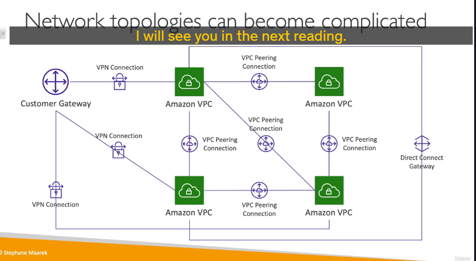
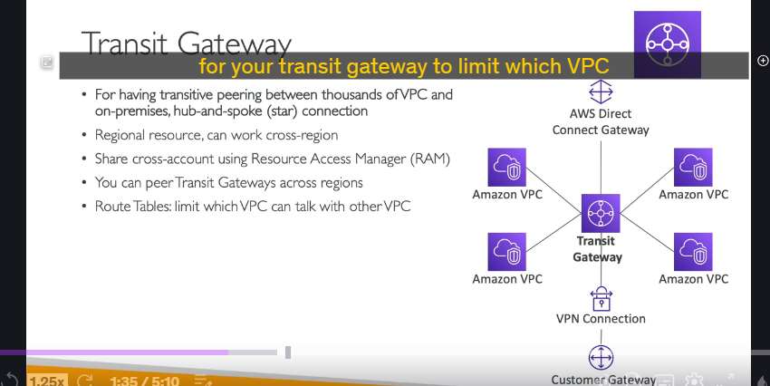
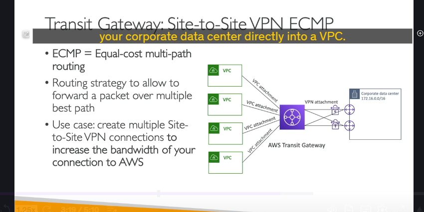
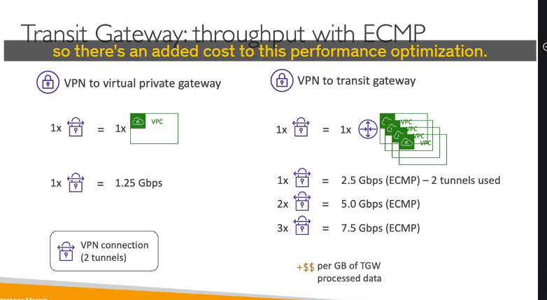
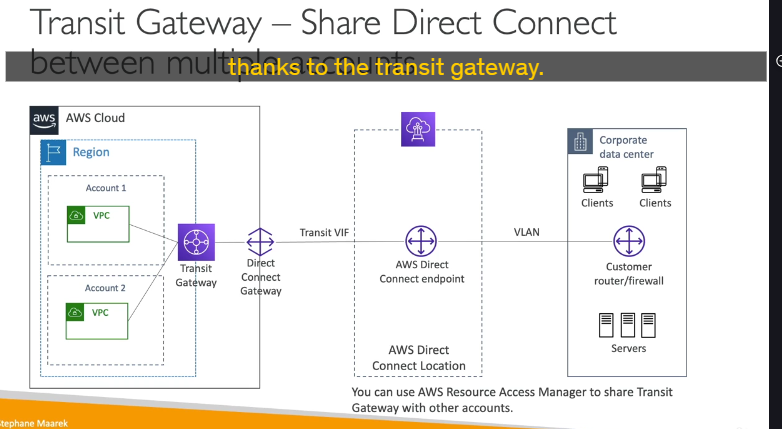

**AWS Transit Gateway**, một dịch vụ mạng then chốt của AWS

### Vấn đề Transit Gateway giải quyết

Khi một tổ chức có nhiều VPC, việc kết nối chúng với nhau và với mạng on-premises trở nên rất phức tạp. Sử dụng VPC Peering sẽ tạo ra một mạng lưới kết nối "full-mesh" khó quản lý. Các kết nối VPN và Direct Connect riêng lẻ đến từng VPC cũng làm tăng độ phức tạp.

**Transit Gateway** ra đời để giải quyết vấn đề này, hoạt động như một **trung tâm mạng (network hub)** trên đám mây. Nó đơn giản hóa toàn bộ cấu trúc mạng của bạn theo mô hình **hub-and-spoke** (trung tâm và nan hoa).

---

### Kiến trúc và Cách hoạt động HUB

Hãy tưởng tượng **Transit Gateway (TGW)** là một "bộ định tuyến ảo" trung tâm. Mọi thứ sẽ kết nối vào nó:

- Hàng ngàn **VPC**
- **Direct Connect Gateway** (đại diện cho kết nối Direct Connect)
- Các kết nối **Site-to-Site VPN**

**Lợi ích chính:** Thay vì các VPC phải kết nối trực tiếp với nhau (peering), chúng chỉ cần kết nối tới TGW. TGW sẽ lo việc định tuyến traffic giữa chúng. Điều này được gọi là **"transitive peering"** - khả năng kết nối bắc cầu mà VPC Peering thông thường không có.

---

### Các tính năng chính và Điểm cần nhớ

- **Tài nguyên theo Region (Regional Resource):** Một Transit Gateway được tạo trong một Region cụ thể. Tuy nhiên, bạn có thể **kết nối (peer) các Transit Gateway lại với nhau** để tạo kết nối liên Region (cross-region).
- **Chia sẻ giữa các tài khoản (Cross-Account Sharing):** Bạn có thể chia sẻ Transit Gateway của mình với các tài khoản AWS khác bằng cách sử dụng **AWS Resource Access Manager (RAM)**. Điều này cực kỳ hữu ích trong môi trường có nhiều tài khoản.
- **Kiểm soát định tuyến (Routing Control):** Sức mạnh của TGW nằm ở các **Route Table**. Bạn có thể tạo nhiều route table khác nhau và liên kết chúng với các "attachment" (VPC, VPN, DX) để kiểm soát chính xác luồng traffic. Ví dụ: cho phép VPC A nói chuyện với VPC B, nhưng không cho phép nói chuyện với VPC C.
- **Hỗ trợ[IP Multicast:](./ly-thuyet-khac/IP-Multicast.md)** Đây là dịch vụ **duy nhất** trên AWS hỗ trợ IP Multicast. Nếu trong đề thi hoặc phỏng vấn có nhắc đến "multicast", câu trả lời chắc chắn là Transit Gateway.

---

### Tăng băng thông VPN với ECMP (Use Case Nâng cao) 🚀

Đây là một câu hỏi tình huống kinh điển trong các kỳ thi và phỏng vấn.

- **ECMP (Equal-Cost Multi-Path routing):** Là một chiến lược định tuyến cho phép chuyển tiếp gói tin qua nhiều "đường đi tốt nhất" cùng một lúc.
- **Vấn đề:** Một kết nối Site-to-Site VPN tiêu chuẩn khi kết nối vào VGW của VPC chỉ có thông lượng tối đa khoảng **1.25 Gbps**.

  

- **Giải pháp với Transit Gateway:**

  1. Khi bạn kết nối một Site-to-Site VPN vào Transit Gateway, TGW sẽ sử dụng được **cả hai tunnel** của kết nối VPN một cách đồng thời nhờ ECMP, tăng thông lượng lên gấp đôi (khoảng **2.5 Gbps**).
  2. Hơn nữa, bạn có thể thiết lập **nhiều kết nối Site-to-Site VPN** song song từ trung tâm dữ liệu của bạn đến **cùng một Transit Gateway**. TGW sẽ sử dụng ECMP để cân bằng tải traffic qua tất cả các tunnel này, giúp bạn nhân băng thông lên nhiều lần (ví dụ: 2 kết nối VPN = 4 tunnels ≈ 5 Gbps).

> **Ghi nhớ:** Nếu bạn cần băng thông VPN cao hơn 1.25 Gbps, giải pháp là sử dụng **Transit Gateway** kết hợp với **nhiều kết nối VPN** và **ECMP**.

---

### Chia sẻ Direct Connect giữa nhiều tài khoản

Transit Gateway cũng là chìa khóa để chia sẻ một đường truyền **Direct Connect** cho nhiều VPC thuộc nhiều tài khoản khác nhau.

**Kiến trúc:**

1. **Kết nối On-premises:** Từ trung tâm dữ liệu, thiết lập một kết nối Direct Connect.
2. **Kết nối vào AWS:** Đường truyền này sẽ kết nối vào một **Direct Connect Gateway**.
3. **Trung tâm phân phối:** Direct Connect Gateway sau đó sẽ kết nối vào **Transit Gateway**.
4. **Chia sẻ:** Transit Gateway (đã được chia sẻ qua AWS RAM) sẽ kết nối đến các VPC trong các tài khoản khác nhau.

Kết quả là chỉ với một đường truyền Direct Connect vật lý, bạn có thể cung cấp kết nối riêng tư cho toàn bộ các tài khoản và VPC trong tổ chức của mình.
