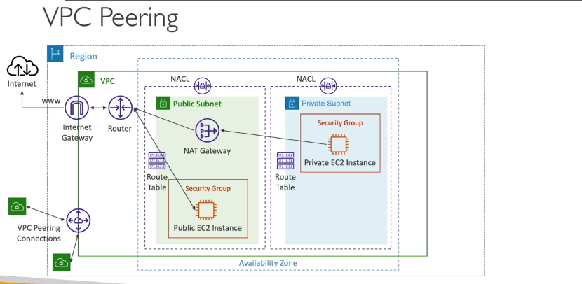

**VPC Peering là gì?**

- VPC Peering là một **kết nối mạng** giữa **hai VPC (Virtual Private Cloud)**, cho phép chúng giao tiếp với nhau bằng cách sử dụng mạng riêng của AWS.
- Mục đích của việc thiết lập peering là để các VPC có thể **hoạt động như thể chúng nằm trong cùng một mạng**, mặc dù thực tế chúng có thể ở các Vùng (Region) khác nhau, thuộc các Tài khoản AWS khác nhau, hoặc thậm chí là hai VPC riêng biệt trong cùng một Tài khoản.

**Tại sao sử dụng VPC Peering?**

- Để kết nối các ứng dụng hoặc dịch vụ chạy trong các VPC khác nhau cần giao tiếp nội bộ (ví dụ: ứng dụng web trong VPC A cần truy cập cơ sở dữ liệu trong VPC B).
- Cho phép truy cập tài nguyên trên các Vùng hoặc Tài khoản khác một cách riêng tư và hiệu quả hơn so với việc đi qua Internet công cộng.

**Yêu cầu Bắt buộc:**

- Để thiết lập VPC Peering giữa hai VPC, khối **CIDR IPv4 (và cả IPv6 nếu có sử dụng)** của hai VPC đó **KHÔNG ĐƯỢC TRÙNG LẶP (must be distant from each other)**.
- Nếu CIDR trùng lặp, các VPC sẽ không thể giao tiếp qua kết nối peering đó. Đây là một ràng buộc quan trọng cần kiểm tra trước khi thiết lập.

**Đặc điểm của VPC Peering:**

1.  **Kết nối điểm-điểm (Point-to-point):** VPC Peering là kết nối trực tiếp giữa **DUY NHẤT hai VPC**.
2.  **KHÔNG có tính bắc cầu (NOT Transitive):** Đây là đặc điểm RẤT RẤT QUAN TRỌNG và là điểm thường gây nhầm lẫn.
    - Nếu bạn có 3 VPC là A, B và C.
    - Bạn tạo kết nối peering giữa A và B (A <-> B). A và B có thể giao tiếp.
    - Bạn tạo kết nối peering giữa B và C (B <-> C). B và C có thể giao tiếp.
    - **Tuy nhiên, A và C sẽ KHÔNG THỂ giao tiếp trực tiếp với nhau thông qua B.** Kết nối peering không có tính bắc cầu.
    - Để A và C có thể giao tiếp, bạn **bắt buộc phải tạo thêm một kết nối peering trực tiếp giữa A và C** (A <-> C). Mỗi cặp VPC cần giao tiếp phải có một kết nối peering riêng.

**Cấu hình Bổ sung Bắt buộc (sau khi tạo kết nối Peering):**

- Việc tạo kết nối VPC Peering chỉ mới là bước "thiết lập đường hầm". Để lưu lượng mạng thực sự đi qua đường hầm đó, bạn **bắt buộc phải cập nhật Bảng Định tuyến (Route Table)** trong các Subnet của **cả hai VPC** tham gia peering.
- Trong Bảng định tuyến của Subnet thuộc VPC A, bạn cần thêm một quy tắc định tuyến:
  - **Đích (Destination):** Khối CIDR của VPC B.
  - **Đích đến (Target):** Chọn **Peering Connection** và chỉ định ID kết nối peering giữa A và B.
- Tương tự, trong Bảng định tuyến của Subnet thuộc VPC B, bạn cần thêm quy tắc:
  - **Đích (Destination):** Khối CIDR của VPC A.
  - **Đích đến (Target):** Chọn Peering Connection và chỉ định ID kết nối peering giữa A và B.
- Bước cập nhật Bảng định tuyến này là **thiết yếu** để cho phép các phiên bản EC2 trong các Subnet khác nhau thuộc hai VPC đã peering có thể "biết đường" để gửi lưu lượng cho nhau.

**Khả năng kết nối của VPC Peering:**

VPC Peering rất linh hoạt và có thể kết nối các VPC:

- **Trong cùng một Tài khoản AWS:** Kết nối hai VPC khác nhau trong cùng một tài khoản.
- **Giữa các Tài khoản AWS khác nhau:** Kết nối VPC thuộc Tài khoản A với VPC thuộc Tài khoản B.
- **Giữa các Vùng AWS khác nhau:** Kết nối VPC ở Vùng này với VPC ở Vùng khác.

**Tính năng Nâng cao ([Security Groups qua Peering]() ):**

- Khi kết nối peering được thiết lập giữa các VPC **trong CÙNG một Vùng** (có thể trong cùng tài khoản hoặc khác tài khoản), bạn có thể **tham chiếu (reference)** một **Security Group ID** từ VPC được peering trong luật của Security Group trong VPC của bạn.
- Điều này rất mạnh mẽ vì bạn có thể cho phép lưu lượng dựa trên "phiên bản này là thành viên của Security Group X" thay vì phải dựa trên dải địa chỉ IP (CIDR) của toàn bộ Subnet hoặc VPC.

**Tóm lại:**

VPC Peering là cách kết nối trực tiếp hai VPC qua mạng AWS. Yêu cầu CIDR không trùng lặp. Quan trọng nhất là nó **không có tính bắc cầu** (mỗi cặp cần peering riêng) và bạn **phải cập nhật Bảng định tuyến** ở cả hai phía để lưu lượng đi qua. Nó hỗ trợ kết nối trong/khác tài khoản và trong/khác vùng, với tính năng tham chiếu Security Group cho các kết nối cùng vùng.
