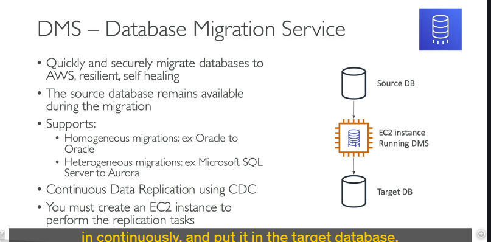
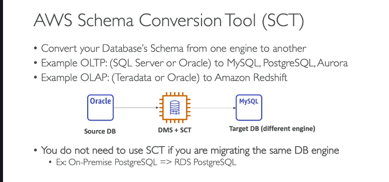
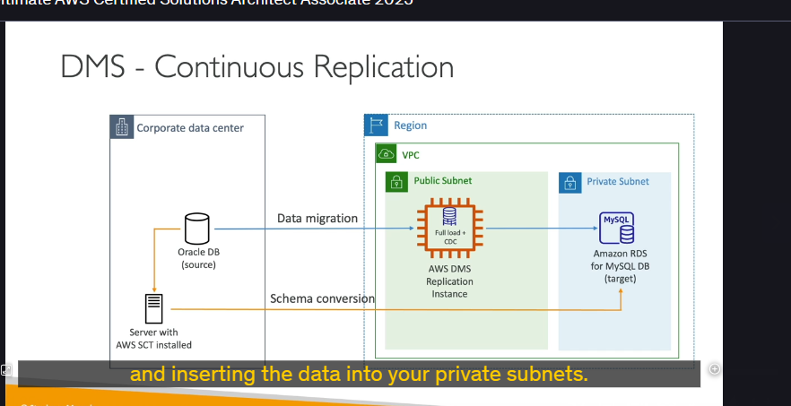
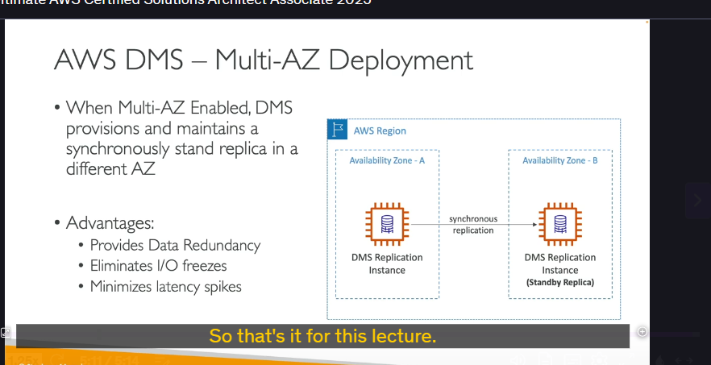

**AWS Database Migration Service (DMS)** là một dịch vụ giúp bạn di chuyển cơ sở dữ liệu (CSDL) một cách nhanh chóng, an toàn và hiệu quả từ hệ thống tại chỗ (on-premises) lên AWS, hoặc giữa các CSDL khác nhau trên AWS.

Dưới đây là những kiến thức chi tiết cần nhớ:

---

## Đặc điểm nổi bật của AWS DMS 🚀

- **Di chuyển linh hoạt:** Hỗ trợ di chuyển giữa các CSDL cùng loại (homogeneous migrations), ví dụ từ Oracle sang Oracle, hoặc khác loại (heterogeneous migrations), ví dụ từ Microsoft SQL Server sang Amazon Aurora.
- **Thời gian ngừng hoạt động tối thiểu (Minimal Downtime):** CSDL nguồn vẫn hoạt động bình thường trong suốt quá trình di chuyển.
- **Khả năng phục hồi và tự vá lỗi (Resilient and Self-healing):** Dịch vụ được thiết kế để có khả năng phục hồi cao.
- **Sao chép dữ liệu liên tục (Continuous Data Replication):** Sử dụng **Change Data Capture (CDC)** để đồng bộ những thay đổi dữ liệu một cách liên tục từ nguồn sang đích sau khi quá trình tải ban đầu (full load) hoàn tất.
- **Yêu cầu hạ tầng:** Để sử dụng DMS, bạn cần tạo một **EC2 instance**. Instance này sẽ chạy phần mềm DMS và thực hiện các tác vụ sao chép dữ liệu.

---

## Các nguồn (Sources) và đích (Targets) được hỗ trợ

Bạn không cần nhớ hết danh sách này, nhưng cần hiểu rằng DMS hỗ trợ rất nhiều loại CSDL:

- **Nguồn (Sources) có thể bao gồm:**
  - CSDL on-premises hoặc trên EC2: Oracle, Microsoft SQL Server, MySQL, MariaDB, PostgreSQL, MongoDB, SAP, DB2.
  - CSDL trên Azure: Azure SQL Database.
  - CSDL trên AWS: Amazon RDS (tất cả các loại, bao gồm Aurora), Amazon S3, DocumentDB.
- **Đích (Targets) có thể bao gồm:**
  - CSDL on-premises hoặc trên EC2: Oracle, Microsoft SQL Server, MySQL, MariaDB, PostgreSQL, SAP.
  - CSDL trên AWS: Amazon RDS (tất cả các loại), Amazon Redshift, Amazon DynamoDB, Amazon S3.
  - Các dịch vụ khác: Kinesis Data Streams, Apache Kafka, DocumentDB, Amazon Neptune, Redis, Babelfish (cho Aurora PostgreSQL).

**Ý tưởng chính:** DMS giúp bạn lấy CSDL từ nhiều nguồn khác nhau (đặc biệt là on-premises) và di chuyển nó lên hầu hết các loại CSDL mà AWS cung cấp.

---

## AWS Schema Conversion Tool (SCT) 🛠️

Đây là công cụ cực kỳ quan trọng khi bạn di chuyển giữa các CSDL **khác loại (heterogeneous migration)**.

- **Chức năng:** SCT giúp **chuyển đổi schema** (cấu trúc bảng, kiểu dữ liệu, stored procedures, functions, v.v.) của CSDL nguồn sang định dạng tương thích với CSDL đích.
  - Ví dụ OLTP: Chuyển đổi từ SQL Server hoặc Oracle sang MySQL, PostgreSQL, hoặc Aurora.
  - Ví dụ OLAP (Analytics): Chuyển đổi từ Teradata hoặc Oracle sang Amazon Redshift.
- **Khi nào KHÔNG cần dùng SCT:** Nếu bạn di chuyển giữa các CSDL **cùng loại** (ví dụ: từ PostgreSQL on-premises sang RDS PostgreSQL), bạn **không cần** sử dụng SCT. Engine CSDL là như nhau.
- **Khi nào BẮT BUỘC dùng SCT:** Nếu bạn di chuyển giữa các CSDL **khác loại** (ví dụ: từ Oracle sang PostgreSQL), bạn **phải** sử dụng SCT để chuyển đổi schema trước khi DMS có thể di chuyển dữ liệu.

---

## Quy trình thiết lập sao chép liên tục với DMS và SCT

Xem xét ví dụ di chuyển từ Oracle (on-premises) sang Amazon RDS MySQL:

1. **Cài đặt SCT:** Thiết lập một server (thường là on-premises theo best practice) và cài đặt AWS SCT lên đó.
2. **Chuyển đổi Schema:** Sử dụng SCT để kết nối đến CSDL Oracle nguồn và CSDL RDS MySQL đích. SCT sẽ phân tích schema nguồn và tạo ra các script để chuyển đổi sang schema tương thích với MySQL. Bạn sẽ chạy các script này trên RDS MySQL để tạo cấu trúc.
3. **Tạo Replication Instance:** Tạo một EC2 instance cho DMS (DMS Replication Instance). Instance này sẽ thực hiện việc di chuyển dữ liệu.
4. **Thực hiện Full Load:** DMS Replication Instance sẽ đọc toàn bộ dữ liệu từ CSDL Oracle nguồn và tải nó vào CSDL RDS MySQL đích.
5. **Bật Change Data Capture (CDC):** Sau khi full load hoàn tất, DMS sẽ sử dụng CDC để theo dõi các thay đổi trên CSDL Oracle nguồn và áp dụng những thay đổi đó vào CSDL RDS MySQL đích một cách liên tục. Điều này đảm bảo dữ liệu giữa nguồn và đích luôn được đồng bộ.

---

## Tính sẵn sàng cao với Multi-AZ Deployment 🌐

DMS hỗ trợ triển khai Multi-AZ cho Replication Instance:

- **Cách hoạt động:** Một DMS Replication Instance chính sẽ được tạo trong một Availability Zone (AZ). Một bản sao đồng bộ (synchronous replica) của instance này sẽ được duy trì ở một AZ khác (standby replica).
- **Lợi ích:**
  - **Khả năng phục hồi cao (Resilient to AZ failure):** Nếu AZ chứa instance chính gặp sự cố, instance standby sẽ tự động được nâng lên làm chính.
  - **Dự phòng dữ liệu (Data redundancy).**
  - **Loại bỏ tình trạng I/O đóng băng (Eliminate I/O freezes).**
  - **Giảm thiểu đột biến độ trễ (Minimize latency spikes).**

**Tóm lại:** AWS DMS là một dịch vụ mạnh mẽ để di chuyển CSDL. Hãy nhớ rằng bạn cần sử dụng **AWS SCT** khi di chuyển giữa các loại CSDL khác nhau và cân nhắc **Multi-AZ** cho các tác vụ di chuyển quan trọng.
