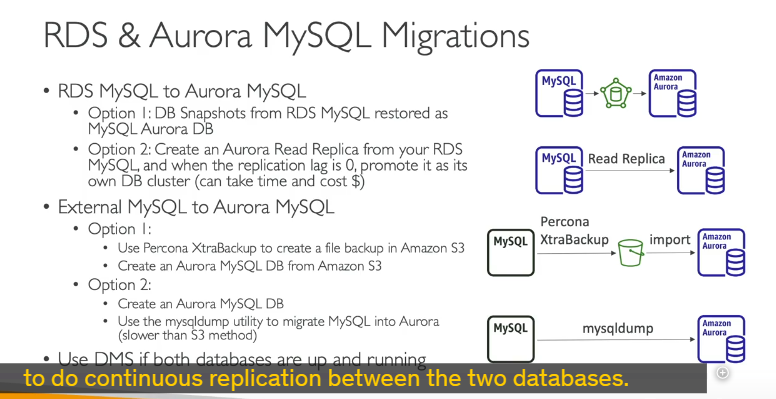
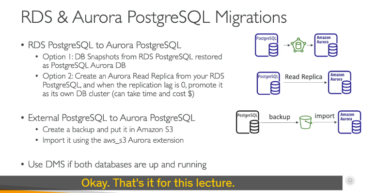

cách chuyển đổi (migration) cơ sở dữ liệu sang **Amazon Aurora**, cụ thể là cho **MySQL** và **PostgreSQL**.

---

## Di chuyển sang Amazon Aurora MySQL 🐘

Khi bạn muốn "dọn nhà" cho cơ sở dữ liệu MySQL của mình sang Aurora MySQL, sẽ có vài con đường tùy thuộc vào việc database của bạn đang ở đâu.

### 1. Từ Cơ sở dữ liệu RDS MySQL (Database đang ở trên RDS)

Nếu MySQL của bạn đã nằm sẵn trên dịch vụ RDS của AWS, bạn có 2 lựa chọn chính:

- **Cách 1: Snapshot và Khôi phục (Database Snapshot & Restore)**

  - **Quy trình:**
    1.  Bạn tạo một bản **snapshot** (ảnh chụp nhanh) từ database RDS MySQL hiện tại.
    2.  Sau đó, bạn **khôi phục (restore)** snapshot này thành một database Aurora MySQL mới.
  - **Điểm cần lưu ý 🧐:**
    - Có khả năng bạn sẽ bị **downtime** (thời gian hệ thống không hoạt động). Lý do là bạn có thể cần phải dừng các hoạt động ghi/đọc trên database MySQL gốc trước khi tạo snapshot để đảm bảo dữ liệu được nhất quán hoàn toàn.

- **Cách 2: Sử dụng Amazon Aurora Read Replica (Bản sao chỉ đọc của Aurora)**
  - **Quy trình:**
    1.  Bạn tạo một **Aurora Read Replica** trực tiếp từ database RDS MySQL của bạn.
    2.  Replica này sẽ liên tục đồng bộ dữ liệu từ database chính.
    3.  Khi **Replica lag** (độ trễ của bản sao) về **0** – tức là bản sao Aurora đã bắt kịp hoàn toàn dữ liệu với database MySQL chính – bạn có thể **promote** (nâng cấp) nó thành một cụm database Aurora độc lập.
  - **Điểm cần lưu ý 🧐:**
    - Đây là phương pháp **liên tục hơn**, giúp giảm thiểu downtime.
    - Có thể tốn **nhiều thời gian hơn** so với cách snapshot để hoàn tất quá trình đồng bộ ban đầu.
    - Có thể phát sinh **chi phí mạng** (network cost) do việc sao chép dữ liệu.

### 2. Từ Cơ sở dữ liệu MySQL bên ngoài RDS (Database ở ngoài, ví dụ on-premise hoặc EC2)

Nếu MySQL của bạn không nằm trên RDS:

- **Cách 1: Sử dụng Percona XtraBackup**

  - **Quy trình:**
    1.  Dùng tiện ích **Percona XtraBackup** để tạo file backup cho database MySQL của bạn.
    2.  Tải file backup này lên **Amazon S3**.
    3.  Từ Amazon Aurora, có tùy chọn để **nhập trực tiếp (import)** file backup này từ S3 vào một cụm DB Aurora MySQL mới.
  - **Lưu ý cực kỳ quan trọng 📢:** Aurora **CHỈ HỖ TRỢ** tiện ích Percona XtraBackup cho phương pháp nhập này.

- **Cách 2: Sử dụng `mysqldump`**

  - **Quy trình:**
    1.  Chạy tiện ích `mysqldump` trên database MySQL của bạn.
    2.  **Pipe** (chuyển hướng) output của lệnh này trực tiếp vào database Amazon Aurora hiện có của bạn.
  - **Điểm cần lưu ý 🧐:**
    - Cách này **rất tốn thời gian**, đặc biệt với database lớn.
    - **Không tận dụng được Amazon S3** (ví dụ để lưu trữ file backup tạm thời rồi mới import), nên có thể kém hiệu quả hơn.

- **Cách 3: Sử dụng Amazon DMS (Database Migration Service)**
  - **Quy trình:** Dùng DMS khi cả hai database (nguồn và đích Aurora) đều đang chạy. DMS sẽ thực hiện **sao chép liên tục (continuous replication)** giữa chúng.
  - **Điểm cần lưu ý 🧐:** Phù hợp cho việc di chuyển với downtime tối thiểu.

---

## Di chuyển sang Amazon Aurora PostgreSQL 🐘

Quá trình di chuyển cho PostgreSQL cũng tương tự như MySQL.

### 1. Từ Cơ sở dữ liệu RDS PostgreSQL

- **Cách 1: Database Snapshot và Khôi phục**

  - Quy trình tương tự MySQL: tạo snapshot từ RDS PostgreSQL rồi restore thành Aurora PostgreSQL.

- **Cách 2: Amazon Aurora Read Replica**
  - Quy trình tương tự MySQL: tạo Aurora Read Replica từ RDS PostgreSQL, chờ replica lag về 0 rồi promote.

### 2. Từ Cơ sở dữ liệu PostgreSQL bên ngoài RDS

- **Cách 1: Backup lên S3 và Import bằng Extension**

  - **Quy trình:**
    1.  Tạo bản backup cho database PostgreSQL bên ngoài của bạn.
    2.  Đưa bản backup này lên **Amazon S3**.
    3.  Sử dụng **AWS S3 Aurora extension** để import dữ liệu từ S3, tạo ra một database Aurora mới.

- **Cách 2: Sử dụng Amazon DMS**
  - Tương tự như với MySQL, dùng DMS để di chuyển liên tục từ PostgreSQL sang Amazon Aurora.

---

**Tóm lại cho kỳ thi của bạn:**

- Nắm rõ sự khác biệt khi di chuyển từ **RDS** và từ **bên ngoài RDS**.
- Với mỗi trường hợp, có những **công cụ/phương pháp đặc thù** nào (Snapshot, Read Replica, Percona XtraBackup, `mysqldump`, DMS, S3 extension).
- Ưu nhược điểm của mỗi cách: **downtime, thời gian, chi phí, tính liên tục**. Ví dụ, nếu yêu cầu downtime tối thiểu, Read Replica hoặc DMS là lựa chọn tốt. Nếu database ngoài RDS và là MySQL, Percona XtraBackup là công cụ được Aurora hỗ trợ trực tiếp qua S3.
