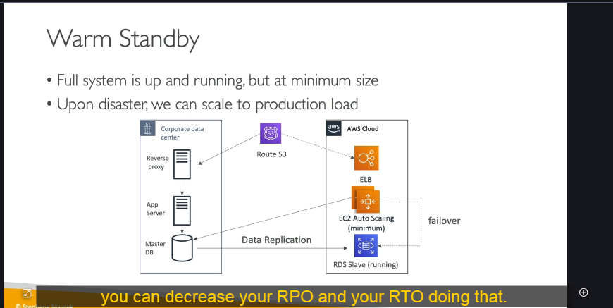

# AWS Disaster Recovery - Hướng Dẫn Toàn Diện

## Mục Lục

- [Giới Thiệu](#giới-thiệu)
- [Khái Niệm Chính](#khái-niệm-chính)
- [Chiến Lược Khôi Phục Thảm Họa](#chiến-lược-khôi-phục-thảm-họa)
- [Ví Dụ Triển Khai](#ví-dụ-triển-khai)
- [Thực Hành Tốt Nhất](#thực-hành-tốt-nhất)
- [Dịch Vụ AWS cho DR](#dịch-vụ-aws-cho-dr)
- [Chaos Engineering](#chaos-engineering)

## Giới Thiệu

**Disaster Recovery (DR)** là rất quan trọng đối với các kiến trúc sư giải pháp và được kiểm tra nhiều trong các kỳ thi chứng chỉ AWS. Hướng dẫn này cung cấp bao quát toàn diện về các khái niệm, chiến lược và triển khai DR trên AWS.

### Thảm Họa Là Gì?

**Thảm họa** là bất kỳ sự kiện nào có tác động tiêu cực đến:

- Tính liên tục kinh doanh của công ty
- Hoạt động tài chính
- Tính toàn vẹn dữ liệu
- Tính sẵn sàng của dịch vụ

### Các Loại Khôi Phục Thảm Họa

| Loại         | Nguồn      | Đích       | Chi Phí    | Độ Phức Tạp |
| ------------ | ---------- | ---------- | ---------- | ----------- |
| Truyền Thống | On-Premise | On-Premise | Rất Cao    | Cao         |
| Hybrid       | On-Premise | AWS Cloud  | Trung Bình | Trung Bình  |
| Cloud-Native | AWS Vùng A | AWS Vùng B | Biến Đổi   | Thấp-TB     |

## Khái Niệm Chính

### RPO vs RTO


Hiểu các chỉ số này là điều cần thiết để thành công trong kỳ thi:

#### RPO (Recovery Point Objective - Mục Tiêu Điểm Khôi Phục)

- **Định nghĩa**: Lượng dữ liệu tối đa có thể chấp nhận mất được tính bằng thời gian
- **Câu hỏi**: "Chúng ta có thể mất bao nhiều dữ liệu?"
- **Ví dụ**:
  - RPO 1 giờ = Có thể mất tối đa 1 giờ dữ liệu
  - RPO 5 phút = Có thể mất tối đa 5 phút dữ liệu

#### RTO (Recovery Time Objective - Mục Tiêu Thời Gian Khôi Phục)

- **Định nghĩa**: Thời gian ngừng hoạt động tối đa có thể chấp nhận để khôi phục
- **Câu hỏi**: "Hệ thống của chúng ta có thể ngừng hoạt động trong bao lâu?"
- **Ví dụ**:
  - RTO 24 giờ = Hệ thống có thể ngừng hoạt động tối đa 24 giờ
  - RTO 1 phút = Hệ thống phải được khôi phục trong vòng 1 phút

### Đánh Đổi Chi Phí vs Hiệu Suất

```
RPO/RTO Thấp Hơn = Chi Phí Cao Hơn
RPO/RTO Cao Hơn = Chi Phí Thấp Hơn
```

## Chiến Lược Khôi Phục Thảm Họa

### 1. Backup and Restore (Sao Lưu và Khôi Phục)


**Đặc điểm:**

- ✅ **Ưu điểm**: Chi phí thấp nhất, triển khai đơn giản
- ❌ **Nhược điểm**: RPO/RTO cao nhất, thời gian khôi phục lâu nhất

**Kiến trúc:**

```
Trung Tâm Dữ Liệu Doanh Nghiệp → AWS S3/Glacier
├── Storage Gateway (đồng bộ liên tục)
├── Lifecycle Policies (tối ưu chi phí)
└── Snowball (chuyển đổi hàng loạt hàng tuần)

Quy Trình Khôi Phục:
1. Tạo AMIs cho các EC2 instances
2. Khôi phục snapshots (EBS, RDS, Redshift)
3. Khởi chạy cơ sở hạ tầng mới
```

**Trường hợp sử dụng:**

- Ứng dụng không quan trọng
- Môi trường phát triển/thử nghiệm
- Các tình huống nhạy cảm về chi phí

### 2. Pilot Light (Đèn Dẫn Đường)


**Đặc điểm:**

- ✅ **Ưu điểm**: Nhanh hơn backup/restore, chi phí vừa phải
- ❌ **Nhược điểm**: Vẫn cần thời gian để mở rộng quy mô

**Kiến trúc:**

```
Trung Tâm Dữ Liệu:
├── Application Server
└── Database (Master)
    ↓ (sao chép liên tục)
AWS Cloud:
├── RDS Database (đang chạy)
├── Route 53 (DNS failover)
└── EC2 instances (chưa chạy , được tạo và chạy trong thảm họa)
```

**Các Bước Triển Khai:**

1. Thiết lập sao chép dữ liệu liên tục đến RDS
2. Cấu hình Route 53 health checks
3. Chuẩn bị AMIs để triển khai EC2 nhanh chóng
4. Thử nghiệm quy trình failover thường xuyên

### 3. Warm Standby (Dự Phòng Ấm)



**Đặc điểm:**

- ✅ **Ưu điểm**: Khôi phục nhanh hơn, cơ sở hạ tầng đã sẵn sàng
- ❌ **Nhược điểm**: Chi phí cao hơn pilot light

**Kiến trúc:**

```
Trung Tâm Dữ Liệu:
├── Reverse Proxy
├── App Server
└── Master Database
    ↓
AWS Cloud:
├── ELB (đang chạy)
├── Auto Scaling Group (công suất tối thiểu)
├── RDS Slave (đang chạy)
└── Route 53 (failover routing)
```

**Quy Trình Failover:**

1. Route 53 chuyển đổi sang ELB
2. Auto Scaling mở rộng đến công suất sản xuất
3. Ứng dụng kết nối với RDS Slave
4. Đạt được công suất sản xuất đầy đủ một cách nhanh chóng

### 4. Multi-Site / Hot Site (Đa Trang Web / Trang Web Nóng)


**Đặc điểm:**

- ✅ **Ưu điểm**: RTO thấp nhất (phút/giây), tính khả dụng cao nhất
- ❌ **Nhược điểm**: Chi phí cao nhất, quản lý phức tạp

**Kiến trúc:**

```
Thiết Lập Active-Active:
Trung Tâm Dữ Liệu (Sản Xuất) ←→ AWS Cloud (Sản Xuất)
├── Công suất đầy đủ đang chạy
├── Sao chép dữ liệu thời gian thực
├── Lưu lượng được cân bằng tải
└── Khả năng failover tức thì
```

**Ví Dụ AWS Multi-Region:**


```
Vùng A (Chính):
├── Aurora Master
├── EC2 Auto Scaling
└── Application Load Balancer

Vùng B (Phụ):
├── Aurora Global Database (Read Replica)
├── EC2 Auto Scaling (standby)
└── Application Load Balancer
```

## So Sánh Chiến Lược Khôi Phục Thảm Họa

| Chiến Lược       | RPO            | RTO        | Chi Phí | Độ Phức Tạp | Tốt Nhất Cho              |
| ---------------- | -------------- | ---------- | ------- | ----------- | ------------------------- |
| Backup & Restore | Giờ-Ngày       | Giờ-Ngày   | 1       | Thấp        | Hệ thống không quan trọng |
| Pilot Light      | Phút-Giờ       | 10phút-Giờ | 2       | Trung Bình  | Hệ thống quan trọng       |
| Warm Standby     | Giây-Phút      | Phút       | 3       | TB-Cao      | Quan trọng kinh doanh     |
| Multi-Site       | Thời gian thực | Giây-Phút  | 4       | Cao         | Quan trọng sứ mệnh        |

## Dịch Vụ AWS cho Khôi Phục Thảm Họa

### Dịch Vụ Backup

```yaml
EBS Snapshots:
  - Lập lịch tự động
  - Sao chép cross-region
  - Quản lý lifecycle

RDS Backups:
  - Backup tự động (lưu trữ 35 ngày)
  - Manual snapshots
  - Sao chép cross-region

S3 Storage Classes:
  - S3 Standard → S3 IA → Glacier → Deep Archive
  - Cross-Region Replication (CRR)
  - Lifecycle policies
```

### Dịch Vụ High Availability

#### Route 53 DNS Failover

```json
{
  "HealthCheck": {
    "Type": "HTTP",
    "ResourcePath": "/health",
    "FailureThreshold": 3
  },
  "RoutingPolicy": "Failover",
  "Primary": "us-east-1",
  "Secondary": "us-west-2"
}
```

#### Dịch Vụ Multi-AZ

- **RDS Multi-AZ**: Sao chép đồng bộ
- **ElastiCache Multi-AZ**: Redis cluster mode
- **EFS**: Multi-AZ theo mặc định
- **S3**: 99.999999999% (11 9's) durability

### Khả Năng Phục Hồi Mạng

```
Chính: Direct Connect
├── Kết nối chuyên dụng
├── Hiệu suất nhất quán
└── Kết nối riêng tư

Dự Phòng: Site-to-Site VPN
├── Backup dựa trên Internet
├── Thiết lập nhanh
└── Dự phòng hiệu quả về chi phí
```

### Công Nghệ Sao Chép

#### Sao Chép Database

```
RDS Cross-Region Read Replicas:
├── Sao chép bất đồng bộ
├── Mở rộng read
└── Khả năng DR

Aurora Global Database:
├── < 1 giây sao chép cross-region
├── Tối đa 5 vùng phụ
└── RPO < 1 giây, RTO < 1 phút
```

## Tự Động Hóa cho Khôi Phục Thảm Họa

### Infrastructure as Code

#### CloudFormation Templates

```yaml
# Ví dụ DR stack template
AWSTemplateFormatVersion: "2010-09-09"
Description: "Cơ Sở Hạ Tầng Khôi Phục Thảm Họa"

Resources:
  DRVPC:
    Type: AWS::EC2::VPC
    Properties:
      CidrBlock: 10.1.0.0/16

  AutoScalingGroup:
    Type: AWS::AutoScaling::AutoScalingGroup
    Properties:
      MinSize: 0
      MaxSize: 10
      DesiredCapacity: 0 # Mở rộng trong DR
```

### Monitoring và Alerting

#### CloudWatch Alarms

```python
# Lambda function cho DR tự động
import boto3

def lambda_handler(event, context):
    ec2 = boto3.client('ec2')

    # Khởi động DR instances
    response = ec2.start_instances(
        InstanceIds=['i-1234567890abcdef0']
    )

    # Cập nhật Route 53 records
    route53 = boto3.client('route53')
    # Logic failover ở đây

    return {
        'statusCode': 200,
        'body': 'DR được khởi tạo thành công'
    }
```

## Thực Hành Tốt Nhất

### 1. Thử Nghiệm Thường Xuyên

- **Lịch trình**: Thử nghiệm DR hàng tháng/quý
- **Tài liệu**: Duy trì runbooks
- **Xác thực**: Thử nghiệm cả quy trình kỹ thuật và kinh doanh

### 2. Bảo Vệ Dữ Liệu

```bash
# Ví dụ script backup tự động
#!/bin/bash

# Tạo EBS snapshots
aws ec2 create-snapshot \
  --volume-id vol-1234567890abcdef0 \
  --description "Backup hàng ngày $(date)"

# Tạo RDS snapshot
aws rds create-db-snapshot \
  --db-instance-identifier mydbinstance \
  --db-snapshot-identifier mydbinstance-$(date +%Y%m%d)
```

### 3. Cân Nhắc Bảo Mật

- **Mã hóa**: Trong quá trình truyền và lưu trữ
- **Kiểm soát truy cập**: IAM roles và policies
- **Tuân thủ**: Đáp ứng yêu cầu quy định

### 4. Tối Ưu Chi Phí

```
Chiến Lược:
├── Sử dụng storage classes phù hợp
├── Triển khai lifecycle policies
├── Dọn dẹp snapshots cũ thường xuyên
└── Right-size cơ sở hạ tầng DR
```

## Chaos Engineering

### Simian Army của Netflix

**Khái niệm**: Cố ý tạo ra lỗi để kiểm tra khả năng phục hồi

**Công cụ**:

- **Chaos Monkey**: Ngẫu nhiên terminate instances
- **Chaos Kong**: Hạ gục toàn bộ AWS regions
- **Latency Monkey**: Tạo độ trễ mạng

### Ví Dụ Triển Khai

```python
# Script chaos monkey đơn giản
import boto3
import random
import time

def chaos_monkey():
    ec2 = boto3.client('ec2')

    # Lấy running instances
    instances = ec2.describe_instances(
        Filters=[{'Name': 'instance-state-name', 'Values': ['running']}]
    )

    # Ngẫu nhiên chọn và terminate
    if random.random() < 0.1:  # 10% cơ hội
        # Terminate instance ngẫu nhiên
        instance_id = random.choice(instance_ids)
        ec2.terminate_instances(InstanceIds=[instance_id])
        print(f"Chaos Monkey đã terminate {instance_id}")

# Chạy chaos testing
chaos_monkey()
```

## Mẹo Thi

### Điểm Chính Cần Nhớ

1. **Đánh đổi RPO/RTO**: Giá trị thấp hơn = chi phí cao hơn
2. **Lựa chọn chiến lược**: Dựa trên yêu cầu kinh doanh
3. **Dịch vụ AWS**: Biết dịch vụ nào hỗ trợ Multi-AZ
4. **Tự động hóa**: CloudFormation, Lambda cho DR orchestration
5. **Thử nghiệm**: Thử nghiệm DR thường xuyên là quan trọng

### Tình Huống Thi Thường Gặp

| Tình Huống                                  | Chiến Lược Khuyến Nghị                 |
| ------------------------------------------- | -------------------------------------- |
| Trang web thương mại điện tử, 99.99% uptime | Multi-Site/Hot Site                    |
| Hệ thống HR nội bộ                          | Warm Standby                           |
| Môi trường phát triển                       | Backup & Restore                       |
| Nền tảng giao dịch tài chính                | Multi-Site với sao chép thời gian thực |

### Câu Hỏi Mẫu

**Q**: Công ty cần RPO 1 giờ và RTO 4 giờ. Giải pháp hiệu quả nhất về chi phí là gì?
**A**: Chiến lược Pilot Light với backup hàng giờ

**Q**: Ứng dụng yêu cầu RTO < 1 phút. Chiến lược nào?
**A**: Phương pháp Multi-Site/Hot Site

## Kết Luận

Khôi Phục Thảm Họa là quan trọng cho:

- Tính liên tục kinh doanh
- Yêu cầu tuân thủ
- Giảm thiểu rủi ro
- Niềm tin khách hàng

**Điểm Chính**:

- Hiểu khái niệm RPO vs RTO
- Biết tất cả bốn chiến lược DR
- Thực hành với các dịch vụ AWS
- Thử nghiệm quy trình DR thường xuyên
- Cân bằng chi phí với yêu cầu

Để biết thêm các chủ đề nâng cao, tham khảo [AWS Disaster Recovery whitepaper](https://docs.aws.amazon.com/whitepapers/latest/disaster-recovery-workloads-on-aws/disaster-recovery-workloads-on-aws.html).
