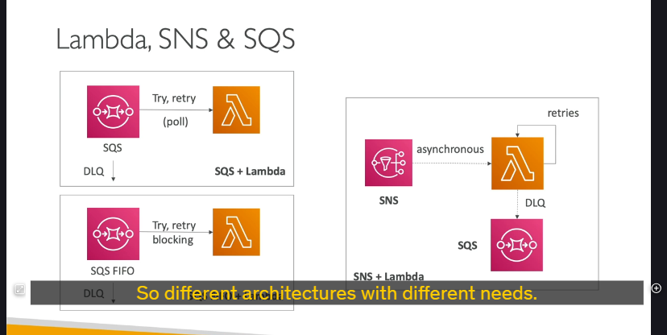
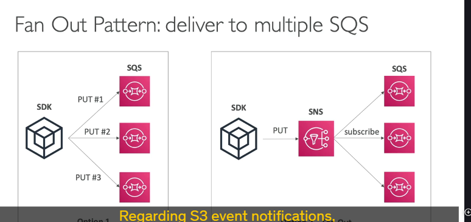
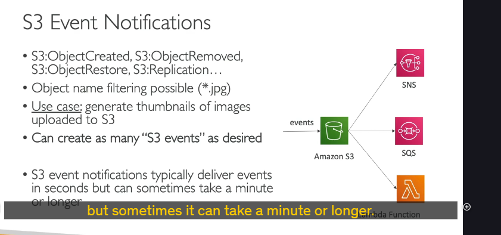
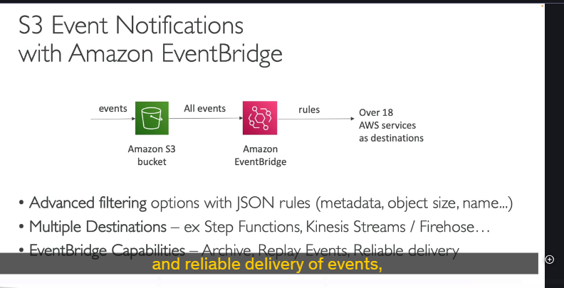
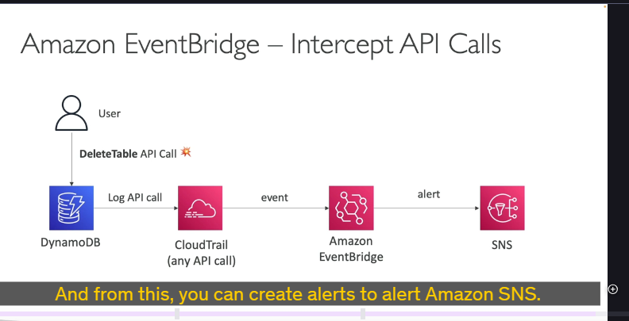
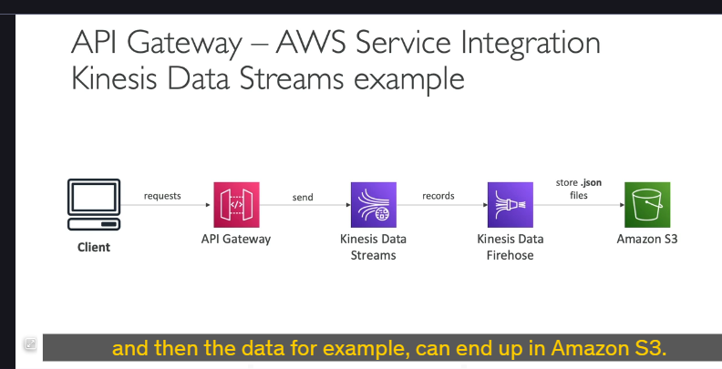

## 1. Xử lý sự kiện với SQS và Lambda 📨 + ⚙️

Đây là một cặp đôi kinh điển!

- **SQS Standard + Lambda:**

  - **Cách hoạt động:** Các sự kiện (messages) được đẩy vào một hàng đợi SQS (Standard Queue). Dịch vụ Lambda sẽ liên tục "thăm dò" (poll) SQS queue này. Nếu có message, Lambda function sẽ được kích hoạt để xử lý.
  - **Xử lý lỗi:** Nếu Lambda xử lý lỗi, message sẽ được trả lại SQS queue và Lambda sẽ thử xử lý lại. Điều này có thể dẫn đến vòng lặp vô hạn nếu một message nào đó "cứng đầu" không thể xử lý được.
  - **Giải pháp "cứu cánh": Dead Letter Queue (DLQ).** Bạn có thể cấu hình SQS để sau một số lần thử lại thất bại (ví dụ, 5 lần), message đó sẽ được chuyển sang một DLQ riêng. Điều này giúp "giải thoát" cho queue chính.
    - _Lưu ý:_ DLQ được cấu hình ở phía SQS.

- **SQS FIFO + Lambda:**

  - **FIFO (First-In, First-Out):** Đảm bảo các message được xử lý **theo đúng thứ tự** chúng được đưa vào queue.
  - **Thách thức:** Nếu một message gặp lỗi và không xử lý được, nó sẽ **chặn toàn bộ queue** vì phải đảm bảo thứ tự.
  - **Giải pháp:** Tương tự, sử dụng DLQ ở phía SQS để chuyển message lỗi đi, giúp queue tiếp tục xử lý các message tiếp theo (dù điều này có thể phá vỡ tính thứ tự nghiêm ngặt nếu không cẩn thận trong thiết kế).

---

## 2. Xử lý sự kiện với SNS và Lambda 📢 + ⚙️

Một cặp bài trùng khác!

- **Cách hoạt động:** Một message được gửi đến một SNS topic. SNS sau đó sẽ gửi message này một cách **bất đồng bộ (asynchronously)** đến các Lambda function đã đăng ký (subscribe) với topic đó.
- **Xử lý lỗi của Lambda:**
  - Nếu Lambda function xử lý message thất bại, nó sẽ tự động **thử lại (retry) nội bộ** (mặc định là 3 lần, bao gồm cả lần chạy đầu tiên).
  - Nếu sau các lần thử lại mà vẫn thất bại, message sẽ bị **hủy bỏ (discarded)**.
  - **Giải pháp DLQ cho Lambda:** Bạn có thể cấu hình một DLQ (ví dụ, một SQS queue) **ở phía dịch vụ Lambda**. Nếu message không thể xử lý thành công sau các lần retry, Lambda sẽ gửi nó vào DLQ này.
- **Điểm khác biệt quan trọng:** Với SQS, DLQ cấu hình trên SQS. Với SNS + Lambda, DLQ cho các message không xử lý được bởi Lambda sẽ được cấu hình trên chính Lambda.

---

## 3. Mô hình Fan-Out: Gửi một tin nhắn đến nhiều nơi

Làm thế nào để gửi cùng một thông điệp đến nhiều SQS queue khác nhau?

- **Cách 1: Từ ứng dụng gửi trực tiếp (Không khuyến khích)**

  - Ứng dụng của bạn (cài AWS SDK) sẽ gửi message lần lượt đến SQS Queue 1, rồi SQS Queue 2, rồi SQS Queue 3.
  - **Rủi ro:** Nếu ứng dụng bị lỗi (crash) sau khi gửi đến Queue 2, thì Queue 3 sẽ không bao giờ nhận được message. Tính nhất quán và độ tin cậy không cao.

- **Cách 2: Sử dụng SNS làm trung gian (Khuyến khích - "Fan-Out Pattern")** 👍

  - **Thiết lập:** Các SQS queue sẽ **đăng ký (subscribe)** vào một SNS topic trung tâm.
  - **Luồng hoạt động:** Ứng dụng của bạn chỉ cần gửi **một message duy nhất** đến SNS topic.
  - SNS topic sẽ tự động "fan-out" (phân phát) message đó đến **tất cả** các SQS queue đã đăng ký.
  - **Ưu điểm:** Đảm bảo cao hơn, ứng dụng đơn giản hơn (chỉ cần quan tâm đến việc gửi cho SNS). Đây là một design pattern rất phổ biến trên AWS.

---

## 4. S3 Event Notifications: Phản ứng với sự kiện trên S3 📦➡️🔔

Bạn có thể tự động hóa hành động khi có sự kiện xảy ra trên S3 bucket.

- **Các loại sự kiện:** Object được tạo mới (created), bị xóa (removed), được khôi phục (restored), sự kiện sao chép (replication), v.v. Bạn cũng có thể lọc theo tên object.
- **Ví dụ điển hình:** Tự động tạo ảnh thumbnail khi một ảnh mới được tải lên S3.

  

- **Đích đến của sự kiện:**

  - SNS topic
  - SQS queue
  - Lambda function

- **Tốc độ:** Thông báo thường được gửi trong vài giây, nhưng đôi khi có thể mất một phút hoặc lâu hơn.

---

## 5. S3 Events với Amazon EventBridge: Nâng tầm xử lý sự kiện S3 📦➡️🌉

Thay vì gửi trực tiếp từ S3 đến SNS/SQS/Lambda, bạn có thể cho sự kiện S3 đi qua **Amazon EventBridge**.

- **Cách hoạt động:** Tất cả sự kiện từ S3 bucket được gửi đến EventBridge. Sau đó, bạn dùng các **Rule (quy tắc)** trong EventBridge để định tuyến chúng đến hơn 18 dịch vụ AWS khác nhau.
- **Tại sao chọn EventBridge thay vì S3 Event Notifications thông thường?**
  - **Lọc nâng cao (Advanced Filtering):** Dùng JSON rules để lọc dựa trên metadata, kích thước object, tên, v.v.
  - **Gửi đến nhiều đích cùng lúc:** Một sự kiện có thể kích hoạt nhiều đích đến khác nhau (ví dụ: Step Functions, Kinesis Streams, Kinesis Data Firehose).
  - **Tận dụng các tính năng của EventBridge:** Lưu trữ sự kiện (archiving), phát lại sự kiện (replaying), đảm bảo việc gửi sự kiện đáng tin cậy hơn.

---

## 6. EventBridge: "Nghe lén" API call qua CloudTrail 🕵️‍♂️

Một khả năng mạnh mẽ của EventBridge là tích hợp với **CloudTrail**.

- **Cách hoạt động:** Mọi API call trong AWS đều được CloudTrail ghi lại. Những log này từ CloudTrail có thể kích hoạt các sự kiện trong EventBridge.

  

- **Ví dụ:** Bạn muốn nhận cảnh báo khi có ai đó xóa một bảng trong DynamoDB (thông qua API call `DeleteTable`).

  1. `DeleteTable` API call được CloudTrail ghi lại.
  2. Sự kiện này trong CloudTrail kích hoạt một rule trong EventBridge.
  3. EventBridge rule gửi một thông báo đến SNS topic (để bạn nhận được alert).

---

## 7. Đón nhận sự kiện từ bên ngoài AWS 🌍➡️ AWS

Bạn cũng có thể xây dựng luồng để nhận và xử lý sự kiện từ các client bên ngoài AWS.

- **Ví dụ luồng:**
  Client (bên ngoài) ➡️ API Gateway ➡️ Kinesis Data Streams ➡️ Kinesis Data Firehose ➡️ Amazon S3 (hoặc các đích khác).

---

## Chốt lại cho kỳ thi 🎯

Bài này khá nhiều thông tin, nhưng những điểm chính bạn cần nắm là:

- Hiểu rõ cơ chế hoạt động, xử lý lỗi và DLQ của cặp **SQS + Lambda** (cả Standard và FIFO) và **SNS + Lambda**.
- Nhận biết và hiểu lợi ích của **Fan-Out pattern** sử dụng SNS.
- Biết các cách xử lý sự kiện từ **S3**: trực tiếp (SNS, SQS, Lambda) và qua **EventBridge** (với các lợi ích nâng cao).
- EventBridge có thể tích hợp với **CloudTrail** để phản ứng với các API call.
- Có thể thiết kế luồng nhận sự kiện từ **bên ngoài** vào AWS.
