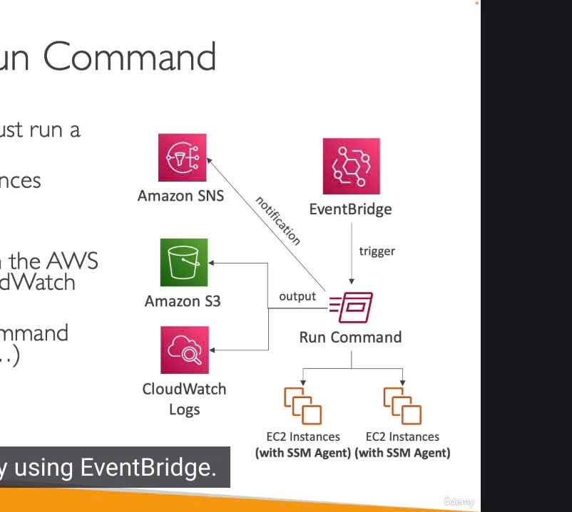
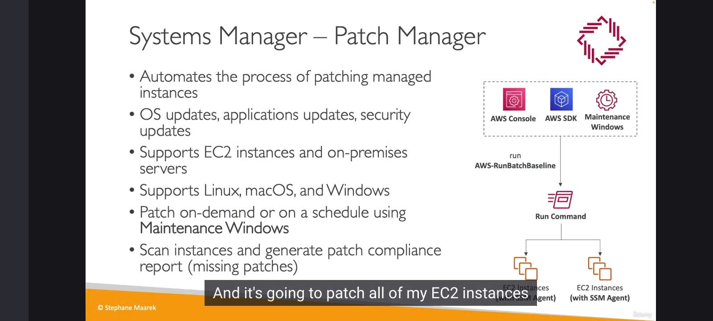
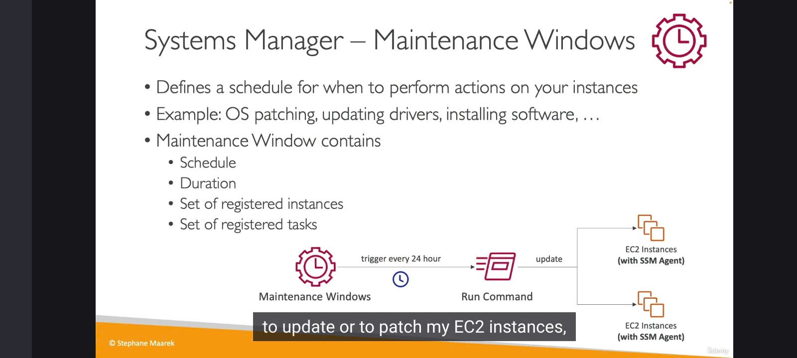
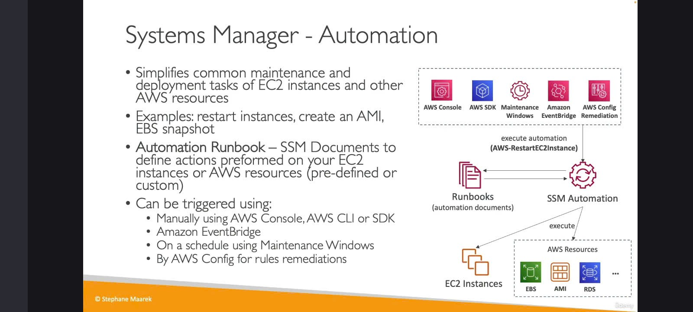

 Chúng ta sẽ tiếp tục khám phá "gia đình" AWS Systems Manager (SSM) với một vài "thành viên" khác cũng rất hữu ích.

1. SSM Run Command: Ra lệnh từ xa, không cần SSH 🗣️💻

   

* "Em là ai?": Run Command cho phép bạn thực thi một "tài liệu" (SSM Document - thực chất là một script) hoặc chỉ một lệnh đơn lẻ trên nhiều instance cùng lúc.
  * Instance ở đây có thể là EC2 hoặc máy chủ on-premises đã đăng ký với Systems Manager (tức là có SSM Agent đang chạy).
* "Điều kỳ diệu": Không cần SSH! Nó sử dụng cơ chế tương tự như Session Manager, tức là thông qua SSM Agent.
* "Kết quả đi về đâu?":
  * Output của lệnh có thể được gửi đến Amazon S3 hoặc CloudWatch Logs.
  * Thông báo trạng thái (đang chạy, thành công, thất bại,...) có thể được gửi đến Amazon SNS.
* "Ai được làm, làm gì?":
  * Tích hợp đầy đủ với IAM để kiểm soát quyền.
  * CloudTrail ghi lại ai đã chạy lệnh gì.
* "Ai gọi em dậy?": Bạn (người dùng) có thể chạy trực tiếp, hoặc Amazon EventBridge có thể tự động kích hoạt Run Command theo một sự kiện nào đó.
  Sơ đồ tóm tắt Run Command:
  Client/EventBridge ➡️ SSM Run Command ➡️ SSM Agent trên (EC2/On-prem) ➡️ Thực thi lệnh
  ↘️ Output (S3/CloudWatch Logs)
  ↘️ Status (SNS)
* 

2. SSM Patch Manager: "Bác sĩ" vá lỗi tự động 🩹🩺

   

* "Nhiệm vụ cao cả": Tự động hóa quá trình vá lỗi (patching) cho các managed instance của bạn.
  * Bao gồm cập nhật hệ điều hành, cập nhật ứng dụng, và các bản vá bảo mật.
* "Bệnh nhân": Hỗ trợ EC2 instance và máy chủ on-premises (Linux, macOS, Windows).
* "Lịch khám bệnh":
  * Vá theo yêu cầu (On-demand): Vá ngay lập tức khi bạn muốn.
  * Vá theo lịch trình: Sử dụng Maintenance Windows (sẽ nói rõ hơn ở dưới) để đặt lịch vá định kỳ.
* "Khám tổng quát":
  * Có thể quét (scan) các instance để kiểm tra tình trạng vá lỗi.
  * Tạo báo cáo tuân thủ vá lỗi (patch compliance report) để xem instance nào đã được vá đầy đủ, instance nào còn thiếu bản vá.
* "Đơn thuốc": Patch Manager thực chất sử dụng một SSM Run Command đặc biệt tên là AWS-RunPatchBaseline để thực hiện việc vá lỗi.

3. SSM Maintenance Windows: Khung giờ "Bảo trì" định kỳ 🗓️🔧

   

* "Em là gì?": Maintenance Windows cho phép bạn định nghĩa một khung thời gian cụ thể (lịch trình) để thực hiện các hành động bảo trì trên instance của mình một cách có tổ chức.
  * Ví dụ: vá lỗi hệ điều hành, cập nhật driver, cài đặt phần mềm, v.v.
* "Đặt lịch thế nào?": Khi định nghĩa một Maintenance Window, bạn cần xác định:
  * Lịch trình (Schedule): Khi nào nó sẽ được kích hoạt (ví dụ: mỗi Chủ Nhật lúc 2 giờ sáng).
  * Thời lượng (Duration): Nó sẽ chạy trong bao lâu (ví dụ: 4 tiếng).
  * Mục tiêu (Targets): Áp dụng cho những instance nào.
  * Tác vụ (Tasks): Những hành động/lệnh nào sẽ được thực thi trong khung giờ đó (ví dụ: chạy Patch Manager, chạy một Run Command cụ thể).
* Ví dụ: Cứ mỗi 24 giờ, Maintenance Window sẽ kích hoạt một Run Command để vá lỗi cho các EC2 instance.

4. SSM Automation: "Pháp sư" tự động hóa đa năng 🧙‍♂️✨

   

* "Siêu năng lực": SSM Automation giúp bạn đơn giản hóa các tác vụ bảo trì và triển khai phổ biến không chỉ trên EC2 instance mà còn trên các tài nguyên AWS khác nữa.
* "Làm được gì nè?":
  * Khởi động lại nhiều instance cùng lúc.
  * Tạo AMI (Amazon Machine Image).
  * Tạo EBS snapshot.
  * Tạo snapshot cho RDS database.
  * Và nhiều tác vụ khác...
* "Bí kíp": Automation sử dụng các "Automation Runbook" (cũng là một dạng SSM Document) để định nghĩa các bước hành động được xác định trước.
* "Ai có thể triệu hồi?":
  * Console, SDK, CLI.
  * Amazon EventBridge.
  * Maintenance Windows.
  * AWS Config: Đây là một tích hợp hay! Nếu AWS Config phát hiện một tài nguyên nào đó không tuân thủ quy định (non-compliant), nó có thể tự động kích hoạt một SSM Automation runbook để thực hiện hành động khắc phục (remediation).
    "Nhét túi" mang vào phòng thi 🎯
    Đối với những dịch vụ này trong Systems Manager, bạn chỉ cần nhớ ý chính:
* Run Command: Chạy script/lệnh trên nhiều instance không cần SSH. Ghi output, gửi thông báo.
* Patch Manager: Tự động vá lỗi (OS, application), báo cáo tuân thủ.
* Maintenance Windows: Lên lịch cho các hoạt động bảo trì định kỳ (bao gồm cả việc chạy Patch Manager hoặc Run Command).
* Automation: Tự động hóa các tác vụ bảo trì/triển khai rộng hơn, không chỉ cho EC2 mà cả các tài nguyên AWS khác, có khả năng tích hợp với AWS Config để tự khắc phục lỗi.

Tất cả chúng đều tận dụng SSM Agent và có khả năng tích hợp sâu với các dịch vụ khác của AWS như IAM, CloudTrail, S3, CloudWatch Logs, SNS, và EventBridge.
