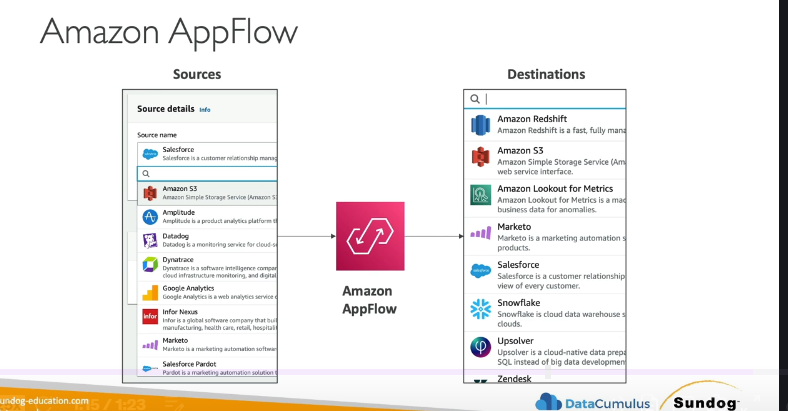

## Amazon AppFlow là gì? 🔄

**Amazon AppFlow** là một dịch vụ **tích hợp được quản lý hoàn toàn**, cho phép bạn dễ dàng **truyền dữ liệu giữa các ứng dụng SaaS (Software-as-a-Service) và các dịch vụ của AWS**.

Nói đơn giản, thay vì bạn phải tự viết code phức tạp để kết nối và lấy dữ liệu từ các dịch vụ như Salesforce hay Slack, AppFlow sẽ làm việc đó giúp bạn chỉ với vài cú click chuột.

---

## Các "Nhân vật chính" trong AppFlow ↔️

* **Nguồn dữ liệu (Sources):** Đây là các ứng dụng SaaS mà AppFlow có thể lấy dữ liệu từ:

  * **Salesforce** (Rất quan trọng cần nhớ cho kỳ thi!)
  * SAP
  * Zendesk
  * Slack
  * ServiceNow
* **Đích đến (Destinations):** Dữ liệu từ các nguồn trên có thể được chuyển đến:

  * **Amazon S3**
  * **Amazon Redshift**
  * Và thậm chí cả các dịch vụ không phải của AWS như Snowflake hay đẩy ngược lại Salesforce.

    

---

## Các tính năng nổi bật ✨

* **Lên lịch linh hoạt:** Bạn có thể thiết lập luồng dữ liệu chạy:
  * Theo một lịch trình định sẵn (on a schedule).
  * Khi có một sự kiện cụ thể xảy ra (in response to specific events).
  * Chạy theo yêu cầu (on demand).
* **Biến đổi dữ liệu:** AppFlow tích hợp sẵn các khả năng xử lý dữ liệu đơn giản như **lọc (filtering)** và **xác thực (validation)**.
* **Bảo mật:** Dữ liệu được **mã hóa khi truyền đi**. Bạn cũng có thể chọn truyền dữ liệu một cách riêng tư qua mạng của AWS bằng **AWS PrivateLink**.

---

## Lợi ích cốt lõi ✅

Lợi ích lớn nhất của AppFlow là **tiết kiệm thời gian và công sức**. Bạn không cần phải viết và duy trì các đoạn code tích hợp phức tạp nữa, chỉ cần cấu hình luồng dữ liệu và sử dụng.

---

## "Chốt hạ" cho Kỳ thi 📝

* Hãy nghĩ đến **Amazon AppFlow** khi bạn cần **truyền dữ liệu giữa các ứng dụng SaaS (đặc biệt là Salesforce) và các dịch vụ AWS** (như S3, Redshift).
* Đây là một dịch vụ **fully managed, low-code/no-code**, giúp đơn giản hóa việc tích hợp.
* Nó có các tính năng tích hợp sẵn như **biến đổi dữ liệu** và **truyền dữ liệu an toàn**.
