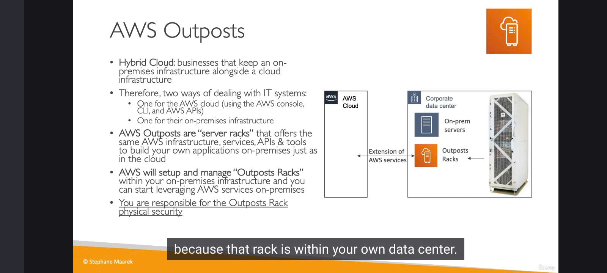

**AWS Outposts**. Dịch vụ này mang cả "đám mây" AWS về tận "sân nhà" của bạn đó! ☁️➡️🏠

---
## Bối cảnh: "Đám mây lai" (Hybrid Cloud) và những trăn trở 🤔

- **Hybrid Cloud là gì?** Đó là khi các doanh nghiệp duy trì cả hạ tầng tại chỗ (on-premises data center) song song với hạ tầng trên cloud (ví dụ: AWS).
- **Thách thức:** Khi đó, họ phải làm việc với hai hệ thống CNTT khác nhau:
    - **Với AWS:** Dùng Console, CLI, API của AWS.
    - **Với On-premises:** Dùng các công cụ quản lý riêng của hạ tầng tại chỗ.
    - Điều này đòi hỏi hai bộ kỹ năng khác nhau, hai loại API khác nhau, gây ra sự phức tạp trong vận hành.

AWS nhận thấy điều này và đã tạo ra **Outposts** để giải quyết!

---
## AWS Outposts là gì mà "ghê gớm" vậy? 🚀

**AWS Outposts** là các **tủ rack máy chủ (server racks)** mà AWS cung cấp, mang đến **đúng hạ tầng, dịch vụ, API và công cụ của AWS** để bạn xây dựng ứng dụng của mình **ngay tại trung tâm dữ liệu on-premises**, y hệt như khi bạn làm trên cloud.

- **Cách hoạt động:**
    - AWS sẽ đến tận nơi, **lắp đặt và quản lý** các tủ rack Outposts này ngay trong trung tâm dữ liệu của bạn.
    - Các server này được cài đặt sẵn các dịch vụ AWS quen thuộc, và bạn có thể sử dụng chúng ngay tại chỗ.
- **Hình dung:** Giờ đây, trong trung tâm dữ liệu của công ty bạn, sẽ có những tủ rack "made by AWS", cho phép bạn mở rộng các dịch vụ AWS vào tận nhà mình. Quá ấn tượng phải không!

---
## Một điểm khác biệt quan trọng về Bảo mật 🛡️

- Khi bạn chạy EC2 instance trên cloud, AWS lo phần an ninh vật lý cho server.
- Nhưng với EC2 instance chạy trên Outposts (tức là server đặt tại trung tâm dữ liệu của bạn), thì **BẠN phải chịu trách nhiệm về an ninh vật lý** cho chính cái tủ rack đó. Điều này cũng dễ hiểu thôi, vì nó nằm trong "nhà" của bạn mà.

---
## Lợi ích "Vàng" khi sử dụng Outposts ✨

1.  **Truy cập Độ trễ Thấp (Low Latency Access):** Các hệ thống on-premises của bạn giờ đây có thể truy cập các dịch vụ AWS (chạy trên Outposts) với độ trễ cực thấp.
2.  **Xử lý Dữ liệu Tại chỗ (Local Data Processing):** Dữ liệu có thể được xử lý ngay tại on-premises mà không cần phải gửi lên cloud, rất quan trọng cho các ứng dụng nhạy cảm về độ trễ hoặc băng thông.
3.  **Lưu trữ Dữ liệu Tại chỗ (Data Residency):** Đáp ứng các yêu cầu nghiêm ngặt về việc dữ liệu phải được lưu trữ trong một quốc gia hoặc một địa điểm cụ thể (vì nó nằm ngay trong data center của bạn).
4.  **Lộ trình Di chuyển Dễ dàng hơn:** Outposts có thể là một bước đệm. Bạn di chuyển từ on-premises "truyền thống" sang Outposts trước (vẫn dùng công cụ AWS quen thuộc), rồi khi sẵn sàng, bạn có thể di chuyển tiếp từ Outposts lên "full cloud".
5.  **Dịch vụ Được Quản lý Hoàn toàn:** AWS sẽ quản lý phần cứng và phần mềm của Outposts cho bạn.

---
## Các dịch vụ AWS có thể chạy trên Outposts (Ví dụ) ⚙️

Bạn có thể chạy rất nhiều dịch vụ quen thuộc trên Outposts, ví dụ:

- Amazon EC2 (Máy chủ ảo)
- Amazon EBS (Lưu trữ khối)
- Amazon S3 (Lưu trữ đối tượng - phiên bản trên Outposts)
- Amazon EKS (Dịch vụ Kubernetes)
- Amazon ECS (Dịch vụ Container)
- Amazon RDS (Cơ sở dữ liệu quan hệ)
- Amazon EMR (Xử lý dữ liệu lớn)
- Và danh sách này vẫn đang tiếp tục được mở rộng!

---
## "Chốt hạ" cho Kỳ thi 📝

- **AWS Outposts** = **Phần cứng và dịch vụ AWS chạy ngay trong trung tâm dữ liệu on-premises của bạn.**
- **Mục đích:** Giải quyết thách thức của hybrid cloud bằng cách cung cấp một **trải nghiệm AWS nhất quán** cả ở on-premises và trên cloud.
- **Lợi ích chính:** Độ trễ thấp cho hệ thống local, xử lý dữ liệu tại chỗ, đáp ứng data residency.
- **Lưu ý quan trọng:** Bạn chịu trách nhiệm về **an ninh vật lý** cho tủ rack Outposts.

AWS Outposts thực sự là một bước tiến mang tính cách mạng, giúp thu hẹp khoảng cách giữa on-premises và cloud. 
