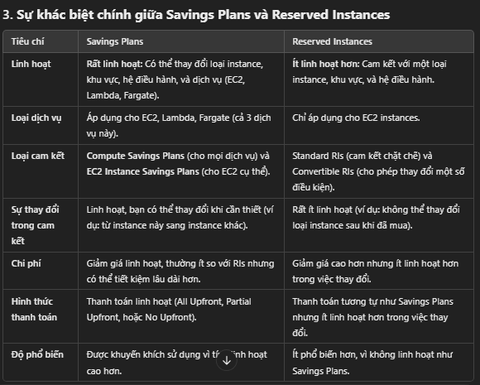

### EC2 Instance Purchasing Options: 

#### 1. **On-Demand Instances** 
- **Đặc điểm:**
  - Phù hợp cho **khối lượng công việc ngắn** hoặc không dự đoán được.
  - Không cần cam kết dài hạn, trả tiền **theo giây** (Linux/Windows, sau phút đầu tiên) hoặc **theo giờ** (các hệ điều hành khác).
  - Chi phí **cao nhất** so với các lựa chọn khác nhưng linh hoạt nhất.
- **Ứng dụng phù hợp:** 
  - Dùng cho ứng dụng có khối lượng công việc không liên tục hoặc không thể đoán trước, ví dụ như ứng dụng thử nghiệm, phát triển.

---

#### 2. **Reserved Instances (RI)**
- **Đặc điểm:**
  - Giảm giá lên đến **72%** so với On-Demand.
  - Yêu cầu **cam kết thời gian dài**: 1 năm (giảm ít hơn) hoặc 3 năm (giảm nhiều hơn).
  - Các lựa chọn thanh toán: Không trả trước, Trả trước một phần, Trả toàn bộ trước (tăng giảm giá lần lượt).
- **Ứng dụng phù hợp:**
  - **Công việc ổn định và lâu dài**, ví dụ như cơ sở dữ liệu.
  - Có thể bán lại trong **Reserved Instance Marketplace** nếu không sử dụng.
- **Convertible Reserved Instances:** Linh hoạt thay đổi loại instance, gia đình instance, hệ điều hành... nhưng giảm giá thấp hơn (khoảng 66%).

---

#### 3. **Savings Plans**
- **Đặc điểm:**
  - Giảm giá tương tự Reserved Instances (lên đến **72%**).
  - Cam kết **một mức sử dụng cố định** (ví dụ: $10/giờ) trong 1 hoặc 3 năm.
  - Linh hoạt hơn so với Reserved Instances:
    - Chuyển đổi kích thước instance (ví dụ: m5.xlarge sang m5.2xlarge).
    - Chuyển đổi hệ điều hành hoặc tenancy (Shared, Dedicated).
- **Ứng dụng phù hợp:** 
  - Các tổ chức muốn cam kết sử dụng lâu dài với chi phí cố định.

---

#### 4. **Spot Instances**
- **Đặc điểm:**
  - Giảm giá lên đến **90%** so với On-Demand.
  - Giá cả biến động theo **cung và cầu**. Nếu giá Spot vượt mức giá tối đa của bạn, instance sẽ bị **tự động thu hồi**.
  - **Không phù hợp** cho các công việc quan trọng, nhưng rất tốt cho:
    - Xử lý hàng loạt (batch processing).
    - Phân tích dữ liệu.
    - Các công việc phân tán và linh hoạt thời gian.
- **Ứng dụng phù hợp:** 
  - Khối lượng công việc không yêu cầu tính liên tục, ví dụ: xử lý ảnh, học máy.

---

#### 5. **Dedicated Hosts**
- **Đặc điểm:**
  - Một **máy chủ vật lý** được dành riêng cho bạn, cho phép:
    - Tuân thủ các yêu cầu pháp lý hoặc quy định.
    - Sử dụng giấy phép phần mềm theo CPU/nhân hoặc máy ảo của bạn (Bring Your Own License - BYOL).
  - Các tùy chọn thanh toán: Trả theo giây (On-Demand) hoặc cam kết 1/3 năm.
- **Ứng dụng phù hợp:** 
  - Các công ty có yêu cầu cao về tuân thủ hoặc cần kiểm soát phần cứng chi tiết.

---

#### 6. **Dedicated Instances**
- **Đặc điểm:**
  - Chạy trên phần cứng chỉ dành riêng cho bạn, nhưng:
    - **Không kiểm soát** được vị trí instance (có thể di chuyển sau khi dừng/chạy lại).
  - Không chia sẻ phần cứng với khách hàng khác, nhưng có thể chia sẻ giữa các instance trong cùng tài khoản.
- **Ứng dụng phù hợp:** Khi cần tránh chia sẻ tài nguyên nhưng không yêu cầu mức kiểm soát cao như Dedicated Hosts.

---

#### 7. **Capacity Reservations**
- **Đặc điểm:**
  - Đặt trước dung lượng **On-Demand** trong một **Vùng sẵn sàng (AZ)** cụ thể.
  - Không có cam kết thời gian: có thể tạo và hủy bất cứ lúc nào.
  - Kết hợp với Reserved Instances hoặc Savings Plans để giảm chi phí.
- **Ứng dụng phù hợp:**
  - Công việc ngắn hạn, không gián đoạn, cần chắc chắn tài nguyên sẽ luôn sẵn có.

---

### So sánh qua ví dụ thực tế
Giả sử instance **m4.large** tại **us-east-1**:
- **On-Demand:** $0.10/giờ.
- **Spot Instance:** $0.038 - $0.039/giờ (giảm đến 61%).
- **Reserved (1 năm, không trả trước):** $0.062/giờ.
- **Savings Plan (1 năm):** Tương tự Reserved Instances.
- **Reserved (3 năm, trả toàn bộ trước):** $0.037/giờ.

---

### Gợi ý lựa chọn
- **On-Demand:** Khi cần linh hoạt, không chắc chắn khối lượng công việc.
- **Reserved/Savings Plans:** Khi bạn có ứng dụng ổn định và cam kết dài hạn.
- **Spot Instances:** Tối ưu chi phí, nhưng cần chấp nhận rủi ro mất instance.
- **Dedicated Hosts:** Đáp ứng nhu cầu tuân thủ nghiêm ngặt hoặc phần mềm đặc biệt.
- **Capacity Reservations:** Đảm bảo tài nguyên cho công việc ngắn hạn nhưng quan trọng.

---------------------spot instance 

### Hướng Dẫn Toàn Diện về EC2 Spot Instances  

EC2 Spot Instances là một dịch vụ trên Amazon Web Services (AWS) mang lại khả năng tiết kiệm chi phí đáng kể, phù hợp cho các workload có khả năng chịu lỗi hoặc bị gián đoạn. Bài viết này sẽ cung cấp chi tiết về cách hoạt động, các chiến lược tối ưu chi phí, quản lý Spot Instances và ứng dụng thực tế.  

---

### 1. **Giới Thiệu EC2 Spot Instances**  

**EC2 Spot Instances** là các phiên bản EC2 được cung cấp với giá chiết khấu lớn (lên đến **90%** so với On-Demand Instances). Tuy nhiên, Spot Instances không được đảm bảo liên tục hoạt động, vì AWS có thể thu hồi chúng khi giá Spot tăng vượt mức giá tối đa mà bạn đã đặt hoặc khi tài nguyên bị giới hạn.  

- **Nguyên tắc hoạt động:**  
  - Bạn đặt **max price** mà bạn sẵn sàng trả.  
  - Spot Instance được cấp nếu giá Spot hiện tại ≤ max price.  
  - Khi giá Spot > max price, AWS sẽ thông báo trước **2 phút** để bạn xử lý:  
    - **Stop:** Dữ liệu được lưu trữ trên ổ đĩa EBS.  
    - **Terminate:** Phiên làm việc bị hủy, dữ liệu không được giữ lại.  

**Lưu ý quan trọng:**  
Spot Instances rất phù hợp cho các workload có khả năng bị gián đoạn, nhưng không lý tưởng cho các ứng dụng cần tính ổn định cao như cơ sở dữ liệu hoặc hệ thống giao dịch thời gian thực.  

---

<!-- lỗi thời ### 2. **Spot Block: Giải Pháp Duy Trì Liên Tục Ngắn Hạn**  

**Spot Block** cho phép bạn giữ Spot Instances trong một khoảng thời gian cố định từ **1 đến 6 giờ**, mà ít khả năng bị gián đoạn. Tuy nhiên, trong một số trường hợp hiếm, AWS có thể thu hồi Spot Block nếu tài nguyên khan hiếm.  

- **Đặc điểm chính:**  
  - Đảm bảo tính liên tục trong thời gian ngắn.  
  - Phù hợp với các workload có thời gian chạy xác định, chẳng hạn như:  
    - **Batch processing.**  
    - **Data analysis.**  
    - **Temporary workloads.**  
  - Không phù hợp với các hệ thống yêu cầu **high availability** hoặc thời gian chạy không xác định.  

--- -->

### 3. **Spot Fleets: Cách Tối Ưu Hóa Spot Instances**  

**Spot Fleet** là một nhóm các Spot Instances (có thể kết hợp với On-Demand Instances), được sử dụng để đảm bảo đáp ứng năng lực tài nguyên theo nhu cầu với chi phí thấp nhất.  

#### **Tính năng chính của Spot Fleets:**  
1. **Cấu hình linh hoạt:**  
   - Cho phép định nghĩa nhiều **launch pools** dựa trên:  
     - **Instance type** (ví dụ: `m5.large`, `t3.micro`).  
     - **Availability Zones.**  
     - **Operating System (OS).**  
   - Spot Fleet tự động chọn từ các nhóm khởi chạy để đạt được hiệu suất và chi phí tối ưu.  

2. **Quản lý chi phí và năng lực:**  
   - Tự động dừng khởi chạy khi đạt **target capacity** hoặc chi phí tối đa.  
                            3. Target Capacity là gì?
                Target capacity là tổng số tài nguyên tính toán (compute capacity) mà bạn muốn đạt được thông qua Spot Fleet.

                Được đo lường bằng number of instances hoặc vCPUs (số lượng CPU ảo).
                Ví dụ:
                Bạn có thể đặt target capacity là 10 instances, nghĩa là Spot Fleet sẽ cố gắng khởi chạy đủ 10 Spot Instances để đáp ứng yêu cầu của bạn.
                Hoặc đặt target capacity là 20 vCPUs, Spot Fleet sẽ phân bổ đủ số lượng instances với tổng tài nguyên CPU đạt mức 20 vCPUs.
                Tự động dừng khởi chạy:

                Khi Spot Fleet đã đạt được target capacity, nó sẽ ngừng khởi chạy thêm instances, giúp kiểm soát chi phí và tránh vượt mức tài nguyên cần thiết.

     - Giúp bạn tiết kiệm tài nguyên và tránh chi phí phát sinh không mong muốn.  

#### **Chiến lược phân bổ Spot Instances:**  
- **lowestPrice:** Chọn từ nhóm(launch pools)0 có giá thấp nhất.  
  - Phù hợp với workload ngắn hạn, ưu tiên giảm chi phí.  

- **diversified:** Phân bổ đều trên các nhóm khởi chạy.  
          Ý nghĩa trong chiến lược diversified:

          Khi sử dụng chiến lược diversified, Spot Fleet sẽ phân bổ các Spot Instances đồng đều trên tất cả các launch pools.
          Điều này đảm bảo rằng nếu một pool nào đó không khả dụng hoặc giá tăng, các instance ở pool khác vẫn có thể hoạt động, tăng tính sẵn sàng cho workload.
  - Tăng tính sẵn sàng, phù hợp với workload dài hạn.  

- **capacityOptimized:** Chọn từ nhóm có dung lượng tốt nhất.  
              . Capacity Optimized: Chọn từ nhóm có dung lượng tốt nhất
              Dung lượng (capacity) ở đây đề cập đến khả năng sẵn có của Spot Instances trong một launch pool.

              Khả năng sẵn có cao: Một launch pool có nhiều tài nguyên nhàn rỗi hơn, tức là AWS có thể cung cấp Spot Instances ổn định hơn từ pool đó.
              Lợi ích của capacityOptimized:
              Giảm nguy cơ bị thu hồi Spot Instances do thiếu tài nguyên trong pool.
              Đảm bảo workload có thể chạy liên tục lâu hơn so với chiến lược chỉ dựa trên giá thấp nhất (lowestPrice).
              Ví dụ:
              Nếu một pool ở us-east-1a có nhiều Spot Instances khả dụng hơn pool ở us-east-1b, chiến lược capacityOptimized sẽ ưu tiên chọn us-east-1a.

  - Giảm nguy cơ gián đoạn, đảm bảo hiệu năng.  
- **priceCapacityOptimized (khuyến nghị):**  
  - Kết hợp các nhóm có dung lượng cao nhất và giá thấp nhất, mang lại hiệu quả toàn diện.  

---

### 4. **Quản Lý Spot Instances**

#### **Hủy và Kết Thúc Spot Instances:**  
Quản lý Spot Instances yêu cầu thực hiện theo trình tự sau:  
1. **Hủy Spot Request:**  
   - Có thể hủy các yêu cầu đang mở, hoạt động hoặc bị vô hiệu hóa.  
2. **Kết thúc Spot Instances:**  
   - Sau khi hủy Spot Request, bạn cần tự tay kết thúc các Spot Instances đã khởi chạy.  

> **Lưu ý:** Việc hủy Spot Request không tự động kết thúc các Spot Instances liên quan.  

---

### 5. **Ưu Điểm và Hạn Chế**  

#### **Ưu Điểm:**  
- **Tiết kiệm chi phí lớn:** Giảm tối đa **90%** so với On-Demand Instances.  
- **Tăng tính linh hoạt:** Hỗ trợ nhiều chiến lược triển khai, đáp ứng các nhu cầu ứng dụng khác nhau.  
- **Tối ưu hóa tài nguyên nhàn rỗi:** Giúp tận dụng tối đa cơ sở hạ tầng AWS.  

#### **Hạn Chế:**  
- **Khả năng bị gián đoạn:** Phụ thuộc vào cung cầu tài nguyên và mức giá hiện tại.  
- **Không phù hợp cho workload quan trọng:** Các hệ thống yêu cầu độ tin cậy cao như cơ sở dữ liệu.  

---

### 6. **Ứng Dụng Thực Tế**  

#### **Các công việc lý tưởng:**  
1. **Batch processing:** Xử lý dữ liệu hàng loạt với thời gian thực hiện linh hoạt.  
2. **Data analysis:** Tận dụng chi phí thấp để chạy các workload phân tích lớn.  
3. **Resilient workloads:** Các ứng dụng không yêu cầu tính liên tục cao.  

#### **Các công việc không phù hợp:**  
- **Mission-critical systems:** Cơ sở dữ liệu, hệ thống giao dịch thời gian thực.  
- **High availability applications:** Không đảm bảo tính ổn định liên tục.  

---

### Kết Luận  

**EC2 Spot Instances** là lựa chọn tuyệt vời để tối ưu chi phí trong các workload không yêu cầu tính liên tục cao. Việc sử dụng **Spot Fleet** với chiến lược **priceCapacityOptimized** giúp đảm bảo hiệu suất tốt nhất với giá thành thấp. Tuy nhiên, cần cân nhắc kỹ nếu workload của bạn yêu cầu **high availability** hoặc không thể bị gián đoạn.  