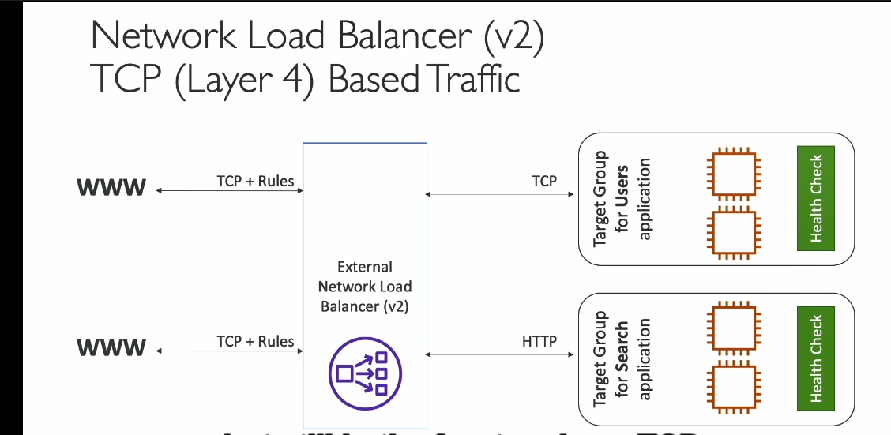
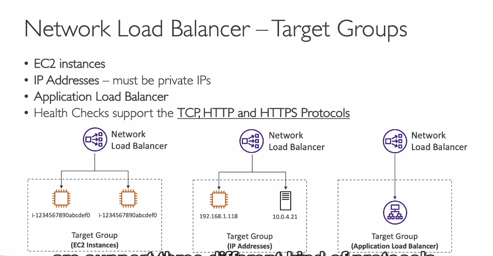

---

### 1. **Định nghĩa và Lớp Hoạt Động**
- **NLB** là **load balancer ở tầng 4** (Layer 4) trong mô hình OSI, nghĩa là xử lý lưu lượng **TCP** và **UDP**.
- Khác với **Application Load Balancer (ALB)** hoạt động ở tầng 7 (Layer 7 - HTTP/HTTPS), NLB tập trung vào các giao thức cấp thấp như **TCP** và **UDP**.

---

### 2. **Hiệu suất**
- **Hiệu suất rất cao**: NLB có khả năng xử lý **hàng triệu yêu cầu mỗi giây**.
- **Độ trễ cực thấp**: Phù hợp cho các ứng dụng yêu cầu tốc độ xử lý nhanh chóng.

---

### 3. **Địa chỉ IP tĩnh**
- **Địa chỉ IP tĩnh trên mỗi Availability Zone (AZ)**:
  - Mỗi AZ chỉ có **một IP tĩnh**.
  - Có thể gán **Elastic IP (EIP)** cho từng AZ.
- Điều này giúp ứng dụng có thể được truy cập thông qua **một hoặc một tập hợp IP tĩnh cụ thể**.
  - Ví dụ: Nếu đề bài yêu cầu giới hạn số lượng IP, chọn NLB là lựa chọn phù hợp.

---

### 4. **Sử dụng và Giá**
- **Không nằm trong AWS Free Tier**.
- **Cách sử dụng**:
  - Tạo **Target Groups** (nhóm mục tiêu).
  - NLB định tuyến lưu lượng đến các nhóm mục tiêu dựa trên giao thức TCP hoặc UDP.

---

### 5. **Target Groups**
- Các **mục tiêu** có thể là:
  - **EC2 Instances**: NLB gửi lưu lượng TCP hoặc UDP trực tiếp đến EC2.
  - **Địa chỉ IP**: 
    - Là các **private IPs** được cấu hình thủ công.
    - Dùng để chuyển tiếp lưu lượng đến:
      - **EC2 Instances**.
      - **Server trong trung tâm dữ liệu tại chỗ** (On-premises data center).
    - Cho phép NLB front-end cả hạ tầng AWS và tại chỗ.
      
---

### 6. **Kết hợp với Application Load Balancer**
- Có thể đặt **NLB trước ALB**:
  - **NLB** cung cấp địa chỉ IP cố định.
  - **ALB** xử lý các quy tắc nâng cao cho HTTP/HTTPS.
  - Thích hợp khi cần kết hợp khả năng xử lý của cả hai loại.

---

### 7. **Health Checks**
- **NLB Target Groups** hỗ trợ 3 giao thức kiểm tra tình trạng:
  - **TCP**
  - **HTTP**
  - **HTTPS**
- Tùy vào giao thức ứng dụng backend, bạn có thể cấu hình health checks tương ứng.

---

### 8. **Khi nào chọn NLB?**
- Khi ứng dụng yêu cầu:
  - **Hiệu suất cực cao** hoặc **độ trễ thấp**.
  - **Giao thức TCP/UDP**.
  - **Địa chỉ IP tĩnh**. 
  Tên DNS của NLB (ví dụ: my-nlb-123456.elb.amazonaws.com) được thiết lập để trỏ đến tất cả các IP tĩnh của NLB trong mọi AZ.
    [khác với alb như nào ](../lý-thuyết-bên-lề/ip-tĩnh-của-nlb-vs-dns-alb.md)
  Khi client thực hiện truy vấn DNS, hệ thống DNS sẽ trả về danh sách các IP tĩnh (mỗi IP tương ứng với một AZ).
  - Tính sẵn sàng cao:
  Nếu một AZ bị lỗi, các IP tĩnh trong AZ đó sẽ không được cung cấp trong danh sách DNS trả về, hoặc client sẽ thử với các IP khác trong danh sách.
- NLB là giải pháp lý tưởng cho các ứng dụng thời gian thực, yêu cầu tốc độ và kết nối ổn định.

---

### Tổng Kết
**Network Load Balancer** là lựa chọn lý tưởng cho các ứng dụng yêu cầu xử lý TCP/UDP nhanh, địa chỉ IP tĩnh và hiệu suất cao. Nếu đề bài nhấn mạnh các yếu tố như **địa chỉ IP cố định**, **hiệu suất cao**, hoặc **giao thức tầng thấp**, thì NLB là giải pháp phù hợp.

