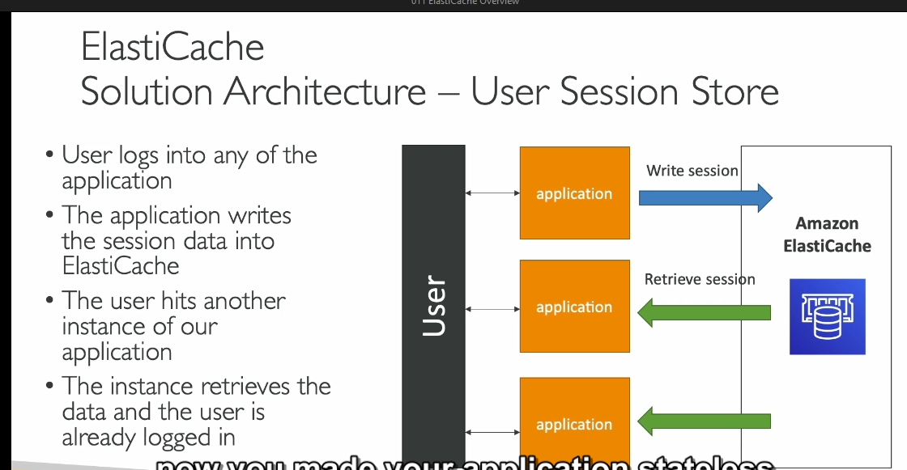

### Chi tiết về Amazon ElastiCache: Kiến thức cho Blog

#### Giới thiệu về Amazon ElastiCache
Amazon ElastiCache là một dịch vụ quản lý bộ nhớ đệm [in-memory](../lý-thuyết-bên-lề/in-memory-statless'full.md) (trong bộ nhớ) được cung cấp bởi AWS. Nó hỗ trợ hai công nghệ chính là **Redis** và **Memcached**. ElastiCache mang đến hiệu năng cao, độ trễ thấp và giúp giảm tải cho các cơ sở dữ liệu truyền thống, đặc biệt trong các khối lượng công việc đòi hỏi nhiều truy vấn đọc.

#### Lợi ích của Cache
- **Hiệu năng cao và độ trễ thấp**: Cache là cơ sở dữ liệu trong bộ nhớ, giúp cải thiện hiệu năng đáng kể so với cơ sở dữ liệu truyền thống.
- **Giảm tải cơ sở dữ liệu**: Các truy vấn thường xuyên được lưu trữ trong cache, giảm thiểu số lần truy cập trực tiếp vào cơ sở dữ liệu.
- **Tạo ứng dụng Stateless**: Lưu trạng thái của ứng dụng trong ElastiCache, hỗ trợ ứng dụng hoạt động theo hướng không lưu trạng thái.

#### Cách hoạt động của Cache
1. **Cache Hit**: Nếu dữ liệu đã tồn tại trong cache, truy vấn sẽ được xử lý ngay lập tức từ cache mà không cần truy cập vào cơ sở dữ liệu.
2. **Cache Miss**: Nếu dữ liệu không có trong cache, hệ thống sẽ lấy dữ liệu từ cơ sở dữ liệu, sau đó ghi vào cache để dùng cho các lần truy vấn tiếp theo.

Để duy trì tính nhất quán, cần một chiến lược **xóa dữ liệu cache (cache invalidation)** đảm bảo rằng dữ liệu trong cache luôn là dữ liệu mới nhất.

#### Kiến trúc mẫu sử dụng ElastiCache
Một kiến trúc phổ biến bao gồm:
- **Ứng dụng**: Truy vấn ElastiCache trước, nếu dữ liệu không có (cache miss) sẽ truy vấn cơ sở dữ liệu (như RDS).
- **Cơ sở dữ liệu RDS**: Lưu trữ dữ liệu gốc.
- **ElastiCache**: Lưu trữ các kết quả truy vấn thường xuyên để tăng tốc độ truy cập.

#### Stateless Application và ElastiCache
- **Quản lý phiên làm việc của người dùng**: Dữ liệu phiên (session) được lưu trữ trong ElastiCache. Khi người dùng chuyển sang một instance khác của ứng dụng, dữ liệu phiên sẽ được lấy từ ElastiCache, duy trì trạng thái đăng nhập mà không cần yêu cầu đăng nhập lại.
- **Lợi ích**: Ứng dụng trở nên **stateless**, dễ mở rộng và quản lý.

#### So sánh Redis và Memcached
| **Đặc điểm**            | **Redis**                                         | **Memcached**                               |
|--------------------------|---------------------------------------------------|---------------------------------------------|
| **Khả dụng cao**         | Hỗ trợ Multi-AZ với Auto-Failover                 | Không hỗ trợ                                |
| **Đọc mở rộng**          | Có (Read Replicas)                                | Không                                       |
| **Dữ liệu bền vững**     | Hỗ trợ (AOF persistence, Backup & Restore)        | Không                                       |
| **Tính năng bổ sung**    | Sets, Sorted Sets, Pub/Sub, Streams               | Chỉ lưu dữ liệu dạng key-value đơn giản    |
| **Kiến trúc**            | Đơn luồng                                        | Đa luồng                                   |
| **Phân mảnh dữ liệu**    | Có (Cluster Mode)                                | Có (Sharding)                              |
| **Sử dụng chính**        | Cần độ bền dữ liệu, khả dụng cao                  | Bộ nhớ đệm đơn giản, không cần dữ liệu bền |

#### Kết luận
Redis và Memcached đều có ưu điểm riêng, tùy thuộc vào nhu cầu cụ thể của hệ thống:
- **Redis**: Thích hợp khi cần khả năng chịu lỗi, độ bền dữ liệu và tính năng mở rộng đọc.
- **Memcached**: Phù hợp cho các ứng dụng yêu cầu bộ nhớ đệm nhanh, đơn giản và không yêu cầu dữ liệu bền.

---
### Các Tính Năng Bảo Mật của ElastiCache

1. **Xác thực IAM cho Redis**:
   - ElastiCache hỗ trợ xác thực **IAM** cụ thể cho **Redis**. Điều này có nghĩa là bạn có thể sử dụng các **vai trò IAM AWS** để quản lý quyền truy cập cho Redis, mang lại một mức độ kiểm soát bảo mật chi tiết hơn về những người có thể tương tác với tài nguyên Redis của bạn.

2. **Xác thực bằng tên người dùng và mật khẩu cho các dịch vụ khác**:
   - Đối với các loại kho dữ liệu khác trong ElastiCache (như Memcached), ElastiCache sử dụng **xác thực bằng tên người dùng và mật khẩu**. Đây là một phương pháp bảo mật đơn giản và phổ biến để kiểm soát quyền truy cập.

3. **Các chính sách IAM cho quyền API của AWS**:
   - Khi bạn định nghĩa các chính sách **IAM** cho ElastiCache, những chính sách này chỉ kiểm soát quyền truy cập vào các hoạt động API của AWS (ví dụ: tạo, xóa hoặc quản lý các cụm ElastiCache). Các chính sách IAM không kiểm soát quyền truy cập trực tiếp vào dữ liệu Redis hoặc Memcached; chúng chỉ áp dụng cho các tương tác với dịch vụ AWS.

4. **Redis AUTH**:
   - Trong Redis, có một cơ chế bảo mật gọi là **Redis AUTH**, cho phép bạn đặt một mật khẩu và token khi tạo cụm Redis. Điều này cung cấp một lớp bảo mật bổ sung cho bộ nhớ cache của bạn trên lớp bảo mật nhóm bảo mật (security group) của AWS. Nó giúp bảo vệ chống lại các cuộc tấn công xâm nhập và truy cập trái phép vào Redis.

5. **Bảo mật SSL trong quá trình truyền tải**:
   - ElastiCache cũng hỗ trợ mã hóa **SSL** trong quá trình truyền tải dữ liệu (in-flight encryption), giúp bảo vệ dữ liệu khỏi các cuộc tấn công qua mạng.

### 2. Các Chiến Lược Tải Dữ Liệu vào ElastiCache

ElastiCache hỗ trợ ba kiểu chiến lược tải dữ liệu chính:

1. **Lazy Loading**:
   - Trong chiến lược này, toàn bộ dữ liệu đọc được lưu trữ trong bộ nhớ cache, nhưng dữ liệu có thể bị lỗi thời (stale). Điều này có thể xảy ra nếu dữ liệu bị thay đổi trong cơ sở dữ liệu nhưng chưa được cập nhật trong bộ nhớ cache.

2. **Write Through**:
   - Khi có một lệnh thêm hoặc cập nhật dữ liệu trong cơ sở dữ liệu, nó cũng sẽ tự động được thêm vào bộ nhớ cache của ElastiCache. Dữ liệu trong cache luôn được đồng bộ với dữ liệu từ cơ sở dữ liệu, do đó không có dữ liệu bị lỗi thời.

3. **Session Store**:
   - ElastiCache có thể được sử dụng như một nơi lưu trữ phiên (session store). Bạn có thể thiết lập thời gian hết phiên (time-to-live) để dữ liệu phiên bị xóa tự động, giúp quản lý và tối ưu hóa không gian lưu trữ.

### 3. Các vấn đề phức tạp với Caching

Caching (bộ nhớ đệm) là một chủ đề phức tạp trong khoa học máy tính. Nó liên quan đến việc quản lý sự hết hạn và cập nhật dữ liệu khi cần thiết. Có một câu nói nổi tiếng trong khoa học máy tính rằng: "Có hai điều khó khăn nhất: invalidation bộ nhớ cache và việc đặt tên cho dữ liệu." 

Caching là một vấn đề khó khăn vì dữ liệu phải được cập nhật thường xuyên và đảm bảo tính chính xác để tránh lỗi. 

### 4. Chiến lược Lazy Loading

- **Chiến lược Lazy Loading** hoạt động bằng cách kiểm tra xem ứng dụng có tìm thấy dữ liệu trong ElastiCache hay không. Nếu có, dữ liệu được trả lại ngay lập tức từ cache. Nếu không tìm thấy, dữ liệu được đọc từ cơ sở dữ liệu và sau đó được thêm vào cache. 

Chiến lược này được gọi là "Lazy Loading" vì dữ liệu chỉ được tải vào ElastiCache khi không có một bản ghi trong cache. 

### 5. Use Cases cho Redis

Redis là một trong những cơ sở dữ liệu bộ nhớ đệm phổ biến trong ElastiCache. Có một trường hợp nổi bật được đề cập là **danh sách bảng xếp hạng (leaderboard) cho game**. 

Ý tưởng của danh sách bảng xếp hạng là xác định ai đứng đầu bảng xếp hạng hiện tại, ai đứng thứ hai, và ai đứng thứ ba ở bất kỳ thời điểm nào trong game. Redis có một cấu trúc dữ liệu đặc biệt gọi là **Sorted Sets**, giúp đảm bảo tính duy nhất và thứ tự của các phần tử.

- **Sorted Sets** trong Redis cho phép xếp hạng các phần tử theo thời gian thực và luôn được giữ đúng thứ tự. Bằng cách sử dụng một cụm Redis, bạn có thể tạo ra một bảng xếp hạng game thời gian thực, nơi mọi người có thể thấy ai đứng đầu, ai đứng thứ hai, và thứ ba một cách tự động.

Redis với cấu trúc dữ liệu Sorted Sets giúp tránh việc phải viết mã phức tạp để duy trì bảng xếp hạng game, mang lại sự tiện lợi và hiệu quả cho các ứng dụng thực tế.

Tóm lại, ElastiCache là một công cụ mạnh mẽ với nhiều tính năng bảo mật và cách thức quản lý dữ liệu, giúp tối ưu hóa hiệu suất và bảo mật trong các ứng dụng.