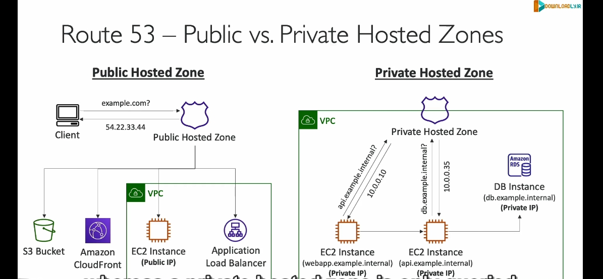

#### **DNS là gì?**
DNS (Domain Name System) là hệ thống chuyển đổi tên miền dễ đọc (như `example.com`) thành địa chỉ IP (như `192.168.1.1`) để các thiết bị có thể giao tiếp với nhau qua internet.

---

### **Tổng Quan về Amazon Route 53**
- **Khả dụng cao và mở rộng linh hoạt**: Được thiết kế để xử lý lượng lớn truy vấn một cách đáng tin cậy.
- **Quản lý hoàn toàn và có thẩm quyền**: Người dùng có toàn quyền kiểm soát và cập nhật các bản ghi DNS.
- **Đăng ký tên miền**: Route 53 cho phép bạn đăng ký tên miền tùy chỉnh như `example.com`.

---

#### **Tính năng chính của Route 53**
1. **Định tuyến lưu lượng đến tài nguyên**:
   - Chuyển đổi tên miền thành địa chỉ IP thông qua các bản ghi DNS.
   - **Ví dụ**: Khi người dùng nhập `example.com`, Route 53 ánh xạ tên miền này tới một địa chỉ IP công cộng (như `54.22.33.44`) để kết nối tới máy chủ mong muốn.

2. **Kiểm tra sức khỏe tài nguyên**:
   - Theo dõi tình trạng của các tài nguyên (như máy chủ hoặc ứng dụng) để đảm bảo chúng đang hoạt động bình thường.

3. **Cam kết SLA khả dụng 100%**:
   - Đây là dịch vụ duy nhất của AWS cung cấp SLA khả dụng 100%.

---

#### **Tại sao gọi là Route 53?**
Tên Route 53 lấy cảm hứng từ **cổng 53**, cổng tiêu chuẩn được sử dụng bởi dịch vụ DNS.

---

### **Các Bản Ghi DNS trong Route 53**

1. **Các thông tin trong một bản ghi DNS**:
   - **Tên miền**: Ví dụ, `example.com`.
   - **Loại bản ghi**: Các loại phổ biến gồm A, AAAA, CNAME, NS.
   - **Giá trị**: Địa chỉ IP (như `12.34.56.78`) hoặc tên máy chủ khác.
   - **Chính sách định tuyến**: Quy định cách Route 53 phản hồi truy vấn.
   - **TTL (Time-to-Live)**: Thời gian bản ghi được lưu trong bộ nhớ cache tại các DNS resolver.

2. **Các loại bản ghi quan trọng**:
   - **A (Address Record)**: Ánh xạ tên miền tới địa chỉ IPv4.
     - **Ví dụ**: `example.com` -> `1.2.3.4`.
   - **AAAA**: Tương tự A nhưng dành cho địa chỉ IPv6.
     - **Ví dụ**: `example.com` -> `2001:0db8::ff00:42:8329`.
   - **CNAME (Canonical Name)**: Ánh xạ một tên miền tới một tên miền khác.
     - **Lưu ý**: Không thể tạo CNAME cho tên miền gốc (như `example.com`), nhưng có thể tạo cho các tên miền phụ (như `www.example.com`).
   - **NS (Name Server)**: Xác định máy chủ tên (name server) chịu trách nhiệm trả lời truy vấn DNS cho một vùng được lưu trữ (hosted zone).

---

### **Hosted Zone trong Route 53**

#### **Khái niệm**:
- Hosted Zone là một tập hợp các bản ghi DNS, xác định cách định tuyến lưu lượng đến một tên miền hoặc các tên miền phụ.

#### **Các loại Hosted Zone**:
1. **Public Hosted Zone**:
   - Dùng cho các tên miền công khai trên internet (ví dụ, `example.com`).
   - Trả lời các truy vấn DNS từ bất kỳ người dùng nào trên internet.

2. **Private Hosted Zone**:
   - Dùng cho các tên miền nội bộ, chỉ có thể truy cập từ trong VPC (Virtual Private Cloud).
   - **Ví dụ**: `application1.company.internal` chỉ có thể được truy cập từ mạng nội bộ của công ty.

---

### **So sánh Public và Private Hosted Zone**
| **Public Hosted Zone**             | **Private Hosted Zone**               |
|------------------------------------|---------------------------------------|
| Dành cho tên miền công khai.        | Dành cho tên miền nội bộ.             |
| Trả lời truy vấn từ bất kỳ ai.      | Chỉ trả lời truy vấn từ VPC.          |
| **Ví dụ**: `example.com`.           | **Ví dụ**: `database.company.internal`.|

#### **Hoạt động của Private Hosted Zone**:
- Một EC2 instance trong VPC có thể sử dụng tên miền nội bộ (như `api.example.internal`) để giao tiếp với các tài nguyên khác trong cùng mạng.
- Route 53 sẽ trả về địa chỉ IP nội bộ của tài nguyên (ví dụ, `10.0.0.10`).

---

### **Chi phí Route 53**
- Tạo Hosted Zone: **0.50 USD/tháng**.
- Đăng ký tên miền: **Từ 12 USD/năm**.

---

### **Tóm tắt**
- **Public Hosted Zone**: Dành cho các tài nguyên công khai.
- **Private Hosted Zone**: Dành cho các tài nguyên nội bộ trong VPC.
- Route 53 cung cấp một cách mạnh mẽ và linh hoạt để quản lý DNS, định tuyến lưu lượng, và đảm bảo hoạt động ổn định cho các ứng dụng.

    Ví dụ thực tế về bản ghi ns:
    Giả sử bạn gõ www.example.com vào trình duyệt.
    Trình duyệt của bạn sẽ hỏi: “Name Server nào biết thông tin về example.com?”.
    NS Record sẽ trả lời: “Thông tin của example.com nằm ở máy chủ tên ns1.example.com và ns2.example.com.”
    Trình duyệt sau đó sẽ liên hệ với ns1.example.com để lấy địa chỉ IP của trang web.
