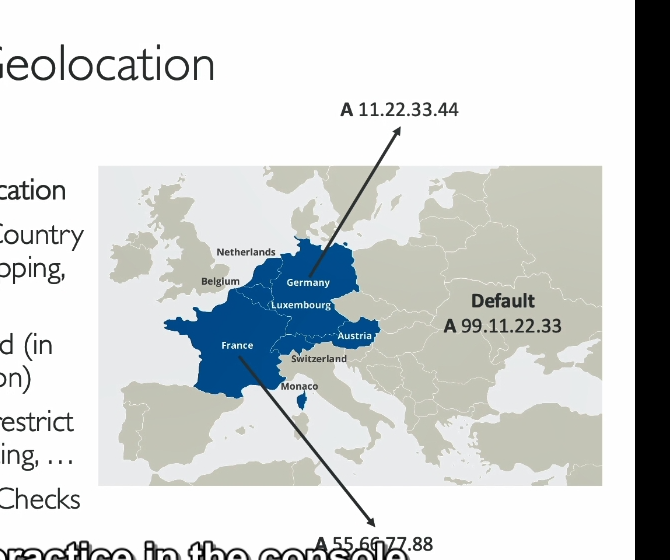

### Chính sách định tuyến: Geolocation trong AWS Route 53

Chính sách định tuyến Geolocation trong AWS Route 53 cho phép định tuyến dựa trên **vị trí thực tế của người dùng**. Điều này khác biệt với định tuyến dựa trên độ trễ (Latency-based routing), nơi lưu lượng được chuyển đến điểm cuối gần nhất với độ trễ thấp nhất. Dưới đây là phần giải thích chi tiết:

---

### 1. **Cách hoạt động của định tuyến Geolocation**
- **Dựa trên vị trí người dùng**: Định tuyến lưu lượng dựa vào vị trí, như:
  - **Cấp châu lục** (VD: Châu Âu, Châu Á).
  - **Cấp quốc gia** (VD: Hoa Kỳ, Đức).
  - **Cấp vùng cụ thể** (VD: Các tiểu bang Hoa Kỳ).
- **Ưu tiên theo độ chính xác**: Quy tắc chi tiết hơn (VD: quy tắc quốc gia) sẽ được ưu tiên hơn so với quy tắc bao quát (VD: quy tắc châu lục).
- **Bản ghi mặc định**: Cần tạo một bản ghi mặc định để xử lý các vị trí không được định nghĩa trong quy tắc. Điều này đảm bảo người dùng không thuộc khu vực nào được chỉ định vẫn có thể truy cập.

---

### 2. **Các trường hợp sử dụng**
- **Địa phương hóa website**: Cung cấp nội dung theo khu vực cụ thể (VD: website tiếng Đức cho người dùng tại Đức).
- **Hạn chế phân phối nội dung**: Kiểm soát nội dung nào được hiển thị dựa trên vị trí người dùng.
- **Cân bằng tải**: Phân phối lưu lượng dựa trên tải khu vực hoặc ưu tiên địa lý.

---

### 3. **Kết hợp Geolocation với Health Check**
- Các bản ghi Geolocation có thể được liên kết với **Route 53 Health Check**.
- Nếu một Health Check bị lỗi cho một vị trí cụ thể, lưu lượng sẽ tự động được chuyển hướng đến một vị trí mặc định hoặc dự phòng.

---

### 4. **Ví dụ thực tế: Thiết lập định tuyến Geolocation**
Giả sử bạn có ba vùng AWS:
- `ap-southeast-1` (Châu Á)
- `us-east-1` (Hoa Kỳ)
- `eu-central-1` (vị trí mặc định cho các yêu cầu không khớp)

#### **Cấu hình từng bước**
1. **Tạo bản ghi cho Châu Á**
   - Loại bản ghi: `A`
   - Chính sách định tuyến: `Geolocation`
   - Vị trí: `Asia`
   - Giá trị: Địa chỉ IP của instance trong `ap-southeast-1`.
   - Tuỳ chọn: Liên kết với Health Check.
   - ID bản ghi: VD: `Asia`.

2. **Tạo bản ghi cho Hoa Kỳ**
   - Loại bản ghi: `A`
   - Chính sách định tuyến: `Geolocation`
   - Vị trí: `United States`
   - Giá trị: Địa chỉ IP của instance trong `us-east-1`.
   - ID bản ghi: VD: `US`.

3. **Tạo bản ghi mặc định**
   - Loại bản ghi: `A`
   - Chính sách định tuyến: `Geolocation`
   - Vị trí: `Default`
   - Giá trị: Địa chỉ IP của instance trong `eu-central-1`.
   - ID bản ghi: VD: `Default-EU`.

---

### 5. **Kiểm tra định tuyến Geolocation**
- Sử dụng **VPN** để mô phỏng các yêu cầu từ các vị trí khác nhau:
  - **Từ Châu Á (VD: Ấn Độ)**: Nên chuyển hướng đến `ap-southeast-1`.
  - **Từ Hoa Kỳ**: Nên chuyển hướng đến `us-east-1`.
  - **Từ vị trí không được chỉ định (VD: Mexico)**: Nên chuyển hướng đến `eu-central-1` (mặc định).

---

### 6. **Xử lý sự cố**
- **Lỗi timeout**: Thường do cấu hình sai **Security Group**. Đảm bảo rằng:
  - Quy tắc inbound **HTTP hoặc HTTPS** đã được thêm vào Security Group của instance liên quan.
- **Health Check thất bại**: Nếu kiểm tra sức khỏe thất bại:
  - Xác minh rằng điểm cuối có thể truy cập.
  - Đảm bảo cài đặt Health Check phù hợp với đặc điểm phản hồi của điểm cuối.

---

Việc triển khai định tuyến Geolocation giúp bạn cung cấp trải nghiệm tùy chỉnh cho người dùng từ các khu vực khác nhau, đồng thời đảm bảo các cơ chế dự phòng để duy trì tính sẵn sàng cao.