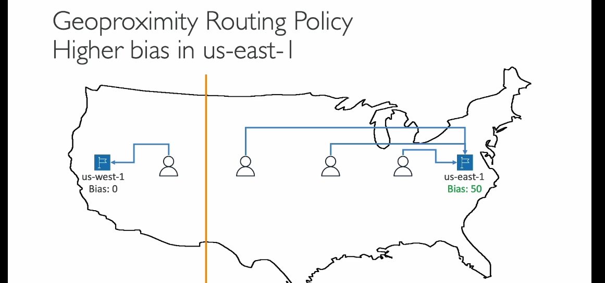

### Định tuyến Geoproximity trong AWS Route 53

Chính sách định tuyến **Geoproximity** là một tính năng nâng cao của AWS Route 53, cho phép bạn định tuyến lưu lượng truy cập dựa trên **vị trí địa lý của người dùng và tài nguyên**. Ngoài ra, bạn có thể sử dụng một tham số gọi là **bias** để kiểm soát và điều chỉnh lượng lưu lượng truy cập đến từng tài nguyên. Dưới đây là phần giải thích chi tiết:

---

### 1. **Định tuyến Geoproximity là gì?**
- **Cơ chế hoạt động**: Định tuyến lưu lượng dựa trên khoảng cách giữa vị trí của người dùng và các tài nguyên (như EC2 hoặc dữ liệu on-premise). 
- **Điều chỉnh bằng Bias**:
  - **Tăng Bias** (giá trị dương): Mở rộng phạm vi vùng, kéo nhiều lưu lượng truy cập hơn đến một tài nguyên cụ thể.
  - **Giảm Bias** (giá trị âm): Thu nhỏ phạm vi vùng, giảm lưu lượng truy cập đến tài nguyên đó.

---

### 2. **Khi nào sử dụng Geoproximity Routing?**
- **Tăng tải khu vực cụ thể**: Nếu bạn muốn chuyển hướng nhiều lưu lượng truy cập đến một khu vực có tài nguyên mạnh hơn.
- **Phân phối tải địa lý linh hoạt**: Kiểm soát lưu lượng truy cập theo từng vùng dựa trên yêu cầu cụ thể.
- **Tích hợp giữa AWS và tài nguyên On-premise**: Hỗ trợ chỉ định vị trí tài nguyên bên ngoài AWS bằng cách sử dụng tọa độ **vĩ độ** và **kinh độ**.

---

### 3. **Ví dụ thực tế**
#### Cấu hình ban đầu:
- Tài nguyên tại `us-west-1` (California) và `us-east-1` (Virginia).
- Bias được thiết lập như sau:
  - `us-west-1`: Bias = 0.
  - `us-east-1`: Bias = +50.

#### Hiệu quả:
- Nếu không có Bias, đường phân chia lưu lượng sẽ chia nước Mỹ thành hai nửa:
  - **Trái**: Lưu lượng truy cập đi đến `us-west-1`.
  - **Phải**: Lưu lượng truy cập đi đến `us-east-1`.

- Khi Bias của `us-east-1` tăng lên +50, đường phân chia sẽ dịch chuyển sang **trái**, kéo thêm người dùng từ phía giữa nước Mỹ đến `us-east-1`.

---

### 4. **Tích hợp nâng cao**
- **Route 53 Traffic Flow**:
  - Cần kích hoạt tính năng **Traffic Flow** trong Route 53 để sử dụng Geoproximity Routing và thiết lập Bias.
- **Hỗ trợ tài nguyên không thuộc AWS**:
  - Đối với các tài nguyên không thuộc AWS (VD: trung tâm dữ liệu on-premise), bạn cần chỉ định chính xác tọa độ vĩ độ và kinh độ để AWS tính toán định tuyến.

---

### 5. **Điều cần nhớ**
- **Bias**: Là tham số quan trọng giúp thay đổi kích thước vùng và điều chỉnh lưu lượng truy cập.
- **Ứng dụng thực tế**:
  - Chuyển tải đến vùng mạnh hơn khi có sự cố.
  - Hỗ trợ tối ưu hóa tài nguyên và giảm độ trễ.
- **Tích hợp với Route 53 Traffic Flow**: Cần thiết để tận dụng hết khả năng của Geoproximity Routing.

