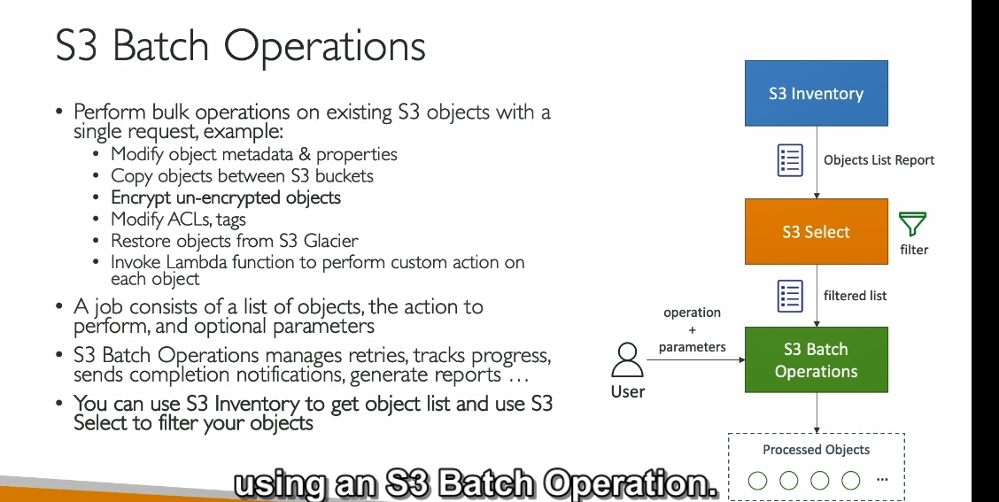

---

### **Phân tích nội dung:**

#### **Giới thiệu về S3 Batch Operation**

1. **Nội dung:**
   - S3 Batch Operation cho phép thực hiện các thao tác hàng loạt (bulk operations) trên các đối tượng S3 hiện có chỉ với một yêu cầu duy nhất.
2. **Ví dụ:**
   - Thay đổi metadata và thuộc tính của nhiều đối tượng cùng lúc.
   - Sao chép các đối tượng giữa các bucket.
   - Mã hóa lại (encrypt) tất cả các đối tượng chưa được mã hóa.
   - Thay đổi ACLs (Access Control Lists) hoặc gắn thẻ (tags).
   - Khôi phục các đối tượng từ Glacier.
   - Gọi Lambda function để thực hiện các hành động tùy chỉnh trên từng đối tượng.

#### **Cách hoạt động của S3 Batch Operation**

- Một công việc (job) bao gồm:
  - **Danh sách các đối tượng:** Được tạo từ S3 Inventory.
  - **Thao tác cần thực hiện:** Ví dụ: mã hóa hoặc sao chép.
  - **Các tham số tùy chọn:** Như cấu hình, thông báo hoàn tất, và báo cáo.

#### **Lợi ích so với tự viết script**

- Quản lý việc thử lại (retries).
- Theo dõi tiến trình.
- Gửi thông báo hoàn tất.
- Tự động tạo báo cáo.

#### **Cách tạo danh sách đối tượng**

- Sử dụng **S3 Inventory** để liệt kê các đối tượng.
- Dùng **S3 Select** để lọc danh sách theo điều kiện.

#### **Ứng dụng chính**

- Tìm các đối tượng chưa mã hóa và mã hóa chúng hàng loạt.

---

1. **Bulk operations:** Các thao tác hàng loạt, thường áp dụng cho nhiều đối tượng cùng lúc.
2. **Metadata:** Dữ liệu mô tả thông tin của đối tượng, như ngày tạo, loại tệp.
3. **Properties:** Thuộc tính của đối tượng, như quyền truy cập (ACLs).
4. **Encrypt:** Mã hóa dữ liệu để tăng cường bảo mật.
5. **ACL (Access Control List):** Danh sách điều khiển quyền truy cập, xác định ai có quyền làm gì với các đối tượng.
6. **S3 Glacier:** Một dịch vụ lưu trữ dữ liệu dài hạn với chi phí thấp.
7. **Lambda function:** Một hàm không máy chủ (serverless), thực thi code tùy chỉnh trên AWS.
8. **Retries:** Hành động thử lại nếu một thao tác thất bại.
9. **Inventory:** Bản liệt kê toàn bộ các đối tượng trong bucket.
10. **Select:** Bộ lọc để tìm các đối tượng thỏa mãn điều kiện cụ thể.

---
