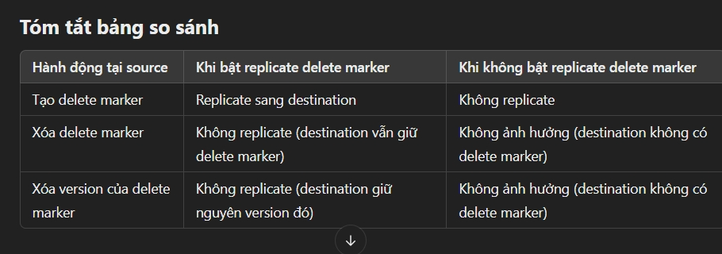

lab của a Việt Trần https://youtu.be/T-Rhn9pR3Bc?si=2ikqPmBXXi2nyUBr

### **Chi tiết kiến thức về Amazon S3 Replication**

#### 1. **Giới thiệu về Amazon S3 Replication**:
- **S3 Replication** là một tính năng trong Amazon S3 cho phép sao chép dữ liệu từ một *bucket* S3 này sang một *bucket* S3 khác, có thể trong cùng một khu vực (region) hoặc khác khu vực.  
- Replication giúp tăng tính bảo mật, cải thiện hiệu suất và đảm bảo sự liên tục trong các tình huống cần sao lưu dữ liệu hoặc đảm bảo tuân thủ các yêu cầu pháp lý.

#### 2. **Các loại replication trong S3**:
- **Cross-Region Replication (CRR)**:
  - **CRR** là sao chép giữa các *bucket* S3 thuộc các khu vực (regions) khác nhau.
  - Ví dụ: Sao chép dữ liệu từ một *bucket* ở khu vực *US-East* sang *bucket* ở khu vực *EU-West*.
  - **Lợi ích của CRR**:
    - **Tuân thủ pháp lý**: Đáp ứng các yêu cầu về việc lưu trữ dữ liệu ở nhiều khu vực khác nhau.
    - **Giảm độ trễ**: Cung cấp dữ liệu nhanh hơn cho người dùng ở các khu vực khác nhau trên thế giới.

- **Same-Region Replication (SRR)**:
  - **SRR** là sao chép giữa các *bucket* trong cùng một khu vực (region).
  - Ví dụ: Sao chép từ một *bucket* trong *US-East* sang *bucket* khác trong cùng khu vực *US-East*.
  - **Lợi ích của SRR**:
    - **Sao lưu nội bộ**: Dùng cho các trường hợp cần sao lưu dữ liệu hoặc sử dụng trong môi trường thử nghiệm (test environment).
    - **Quản lý và phân tích log**: Dễ dàng sao chép và tổng hợp dữ liệu log từ nhiều *bucket* khác nhau trong cùng khu vực.

#### 3. **Cấu hình và yêu cầu khi sử dụng S3 Replication**:
- **Bật Versioning**:
  - Để sử dụng S3 Replication, bạn cần **bật tính năng Versioning** trên cả *bucket nguồn* (source bucket) và *bucket đích* (destination bucket). Điều này giúp theo dõi các phiên bản dữ liệu và đảm bảo dữ liệu sao chép là chính xác.
  
- **Sao chép giữa các tài khoản AWS**:
  - Replication có thể xảy ra giữa các *bucket* thuộc các tài khoản AWS khác nhau. Bạn cần cấp quyền **IAM** (Identity and Access Management) thích hợp để cho phép dịch vụ S3 có quyền **đọc và ghi** dữ liệu giữa các *bucket*.

- **Sao chép bất đồng bộ**:
  - Quá trình replication diễn ra **bất đồng bộ** (asynchronously), tức là dữ liệu sẽ được sao chép ở nền sau khi tệp được tải lên *bucket nguồn*. Thao tác sao chép không làm gián đoạn hoạt động của các ứng dụng.

#### 4. **Quyền IAM cần thiết cho Replication**:
- Để replication hoạt động, bạn cần cấp quyền **IAM** cho dịch vụ S3 sao cho dịch vụ này có quyền **đọc và ghi** trên các *bucket* được chỉ định.
  - Cấp quyền **S3:ReplicateObject** và **S3:ReplicateDelete** để sao chép đối tượng và xóa trong quá trình replication.
  - Cấp quyền **S3:GetObject** và **S3:PutObject** để dịch vụ có thể đọc từ *bucket nguồn* và ghi vào *bucket đích*.

#### 5. **Các tình huống sử dụng S3 Replication**:
- **Cross-Region Replication (CRR)**:
  - **Compliance**: Nếu bạn cần sao chép dữ liệu tới các khu vực khác để đáp ứng yêu cầu pháp lý (ví dụ, yêu cầu lưu trữ dữ liệu tại một quốc gia cụ thể).
  - **Cung cấp truy cập dữ liệu với độ trễ thấp**: Nếu bạn có người dùng toàn cầu, CRR giúp sao chép dữ liệu tới các khu vực gần với người dùng nhất, giúp giảm độ trễ khi truy cập dữ liệu.
  - **Sao chép dữ liệu giữa các tài khoản**: Giúp sao chép dữ liệu từ một *bucket* trong tài khoản này sang *bucket* trong tài khoản khác, có thể dùng trong môi trường tổ chức đa tài khoản.

- **Same-Region Replication (SRR)**:
  - **Tổng hợp log**: SRR có thể được sử dụng để sao chép log từ nhiều *bucket* khác nhau trong cùng khu vực vào một *bucket* chung, thuận tiện cho việc theo dõi và phân tích.
  - **Môi trường thử nghiệm**: SRR hữu ích khi sao chép dữ liệu giữa *bucket* sản xuất và *bucket* thử nghiệm trong cùng một khu vực, hỗ trợ quá trình phát triển và thử nghiệm mà không ảnh hưởng đến dữ liệu sản xuất.
  
#### 6. **Lưu ý quan trọng**:
- **Phiên bản dữ liệu**: Mỗi tệp được sao chép sẽ có một phiên bản riêng biệt trong *bucket đích*, giúp bạn theo dõi và phục hồi các phiên bản cũ nếu cần thiết.
- **Chi phí**: Việc sao chép dữ liệu giữa các khu vực (CRR) có thể phát sinh chi phí cao hơn do băng thông liên vùng (inter-region data transfer).
- **Tốc độ sao chép**: Quá trình sao chép dữ liệu có thể bị ảnh hưởng bởi độ trễ mạng và kích thước của dữ liệu cần sao chép. 

---

1. **Chỉ các đối tượng mới được sao chép**:
   - Sau khi bật tính năng **Replication** trong Amazon S3, **chỉ các đối tượng mới** (new objects) sẽ được sao chép tự động từ *bucket nguồn* (source bucket) sang *bucket đích* (destination bucket).
   - Điều này có nghĩa là **các đối tượng đã có sẵn trước khi bật Replication sẽ không được sao chép tự động**.

2. **Sao chép các đối tượng đã tồn tại**:
   - Nếu bạn muốn sao chép **các đối tượng đã tồn tại** trong *bucket* từ trước, bạn sẽ cần sử dụng tính năng **S3 Batch Replication**.
   - **S3 Batch Replication** cho phép bạn sao chép những đối tượng đã có từ trước và **các đối tượng đã thất bại trong quá trình sao chép** (failed replication).

3. **Sao chép các đánh dấu xóa (delete markers)**:
   - Nếu có thao tác **xóa** đối tượng, bạn có thể sao chép **đánh dấu xóa (delete marker)** từ *bucket nguồn* sang *bucket đích*.
   - **Delete markers** là các đối tượng đặc biệt được tạo ra khi một đối tượng bị xóa, giúp đánh dấu rằng đối tượng đã bị xóa mà không thực sự loại bỏ nó ngay lập tức.

4. **Lưu ý về xóa vĩnh viễn**:
  - chỉ delete marker được replicate thì vô setting rule , còn thg thì delete version bth là xóa vĩnh viên sẽ k replicate 
5. **Không hỗ trợ sao chép liên tiếp (chaining of replications)**:
   - Amazon S3 **không hỗ trợ sao chép liên tiếp** giữa các *bucket*. Điều này có nghĩa là:
     - Nếu *bucket 1* sao chép dữ liệu sang *bucket 2*,
     - và *bucket 2* lại sao chép dữ liệu sang *bucket 3*,
     - thì các đối tượng từ *bucket 1* **sẽ không được sao chép vào *bucket 3***.
   - Mỗi *bucket* trong quá trình replication hoạt động độc lập và không có sự sao chép qua lại giữa các *bucket* liên tiếp.

### **Tóm tắt**:
- **Replication** chỉ sao chép đối tượng mới và yêu cầu sử dụng **S3 Batch Replication** cho các đối tượng đã tồn tại.
- Các đối tượng bị xóa hoặc đánh dấu xóa có thể được sao chép, nhưng xóa vĩnh viễn sẽ không được sao chép để bảo vệ dữ liệu.
- Không có **sao chép liên tiếp** giữa các *bucket*, nghĩa là dữ liệu sẽ không được sao chép qua nhiều *bucket* khác nhau trong một chuỗi.