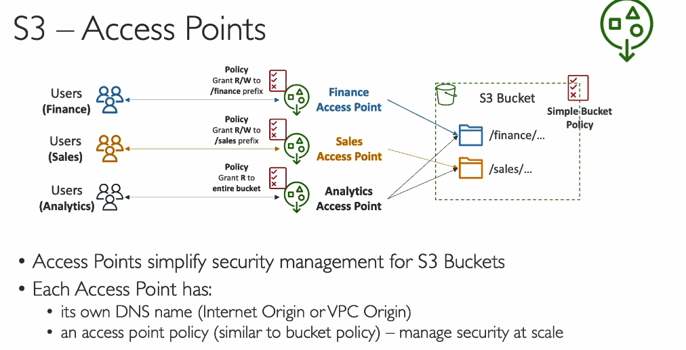

Dưới đây là chi tiết kiến thức về **S3 Access Points** trong Amazon S3 từ bài giảng trong đoạn transcript mà bạn yêu cầu:

### 1. **Giới thiệu về S3 Access Points**
   - **S3 Access Points** là một tính năng của Amazon S3 giúp quản lý quyền truy cập vào dữ liệu trong **S3 bucket** một cách dễ dàng và có tổ chức hơn.
   - Sử dụng Access Points, bạn có thể tách biệt quyền truy cập vào các phần khác nhau của dữ liệu trong một bucket mà không cần tạo chính sách phức tạp cho toàn bộ bucket.

### 2. **Vấn đề với S3 Bucket Policy truyền thống**
   - Khi một **S3 bucket** chứa nhiều loại dữ liệu khác nhau (ví dụ: dữ liệu tài chính, bán hàng), việc sử dụng một **S3 bucket policy** duy nhất có thể trở nên phức tạp khi số lượng người dùng và dữ liệu tăng lên.
   - Một bucket chính có thể chứa nhiều nhóm người dùng với quyền truy cập khác nhau vào các phần khác nhau của dữ liệu.
   - Việc quản lý chính sách truy cập cho mỗi nhóm có thể gây khó khăn và dễ dẫn đến các lỗi bảo mật nếu không được quản lý tốt.

### 3. **Giải pháp - S3 Access Points**
   - Sử dụng **S3 Access Points** để quản lý quyền truy cập cho từng phần dữ liệu của bucket, giúp đơn giản hóa việc quản lý quyền.
   - **Access Point** là một endpoint có thể được tạo ra cho một loại dữ liệu hoặc nhóm người dùng cụ thể, thay vì áp dụng chính sách cho toàn bộ bucket.

### 4. **Cách thức hoạt động của S3 Access Points**
   - **Access Point cho Tài chính**: Một access point có thể được tạo ra để cung cấp quyền truy cập vào phần **dữ liệu tài chính** trong S3 bucket. Access point này sẽ có một chính sách truy cập riêng, cho phép quyền **đọc và ghi** vào prefix chứa dữ liệu tài chính.
   - **Access Point cho Bán hàng**: Tương tự, bạn có thể tạo một access point khác cho phần **dữ liệu bán hàng** và cấp quyền truy cập cho nhóm người dùng có nhu cầu.
   - **Access Point cho Phân tích**: Một **access point phân tích** có thể được tạo ra để chỉ có quyền truy cập **đọc** vào cả dữ liệu tài chính và bán hàng, giúp nhóm phân tích truy cập vào các phần này mà không có quyền thay đổi dữ liệu.

### 5. **Ưu điểm của việc sử dụng S3 Access Points**
   - **Quản lý bảo mật đơn giản**: Việc quản lý quyền truy cập trở nên dễ dàng hơn với mỗi access point có chính sách bảo mật riêng biệt, thay vì quản lý một chính sách phức tạp cho toàn bộ bucket.
   - **Quyền truy cập chi tiết**: Bạn có thể tạo các access point cho các nhóm người dùng khác nhau với quyền truy cập chi tiết vào các phần cụ thể của bucket.
   - **Quyền truy cập linh hoạt**: Ví dụ, một nhóm người dùng có thể chỉ được quyền truy cập dữ liệu tài chính, trong khi nhóm khác có thể truy cập cả dữ liệu tài chính và bán hàng.

### 6. **Tích hợp với IAM (Identity and Access Management)**
   - S3 Access Points được tích hợp với **IAM (Identity and Access Management)** để kiểm soát quyền truy cập vào các access point cụ thể.
   - **IAM permissions** giúp xác định ai có thể truy cập vào các access point và các hành động mà họ có thể thực hiện (ví dụ: chỉ đọc, hoặc đọc và ghi).

### 7. **Kết nối với VPC**
   - **VPC Origin**: Access Points có thể được kết nối với một **VPC (Virtual Private Cloud)** để cung cấp quyền truy cập **riêng tư** vào dữ liệu trong S3 bucket mà không cần đi qua internet.
   - Điều này rất hữu ích khi các máy chủ EC2 trong VPC cần truy cập vào dữ liệu trong S3 mà không cần kết nối qua internet công cộng.
   - Để kết nối với **VPC Origin**, bạn cần tạo một **VPC endpoint**. VPC endpoint này sẽ cho phép các instance trong VPC kết nối trực tiếp với S3 access point mà không đi qua internet.

### 8. **Chính sách bảo mật**
   - Mỗi **VPC endpoint** cũng có thể có một chính sách riêng biệt, gọi là **VPC endpoint policy**, giúp kiểm soát quyền truy cập vào S3 bucket thông qua access points.
   - Chính sách này đảm bảo rằng chỉ những yêu cầu hợp lệ từ các EC2 instance trong VPC mới có thể truy cập vào dữ liệu trong S3.

### 9. **Tóm tắt các lợi ích của S3 Access Points**
   - **Giảm độ phức tạp** trong việc quản lý các quyền truy cập vào bucket.
   - **Quản lý bảo mật dễ dàng hơn** với các chính sách truy cập cụ thể cho từng access point.
   - **Có thể truy cập qua internet hoặc VPC** (cho việc truy cập riêng tư).
   - **Mỗi access point có DNS riêng biệt** để giúp định danh và kết nối.

### 10. **Tóm tắt**
   - **S3 Access Points** là công cụ mạnh mẽ giúp quản lý quyền truy cập vào S3 bucket dễ dàng và có tổ chức hơn, đặc biệt trong môi trường có nhiều dữ liệu và người dùng.
   - Việc sử dụng **Access Points** giúp giảm thiểu sự phức tạp trong việc tạo và quản lý **S3 bucket policy** và cung cấp một phương thức quản lý bảo mật rõ ràng, hiệu quả.

