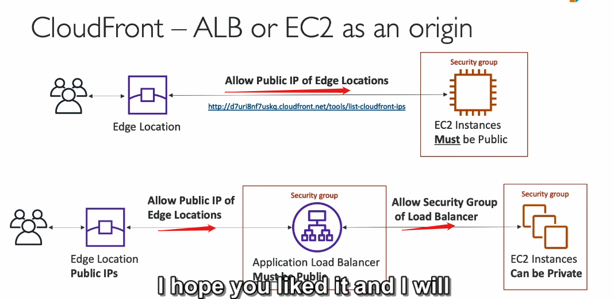

---

#### **1. CloudFront truy cập backend HTTP**

- **Khả năng của CloudFront**:  
  CloudFront có thể kết nối tới bất kỳ backend HTTP nào, chẳng hạn:
  - **EC2 instances**.
  - **Application Load Balancer (ALB)**.

---

#### **2. Kịch bản sử dụng EC2 làm backend**

- **Mô hình hoạt động**:

  - Người dùng truy cập CloudFront thông qua **Edge Locations**.
  - Các **Edge Locations** sẽ gửi yêu cầu đến **EC2 backend**.

- **Yêu cầu**:
  - **EC2 instance phải là public**:
    - Vì CloudFront không hỗ trợ **kết nối private VPC**, EC2 cần có IP công khai.
  - **Cấu hình Security Group cho EC2**:
    - Phải cho phép danh sách các **public IP của Edge Locations** (của CloudFront) kết nối vào.
    - Danh sách các IP này có thể tìm tại [AWS CloudFront IP Ranges](https://docs.aws.amazon.com/general/latest/gr/cloudfront.html#cloudfront-ip-range).

---

#### **3. Kịch bản sử dụng ALB làm backend**

- **Mô hình hoạt động**:

  - Người dùng truy cập CloudFront thông qua **Edge Locations**.
  - Edge Locations gửi yêu cầu đến **ALB** (public).
  - **ALB** chuyển tiếp yêu cầu tới **EC2 instances** (private) thông qua **kết nối private VPC**.

- **Yêu cầu**:
  - **ALB phải là public**:
    - Có thể nhận yêu cầu từ **Edge Locations**.
  - **EC2 instances có thể private**:
    - Vì ALB có kết nối private đến các instance backend.
  - **Cấu hình Security Group**:
    - Security Group của EC2 phải cho phép truy cập từ Security Group của ALB.
    - Security Group của ALB phải cho phép truy cập từ các **public IP của Edge Locations** của CloudFront.

---

#### **4. Các lưu ý quan trọng**

- **Danh sách IP của CloudFront**:  
  Phải thường xuyên cập nhật danh sách **public IP của Edge Locations** để đảm bảo tính tương thích và bảo mật.
- **Bảo mật**:  
  Đảm bảo chỉ mở các cổng (như HTTP/HTTPS) cần thiết trong Security Group, hạn chế tấn công từ bên ngoài.

---

#### **Tóm tắt mô hình**

| Thành phần          | Vai trò                                                            |
| ------------------- | ------------------------------------------------------------------ |
| **CloudFront Edge** | Nhận yêu cầu từ người dùng và chuyển tiếp đến backend.             |
| **EC2 Public**      | Backend trực tiếp, yêu cầu IP công khai và mở đúng Security Group. |
| **ALB Public**      | Làm trung gian giữa Edge Locations và các EC2 private backend.     |
| **EC2 Private**     | Backend phía sau ALB, bảo mật hơn do không cần IP công khai.       |

---
