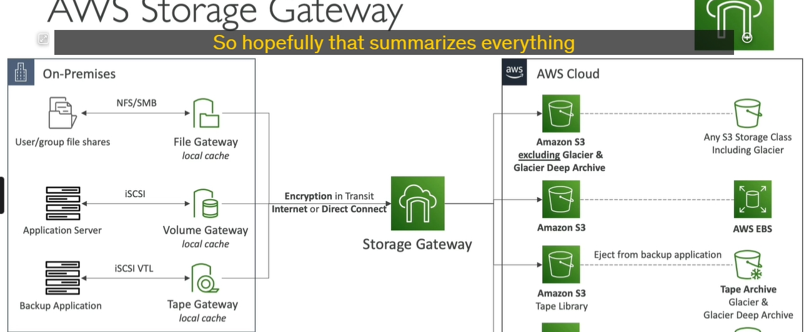

### **Hybrid Cloud và AWS Storage Gateway**

**1. Hybrid Cloud**:

- **Là gì?**: **Hybrid cloud** là mô hình điện toán đám mây kết hợp giữa **cloud** (môi trường đám mây công cộng như AWS) và **on-premises** (hạ tầng nội bộ của tổ chức). Một phần hạ tầng và dữ liệu sẽ được lưu trữ trên cloud, trong khi phần còn lại vẫn duy trì trên cơ sở hạ tầng tại chỗ.
- **Lý do sử dụng hybrid cloud**:
  - **Di chuyển dữ liệu dần dần**: Mô hình hybrid cho phép tổ chức di chuyển dần dần từ cơ sở hạ tầng tại chỗ sang cloud.
  - **Yêu cầu bảo mật**: Các tổ chức có thể giữ một số dữ liệu quan trọng hoặc nhạy cảm trên hệ thống nội bộ để đáp ứng các yêu cầu bảo mật hoặc pháp lý.
  - **Tăng trưởng theo nhu cầu**: Cloud được sử dụng cho các công việc có tính đàn hồi cao (elastic workloads), trong khi các tài nguyên quan trọng hoặc ít thay đổi vẫn duy trì trên cơ sở hạ tầng nội bộ.

---

**2. AWS Storage Gateway**:

- **Là gì?**: AWS Storage Gateway là một dịch vụ của AWS giúp **kết nối dữ liệu tại chỗ** (on-premises) với dữ liệu trên cloud, tạo ra một "cầu nối" giữa hạ tầng nội bộ và các dịch vụ lưu trữ đám mây của AWS. Điều này cho phép tổ chức duy trì dữ liệu trên cloud mà không phải thay đổi toàn bộ cơ sở hạ tầng.
- **Các use case chính của AWS Storage Gateway**:
  - **Disaster Recovery**: Sao lưu dữ liệu tại chỗ vào cloud để đảm bảo phục hồi trong trường hợp thảm họa.
  - **Cloud Migration**: Dễ dàng di chuyển dữ liệu và ứng dụng từ cơ sở hạ tầng nội bộ lên cloud.
  - **Mở rộng lưu trữ**: Dùng Storage Gateway để mở rộng không gian lưu trữ từ hệ thống nội bộ lên cloud, ví dụ: lưu trữ dữ liệu "lạnh" (cold data) trên AWS.
  - **Cache Local**: Sử dụng AWS Storage Gateway như một bộ nhớ đệm tại chỗ để giảm độ trễ khi truy cập dữ liệu tệp từ cloud.

---

**3. Các loại AWS Storage Gateway**:

1. **S3 File Gateway**:

   - **Mục đích**: Kết nối **dữ liệu tệp** tại chỗ với **Amazon S3**.
   - **Ứng dụng**: Sử dụng để sao lưu, lưu trữ lâu dài, hoặc phục hồi dữ liệu từ S3 cho các ứng dụng yêu cầu truy xuất tệp.

2. **Volume Gateway**:

   - **Mục đích**: Kết nối **volume lưu trữ** giữa AWS và hệ thống tại chỗ.
   - **Ứng dụng**: Dùng cho các trường hợp như sao lưu dữ liệu (backup), phục hồi dữ liệu, hoặc lưu trữ block-level dữ liệu.

3. **Tape Gateway**:
   - **Mục đích**: Lưu trữ dữ liệu dưới dạng băng từ (tape) trên cloud.
   - **Ứng dụng**: Lưu trữ dữ liệu lâu dài hoặc sao lưu với băng từ, phù hợp với các yêu cầu lưu trữ lâu dài hoặc khôi phục từ dữ liệu sao lưu.

---

- **Hybrid Cloud** kết hợp giữa cloud và on-premises, cho phép linh hoạt trong việc di chuyển và quản lý dữ liệu.
- **AWS Storage Gateway** cung cấp các giải pháp cầu nối để kết nối hạ tầng nội bộ với AWS, hỗ trợ sao lưu, phục hồi dữ liệu và mở rộng lưu trữ giữa cloud và hệ thống nội bộ.

---

### **I. Amazon S3 File Gateway**

**1. Mục đích của S3 File Gateway:**

- **Kết nối giữa ứng dụng tại chỗ và Amazon S3**: S3 File Gateway cho phép bạn kết nối giữa **Amazon S3** (lưu trữ đối tượng) và các ứng dụng hoặc máy chủ tại chỗ thông qua các giao thức tệp chuẩn như **NFS** (Network File System) hoặc **SMB** (Server Message Block).
- **Giới thiệu về các lớp lưu trữ**: Bạn có thể sử dụng nhiều **storage class** của S3, ví dụ như:
  - **S3 Standard**
  - **S3 Standard-IA** (Infrequent Access)
  - **S3 One Zone-IA**
  - **S3 Intelligent-Tiering**
  - Tuy nhiên, **S3 Glacier** không được hỗ trợ trực tiếp qua S3 File Gateway.

---

**2. Cách hoạt động của S3 File Gateway**:

- **Chuyển đổi các yêu cầu tệp thành yêu cầu HTTPS**: Khi một máy chủ ứng dụng tại chỗ sử dụng giao thức NFS hoặc SMB để truy cập dữ liệu, S3 File Gateway sẽ **dịch các yêu cầu này thành yêu cầu HTTPS** gửi tới **Amazon S3**.
- **Ứng dụng nhìn nhận như một chia sẻ tệp thông thường**: Dù ứng dụng tại chỗ kết nối với S3 thông qua các giao thức tệp, nhưng về bản chất, các dữ liệu được lưu trữ trên **Amazon S3**.

---

**3. Quản lý vòng đời dữ liệu**:

- **Chuyển sang S3 Glacier**: Bạn có thể thiết lập **lifecycle policies** (chính sách vòng đời) cho các đối tượng trong **S3 bucket** để tự động chuyển các đối tượng ít truy cập (archived data) vào **S3 Glacier** sau một thời gian nhất định, giúp tiết kiệm chi phí lưu trữ.

---

**4. Bộ nhớ đệm cho dữ liệu**:

- **Cache các tệp mới truy cập**: S3 File Gateway **cache** các tệp được sử dụng gần đây (most recently used files) trong bộ nhớ đệm tại cổng (gateway), giúp việc truy xuất dữ liệu diễn ra nhanh chóng hơn.
- **Không lưu trữ toàn bộ bucket trong gateway**: **Chỉ các tệp gần đây** được lưu trữ trong bộ nhớ đệm, phần còn lại vẫn ở trên S3.

---

**5. Các yêu cầu cấu hình IAM và Active Directory**:

- **Cấu hình IAM roles**: Để truy cập vào S3 File Gateway, bạn cần tạo **IAM roles** cho mỗi **S3 File Gateway** để xác định quyền truy cập vào các tài nguyên AWS.
- **Tích hợp với Active Directory (AD)**: Nếu sử dụng giao thức **SMB**, bạn có thể tích hợp với **Microsoft Active Directory** để thực hiện xác thực người dùng. Điều này cho phép người dùng trong mạng nội bộ của bạn đăng nhập và truy cập vào **S3 File Gateway** theo các quyền đã định sẵn trong AD.

---

#### **Tóm lại**:

- **Amazon S3 File Gateway** giúp kết nối **S3** với các ứng dụng hoặc máy chủ tại chỗ qua các giao thức tệp chuẩn như NFS và SMB, cho phép truy cập vào dữ liệu trên S3 như thể đó là dữ liệu tệp thông thường.
- Gateway sử dụng bộ nhớ đệm cho các tệp truy cập gần đây để cải thiện hiệu suất, hỗ trợ các chính sách vòng đời để chuyển dữ liệu sang lưu trữ rẻ hơn như **S3 Glacier**, và tích hợp với **Active Directory** để xác thực người dùng khi sử dụng giao thức SMB.

---

### **AWS Storage Gateway - Volume Gateway & Tape Gateway**

**1. Volume Gateway:**

- **Loại lưu trữ**: Là **block storage** sử dụng giao thức **iSCSI** và được hỗ trợ bởi **Amazon S3**.
- **Mục đích chính**: Volume Gateway chủ yếu được sử dụng để **sao lưu các volume từ các máy chủ tại chỗ** lên đám mây và cung cấp khả năng khôi phục lại dữ liệu khi cần thiết.
- **Hai loại Volume Gateway**:

  - **Cached Volumes**:
    - **Truy cập dữ liệu với độ trễ thấp**.
    - **Dữ liệu mới nhất** được lưu trữ trên bộ nhớ cache tại cổng (gateway), phần còn lại được lưu trữ trên **Amazon S3**.
  - **Stored Volumes**:
    - **Toàn bộ dữ liệu** được lưu trữ tại chỗ (on-premises), và **sao lưu định kỳ** vào **Amazon S3**.

- **Cách hoạt động**:
  - Các volume từ các máy chủ ứng dụng tại chỗ sẽ được sao lưu thông qua **EBS snapshots**, và snapshots này sẽ được lưu trữ trên **Amazon S3**.

---

**2. Tape Gateway:**

- **Ứng dụng cho doanh nghiệp sử dụng hệ thống sao lưu tape vật lý**.
- **Mục đích chính**: Tape Gateway cung cấp một **thư viện tape ảo (VTL)**, sao lưu dữ liệu tape truyền thống lên **Amazon S3** và **Amazon Glacier**.
- **Giao thức**: Sử dụng **iSCSI protocol** để tương tác giữa hệ thống sao lưu tại chỗ và đám mây.
- **Kết hợp với phần mềm sao lưu phổ biến**: Tape Gateway có thể làm việc với nhiều phần mềm sao lưu chính để quản lý việc sao lưu và phục hồi dữ liệu từ đám mây.

---

**3. Storage Gateway Hardware Appliance:**

- **Lựa chọn cho các cơ sở hạ tầng không có máy ảo (virtualization)**:
  - Nếu không có máy chủ ảo để chạy cổng lưu trữ (Storage Gateway), bạn có thể sử dụng **Storage Gateway Hardware Appliance** của AWS, một thiết bị phần cứng mini để kết nối với đám mây.
  - **Cài đặt phần cứng** này cung cấp đủ **CPU, bộ nhớ, mạng, và bộ nhớ cache SSD** để hoạt động chính xác.
  - Có thể cài đặt để hoạt động như **File Gateway, Volume Gateway hoặc Tape Gateway** tùy thuộc vào nhu cầu sử dụng.
  - Đây là giải pháp hữu ích cho các trung tâm dữ liệu nhỏ không có khả năng ảo hóa.

---

### **Tóm tắt các dịch vụ trong Storage Gateway:**

1. **S3 File Gateway**:

   - Sử dụng **NFS/SMB** để kết nối ứng dụng tại chỗ với **Amazon S3**.
   - Dữ liệu trong S3 có thể được chuyển qua các lớp lưu trữ khác nhau và có thể di chuyển sang **S3 Glacier** để lưu trữ lâu dài.

2. **Volume Gateway**:

   - Dùng cho các máy chủ ứng dụng truy cập dữ liệu qua giao thức **iSCSI**.
   - Dữ liệu lưu trữ trên **Amazon S3** và có thể chuyển đổi thành **AWS EBS Volumes** khi cần phục hồi.

3. **Tape Gateway**:
   - Hỗ trợ sao lưu dữ liệu tape truyền thống vào **Amazon S3** và **Amazon Glacier**.

---

### **Các lớp lưu trữ trong AWS Storage Gateway**:

- **Amazon S3**: Có thể lưu trữ ở nhiều lớp lưu trữ như **S3 Standard**, **S3 Standard-IA**, **S3 Glacier**.
- **Amazon FSx**: Dùng cho lưu trữ tệp Windows, được sao lưu vào Amazon S3.
- **Amazon Glacier**: Dùng cho lưu trữ dữ liệu lâu dài với chi phí thấp (khi sử dụng Tape Gateway).

### **Tổng kết**:

- **Storage Gateway** cung cấp một cầu nối linh hoạt giữa cơ sở hạ tầng tại chỗ và AWS Cloud. Bạn có thể sao lưu và phục hồi dữ liệu, mở rộng khả năng lưu trữ từ đám mây, và thậm chí sử dụng các thiết bị phần cứng từ AWS khi thiếu các giải pháp ảo hóa tại chỗ.
