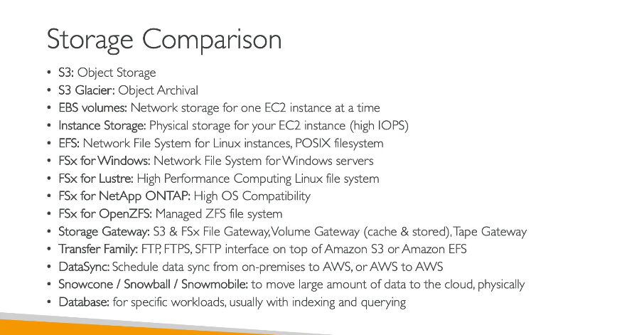

Dưới đây là tổng hợp chi tiết các dịch vụ lưu trữ AWS, cùng với các tính năng và ứng dụng của chúng:

### 1. **Amazon S3 (Simple Storage Service)**:

- **Loại lưu trữ**: Lưu trữ đối tượng (Object Storage).
- **Sử dụng**: Lưu trữ dữ liệu không cấu trúc như hình ảnh, video, file log, sao lưu, và dữ liệu ứng dụng.
- **Tính năng**: API đặc thù để truy xuất và quản lý dữ liệu.
- **Sử dụng cho lưu trữ lâu dài**: Nếu cần lưu trữ dài hạn, có thể sử dụng **Amazon S3 Glacier** (archival storage).

### 2. **Amazon EBS (Elastic Block Store)**:

- **Loại lưu trữ**: Lưu trữ khối (Block Storage) cho EC2 instances , network storage .
- **Sử dụng**: Kết nối ổ đĩa ảo với EC2 instance để lưu trữ dữ liệu.
- **Tính năng**: Các loại volume khác nhau:
  - **GP3**: Lưu trữ giá rẻ và hiệu suất tốt.
  - **IO2**: Dành cho các ứng dụng yêu cầu IOPS cao.
- **Multitask (IO1 & IO2)**: Hỗ trợ đa tác vụ cho I/O cao.

### 3. **EC2 Instance Storage**:

- **Loại lưu trữ**: Lưu trữ vật lý(physical storage ) gắn liền với EC2 instance.
- **Sử dụng**: Lưu trữ tạm thời với IOPS rất cao, nhưng chỉ tồn tại khi EC2 instance đang chạy.

### 4. **Amazon EFS (Elastic File System)**:

- **Loại lưu trữ**: Hệ thống tệp mạng (NFS) cho các instance Linux.
- **Sử dụng**: Các ứng dụng cần chia sẻ tệp giữa các EC2 instances.
- **Tính năng**: Hỗ trợ POSIX filesystem, có thể mở rộng linh hoạt, và có thể mount trên nhiều Availability Zones.

### 5. **Amazon FSx**:

- **Loại lưu trữ**: Hệ thống tệp cho các ứng dụng đặc biệt.
- **Các loại FSx**:
  - **FSx for Windows File Server**: Hệ thống tệp Windows dành cho các ứng dụng Windows.
  - **FSx for Lustre**: Hệ thống tệp hiệu suất cao dành cho HPC (High-Performance Computing).
  - **FSx for NetApp ONTAP**: Tính tương thích cao với hệ thống tệp NetApp.
  - **FSx for OpenZFS**: Quản lý hệ thống tệp ZFS.

### 6. **Storage Gateway**:

- **Loại lưu trữ**: Cầu nối giữa hệ thống lưu trữ tại chỗ và AWS.
- **Các loại**:
  - **File Gateway**: Đồng bộ hóa dữ liệu giữa hệ thống tệp tại chỗ và Amazon S3 hoặc Amazon FSx.
  - **Volume Gateway**: Mount volumes vào các máy chủ tại chỗ, nhưng sao lưu vào đám mây (EBS snapshots).
  - **Tape Gateway**: Sao lưu dữ liệu dưới dạng tape và lưu trữ trong Amazon S3 hoặc Glacier.

### 7. **AWS Transfer Family**:

- **Loại dịch vụ**: Cung cấp FTP, FTPS, hoặc SFTP giao diện cho Amazon S3 hoặc Amazon EFS.
- **Sử dụng**: Dễ dàng chia sẻ dữ liệu và thực hiện sao lưu, di chuyển dữ liệu giữa các dịch vụ lưu trữ trên AWS mà không cần viết mã.

### 8. **AWS DataSync**:

- **Loại dịch vụ**: Đồng bộ hóa dữ liệu từ các hệ thống tại chỗ hoặc từ AWS tới AWS.
- **Sử dụng**: Di chuyển dữ liệu giữa các hệ thống lưu trữ trên AWS(s3,fsx window ,efs ) và hệ thống lưu trữ tại chỗ, hỗ trợ các giao thức NFS, SMB, HDFS.
- **Tính năng**: Duy trì metadata và quyền truy cập tệp khi di chuyển dữ liệu.

### 9. **AWS Snow Family**:

- **Loại dịch vụ**: Di chuyển dữ liệu vật lý khi không có đủ băng thông mạng.
- **Các thiết bị**:
  - **Snowcone**: Thiết bị di động nhỏ gọn với khả năng cài đặt DataSync agent.
  - **Snowball**: Thiết bị lớn hơn cho các khối lượng dữ liệu lớn.
  - **Snowmobile**: Xe tải chứa thiết bị lưu trữ cho khối lượng dữ liệu cực lớn.
- **Ứng dụng**: Di chuyển dữ liệu vật lý từ các hệ thống tại chỗ vào AWS.

### Tóm Tắt:

- **Amazon S3**: Dành cho lưu trữ đối tượng (Object Storage), rất linh hoạt cho các trường hợp sử dụng khác nhau như sao lưu, phục hồi và lưu trữ dài hạn.
- **EBS và Instance Storage**: Lưu trữ khối (Block Storage), dùng cho EC2 instance. EBS hỗ trợ khả năng mở rộng linh hoạt, trong khi Instance Storage mang lại hiệu suất cao.
- **EFS và FSx**: Hệ thống tệp mạng, EFS cho Linux, FSx cho các ứng dụng đặc biệt như Windows, Lustre, và OpenZFS.
- **Storage Gateway**: Cầu nối giữa lưu trữ on-prem và AWS cho các dịch vụ như file, volume, và tape.
- **AWS Transfer Family**: Giao diện FTP/FTPS/SFTP cho việc chuyển dữ liệu vào ra AWS.
- **DataSync**: Đồng bộ hóa dữ liệu on-prem/cloud khác qua các dịch vụ lưu trữ của AWS.
- **Snow Family**: Giải pháp di chuyển dữ liệu vật lý khi không đủ băng thông mạng.

---
FSx file gateway k còn hỗ trợ nên dùng 

VPN hoặc Direct Connect kết hợp với Amazon FSx for Windows File Server:

Nếu yêu cầu của bạn là truy cập dữ liệu từ Amazon FSx for Windows File Server trực tiếp trên AWS từ môi trường on-premises, bạn có thể sử dụng AWS Direct Connect hoặc VPN để kết nối on-premises với AWS.
Sau khi kết nối, bạn có thể trực tiếp truy cập FSx for Windows File Server qua SMB từ các máy chủ Windows của bạn.
