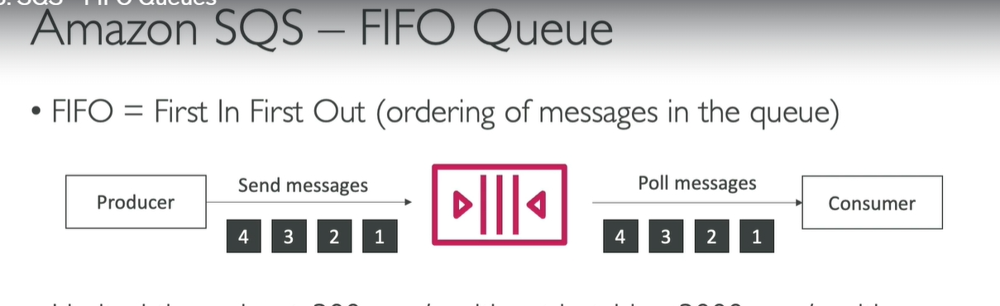

### **Amazon SQS FIFO Queues: Tổng Quan**

---

#### **1. FIFO Queues là gì?**

- **FIFO** có nghĩa là **First In, First Out** (Đến trước, đi trước).
  - Điều này đảm bảo rằng các message được gửi vào queue sẽ được **xử lý theo đúng thứ tự** chúng được đưa vào queue.
  - Ví dụ: Nếu có 4 message được gửi với thứ tự 1, 2, 3, 4, thì consumer sẽ nhận các message theo đúng thứ tự này.

#### **2. Lợi Ích của FIFO Queues**

- **Đảm Bảo Thứ Tự Message**:
  - FIFO queues cung cấp đảm bảo về thứ tự xử lý message. Điều này không có trong các queue thông thường (standard queues), nơi mà các message có thể bị nhận và xử lý không theo thứ tự.
- **Giới Hạn Throughput**:
  - FIFO queues có giới hạn về throughput:
    - **300 messages mỗi giây** nếu không dùng batching.
    - **3,000 messages mỗi giây** nếu dùng batching.
- **Xử Lý Duplicates**:
  - FIFO queues hỗ trợ tính năng **exactly-once delivery**. Điều này có nghĩa là các duplicates có thể bị loại bỏ trực tiếp ở cấp độ queue.
  - Để làm điều này, mỗi message gửi đi cần có một **deduplication ID**. Nếu message có deduplication ID giống với một message đã gửi trong vòng **5 phút** trước đó, message này sẽ bị loại bỏ.

---

#### **3. Message Group ID**

- Để duy trì thứ tự, **Message Group ID** là yêu cầu cần thiết khi gửi message đến FIFO queue.
  - Mỗi nhóm message sẽ được xử lý theo thứ tự cho nhóm đó.
  - Các message cùng **Message Group ID** sẽ được xử lý theo thứ tự, nhưng các nhóm khác nhau có thể được xử lý đồng thời.

---

#### **4. Cách Thiết Lập FIFO Queue**

- **Tên FIFO Queue**:
  - Tên của FIFO queue phải kết thúc bằng **.fifo**.
- **Cấu Hình**:
  - FIFO queues có các tùy chọn giống như queues thông thường, nhưng có thêm một cài đặt quan trọng là **content-based deduplication**.
  - Tính năng này giúp tự động loại bỏ duplicate nếu cùng một message được gửi trong khoảng thời gian **5 phút**.

---

#### **5. Thực Tế Sử Dụng FIFO Queue**

- **Gửi Messages**:
  - Khi gửi message, bạn cần cung cấp **Message Group ID** và **Deduplication ID**.
- **Ví Dụ**:
  - Gửi các message với nội dung `Hello World 1`, `Hello World 2`, v.v., và đảm bảo rằng mỗi message có một **Deduplication ID** khác nhau.
- **Nhận Messages**:
  - Khi consumer nhận message từ FIFO queue, các message sẽ được trả về theo thứ tự mà chúng đã được gửi.

---

#### **6. Quản Lý FIFO Queue**

- **Thứ tự Message**:
  - FIFO queue sẽ luôn bảo đảm rằng các message sẽ được xử lý theo thứ tự gửi vào, như được minh họa trong ví dụ gửi và nhận message.
  - Các message được nhận và xử lý đúng thứ tự, từ `Hello World 1`, `Hello World 2`, đến `Hello World 4`.

---

#### **7. Tóm Tắt**

- **FIFO Queue** giúp bạn đảm bảo rằng các message được xử lý đúng thứ tự, rất hữu ích trong những ứng dụng yêu cầu thứ tự message (như xử lý đơn hàng, các tác vụ dựa trên thời gian).
- Hạn chế throughput của FIFO queue có thể ảnh hưởng đến các ứng dụng có số lượng message lớn, nhưng batching có thể giúp mở rộng khả năng xử lý.
- **Deduplication** là một tính năng quan trọng để loại bỏ các duplicate message, giúp ứng dụng tránh tình trạng xử lý lại các message không cần thiết.

---

### **Điểm Quan Trọng cho Kỳ Thi**

- Hiểu được cách FIFO queue đảm bảo thứ tự message.
- Biết cách sử dụng **Message Group ID** và **Deduplication ID**.
- Nắm được **giới hạn throughput** của FIFO queues và cách batching có thể cải thiện hiệu suất.
