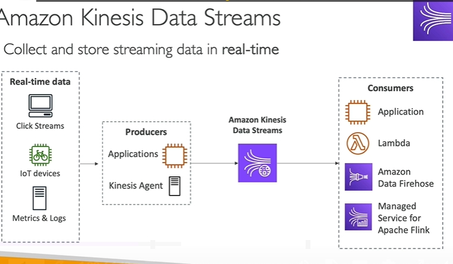

### **Chi Tiết về Amazon Kinesis Data Streams**

---

#### **Kinesis Data Streams là gì?**

Amazon Kinesis Data Streams (KDS) là một dịch vụ của AWS được thiết kế để thu thập, lưu trữ và xử lý **dữ liệu streaming theo thời gian thực**. Đây là giải pháp lý tưởng cho các hệ thống cần xử lý dữ liệu **ngay lập tức**, với độ trễ thấp.

---

#### **Cấu Trúc Hoạt Động**

1. **Nguồn Dữ Liệu Thời Gian Thực**:

   - **Clickstreams**: Dữ liệu tương tác của người dùng trên website hoặc ứng dụng.
   - **Thiết bị IoT**: Ví dụ như xe đạp thông minh hoặc cảm biến kết nối Internet.
   - **Logs/Metric của Server**: Dữ liệu giám sát và hiệu suất của hệ thống.

2. **Producers (Nhà sản xuất dữ liệu)**:

   - **Ứng dụng**: Viết mã để gửi dữ liệu từ nguồn vào KDS.
   - **Kinesis Agent**: Cài đặt trên máy chủ để tự động thu thập log và gửi vào KDS.

3. **Consumers (Nhà tiêu thụ dữ liệu)**:
   - Các ứng dụng hoặc dịch vụ xử lý dữ liệu theo thời gian thực, như:
     - **AWS Lambda**: Xử lý dữ liệu theo sự kiện.
     - **Kinesis Data Firehose**: Chuyển tiếp dữ liệu tới S3, Redshift hoặc Elasticsearch.
     - **Managed Service for Apache Flink**: Phân tích dữ liệu trực tiếp từ dòng.

---

#### **Các Đặc Điểm Chính**

1. **Lưu trữ dữ liệu**:

   - Dữ liệu được lưu giữ tối đa **365 ngày**.
   - Người tiêu thụ có thể **xử lý lại dữ liệu cũ** bất kỳ lúc nào.
   - **Lưu ý**: Dữ liệu không thể bị xóa thủ công, nó sẽ tự động bị xóa khi hết thời gian lưu trữ.

2. **Kích thước dữ liệu**:

   - Mỗi bản ghi có kích thước tối đa **1 MB**.
   - Thích hợp nhất với dữ liệu nhỏ nhưng tần suất cao.

3. **Thứ tự dữ liệu**:

   - Các bản ghi có thể được đảm bảo **đúng thứ tự** bằng cách sử dụng **Partition Key**.

4. **Bảo mật**:

   - **Mã hóa dữ liệu tại chỗ** (KMS).
   - **Mã hóa dữ liệu trong quá trình truyền** (HTTPS).

5. **Thư viện phát triển**:
   - **Kinesis Producer Library (KPL)**: Tối ưu hóa cho việc gửi dữ liệu (producer).
   - **Kinesis Client Library (KCL)**: Tối ưu hóa cho việc xử lý dữ liệu (consumer).

---

#### **Chế Độ Quản Lý Công Suất**

1. **Provisioned Mode**:

   - **Shards**: Là đơn vị cơ bản để xác định dung lượng stream.
     - Ghi (Write): **1 MB/giây** hoặc **1.000 bản ghi/giây** trên mỗi shard.
     - Đọc (Read): **2 MB/giây** trên mỗi shard.
   - **Quy mô linh hoạt**: Tăng/giảm số lượng shard theo nhu cầu.
   - **Giá**: Tính phí dựa trên số lượng shard mỗi giờ.

   **Ví dụ**:

   - Để đạt **10 MB/giây** throughput ghi:
     - Cần **10 shards**.

2. **On-Demand Mode**:
   - **Tự động mở rộng**: Điều chỉnh dung lượng dựa trên lưu lượng thực tế trong 30 ngày gần nhất.
   - Công suất mặc định: **4.000 bản ghi/giây** hoặc **4 MB/giây ghi vào**.
   - **Giá**: Tính phí dựa trên dung lượng dữ liệu vào/ra.

---

#### **Tính Năng Nổi Bật**

1. **Phân tích thời gian thực**:

   - Xử lý và phân tích dữ liệu khi nó được gửi vào.
   - Ví dụ: Phân tích hành vi người dùng hoặc phát hiện lỗi IoT.

2. **Hỗ trợ kiến trúc điều khiển sự kiện**:

   - Kết hợp với **AWS Lambda** để tự động xử lý các sự kiện phát sinh.

3. **Tích hợp với hệ thống giám sát**:

   - Thu thập log và dữ liệu giám sát từ các máy chủ, hệ thống.

4. **Tích hợp Machine Learning**:
   - Truyền dữ liệu trực tiếp vào pipeline để huấn luyện hoặc suy luận mô hình học máy.

---

#### **So sánh Provisioned Mode và On-Demand Mode**

| **Đặc Điểm**           | **Provisioned Mode**            | **On-Demand Mode**               |
| ---------------------- | ------------------------------- | -------------------------------- |
| **Quản lý dung lượng** | Thủ công (manual)               | Tự động (auto-scaling)           |
| **Tăng/giảm quy mô**   | Thay đổi số lượng shard         | Dựa trên lưu lượng thực tế       |
| **Giá**                | Tính phí theo shard             | Tính phí theo dữ liệu sử dụng    |
| **Thích hợp cho**      | Lưu lượng ổn định, dự đoán được | Lưu lượng biến động, khó dự đoán |

---

#### **Ứng Dụng Điển Hình**

1. **Phân tích Clickstream**:

   - Phân tích hành vi người dùng trên website.

2. **Phát hiện bất thường IoT**:

   - Xử lý dữ liệu từ cảm biến hoặc thiết bị thông minh.

3. **Theo dõi log thời gian thực**:

   - Tổng hợp và giám sát log từ các máy chủ.

4. **Kết hợp với học máy**:
   - Thu thập dữ liệu làm đầu vào cho các mô hình AI/ML.

---

### **Kết Luận**

Amazon Kinesis Data Streams là một dịch vụ mạnh mẽ, giúp thu thập và xử lý dữ liệu thời gian thực một cách dễ dàng và linh hoạt. Bằng cách chọn chế độ quản lý công suất phù hợp và sử dụng các công cụ hỗ trợ như KPL hoặc KCL, KDS phù hợp với nhiều loại hình ứng dụng từ giám sát, phân tích, đến điều khiển các hệ thống học máy và sự kiện.
