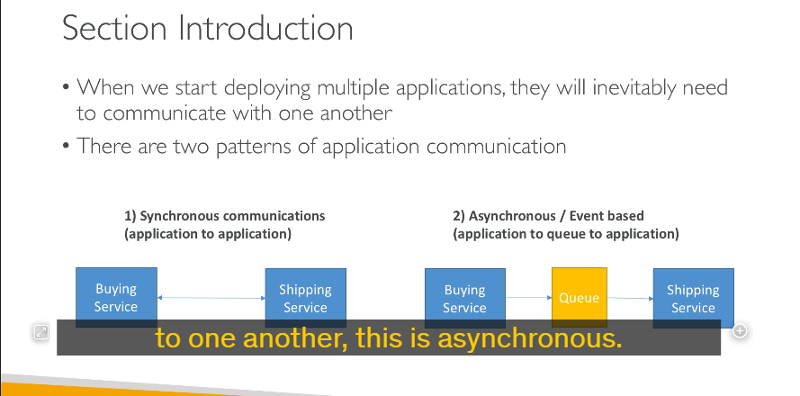

#### **1. Khái niệm tổng quan về tích hợp AWS và messaging**

- **Mục tiêu**:

  - Orchestrate (điều phối) giữa các dịch vụ thông qua **middleware**.
  - Các ứng dụng cần chia sẻ thông tin/dữ liệu với nhau.

- **Hai mô hình giao tiếp ứng dụng**:

  1. **Synchronous Communication (Giao tiếp đồng bộ)**:

     - Các ứng dụng kết nối trực tiếp với nhau.
     - Ví dụ:
       - Dịch vụ **Buying** thông báo cho dịch vụ **Shipping** để xử lý đơn hàng.
     - **Vấn đề**:
       - Nếu một dịch vụ bị quá tải do lượng yêu cầu tăng đột biến, hệ thống sẽ gặp lỗi hoặc downtime.

  2. **Asynchronous Communication (Giao tiếp bất đồng bộ)**:
     - Sử dụng **middleware** (như queue).
     - Ví dụ:
       - Dịch vụ **Buying** đẩy thông tin vào **queue**.
       - Dịch vụ **Shipping** lấy dữ liệu từ queue và xử lý khi sẵn sàng.
     - **Ưu điểm**:
       - Không phụ thuộc vào việc dịch vụ trực tiếp kết nối.
       - Giảm tải cho các dịch vụ khi có lưu lượng tăng đột biến.

#### **2. Các dịch vụ AWS hỗ trợ decoupling**

- **SQS (Simple Queue Service)**:

  - Mô hình queue để xử lý bất đồng bộ.
  - Dùng khi có yêu cầu tăng đột biến và cần xử lý theo hàng đợi.

- **SNS (Simple Notification Service)**:

  - Mô hình pub/sub để gửi thông báo theo luồng sự kiện.
  - Dùng để phát tán thông báo cho nhiều subscriber.

- **Kinesis**:
  - Xử lý dữ liệu thời gian thực (real-time streaming).
  - Phù hợp cho các ứng dụng big data hoặc phân tích.

#### **3. Lợi ích của decoupling với SQS, SNS, Kinesis**

- **Tự động mở rộng**: Các dịch vụ này tự động scale dựa trên lưu lượng dữ liệu.
- **Độc lập**: Dịch vụ không bị phụ thuộc nhau, giúp hệ thống ổn định hơn.

---

### **Tóm Tắt Cô Đọng**

1. **Giao tiếp ứng dụng** có 2 mô hình:

   - **Synchronous** (đồng bộ): Kết nối trực tiếp, dễ quá tải khi lưu lượng cao.
   - **Asynchronous** (bất đồng bộ): Sử dụng middleware (queue), giảm tải hiệu quả.

2. **Dịch vụ AWS giúp decoupling**:

   - **SQS**: Queue cho xử lý bất đồng bộ.
   - **SNS**: Pub/sub cho thông báo sự kiện.
   - **Kinesis**: Xử lý dữ liệu thời gian thực.

3. **Lợi ích**: Các dịch vụ tự động scale, cải thiện hiệu suất và tính ổn định hệ thống.
