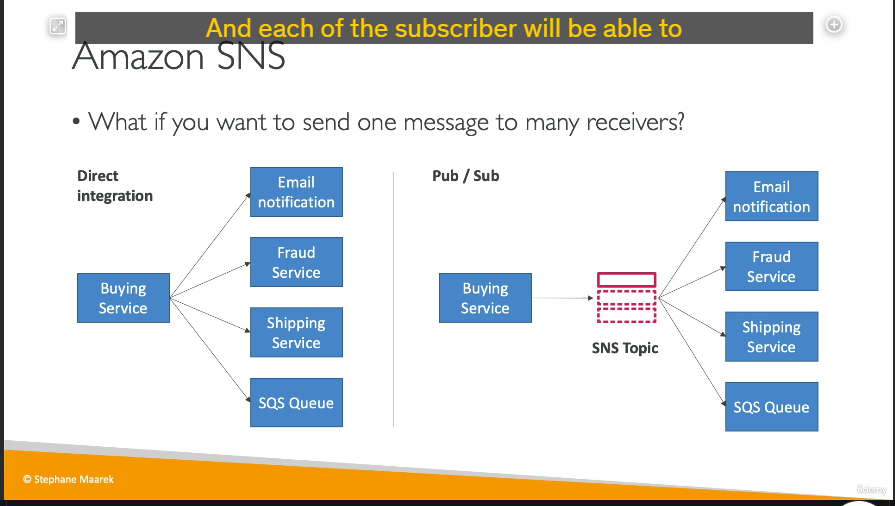
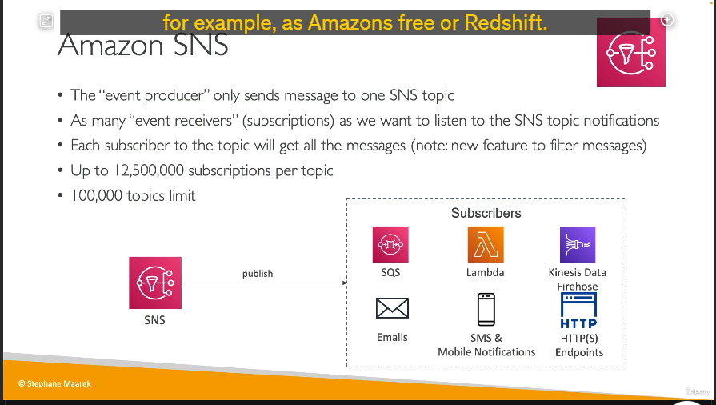
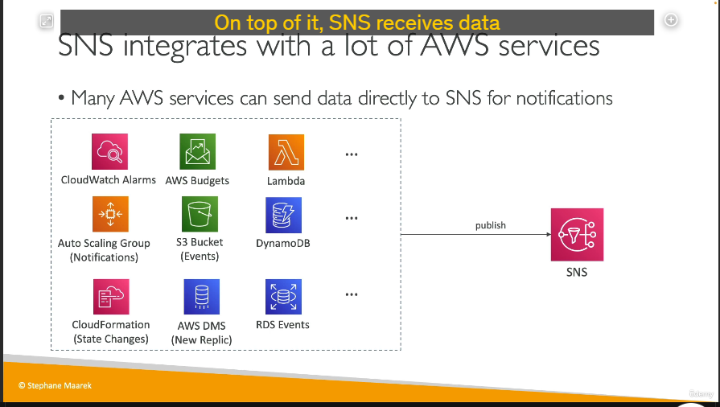

### **Chi tiết kiến thức: Amazon SNS (Simple Notification Service)**

## 

#### **Tổng quan về Amazon SNS**

- **Amazon SNS** là dịch vụ nhắn tin quản lý hoàn toàn cho phép **Pub/Sub (Publish-Subscribe)**:
  - **Publisher (Người gửi thông báo)**: Gửi thông báo đến một **SNS topic**.
  - **Subscriber (Người nhận thông báo)**: Nhận thông báo từ **SNS topic**.

---

#### **Lợi ích của SNS**

1. **Tích hợp dễ dàng**:

   - Thay vì tạo kết nối trực tiếp từ ứng dụng gửi thông báo đến từng dịch vụ (email, dịch vụ vận chuyển, SQS, v.v.), chỉ cần gửi tin nhắn đến SNS topic. Mỗi subscriber sẽ tự động nhận thông báo.

2. **Mô hình Pub/Sub**:
   - Mọi thông báo từ một SNS topic được phát đến tất cả các subscriber.
   - Hỗ trợ lên đến **12 triệu subscription** mỗi topic, và 100,000 topic mỗi tài khoản.

---

#### **Các kiểu subscriber trong SNS**

1. **Email**: Gửi thông báo qua email.
2. **SMS và thông báo di động**: Gửi đến ứng dụng di động thông qua **Google GCM**, **Apple APNS**, hoặc **Amazon ADM**.
3. **HTTP/HTTPS**: Gửi trực tiếp đến endpoint HTTP(S).
4. **Dịch vụ AWS tích hợp**:
   - **SQS**: Gửi tin nhắn vào hàng đợi.
   - **Lambda**: Kích hoạt một hàm Lambda khi nhận tin nhắn.
   - **Kinesis Data Firehose**: Gửi dữ liệu tới S3, Redshift, hoặc các hệ thống dữ liệu khác.

---

#### **Nguồn dữ liệu gửi đến SNS**

- Các dịch vụ AWS có thể gửi thông báo trực tiếp đến SNS topic, bao gồm:
  - **CloudWatch Alarms**: Cảnh báo giám sát.
  - **Auto Scaling Group**: Thông báo thay đổi quy mô.
  - **S3**: Sự kiện trên bucket S3.
  - **DynamoDB, RDS**: Sự kiện cơ sở dữ liệu.
  - **CloudFormation, Lambda, DMS**, và nhiều hơn nữa.

---

#### **Cách thức hoạt động**

1. **Tạo một SNS topic**: Tập trung gửi thông báo.
2. **Tạo các subscription**: Đăng ký người nhận (subscriber) như email, Lambda, SQS.
3. **Gửi thông báo**:
   - Sử dụng SDK của AWS để **publish** thông báo.
   - Tất cả subscriber sẽ nhận thông báo.

---

#### **Bảo mật trong SNS**

1. **Mã hóa dữ liệu**:
   - **In-flight encryption**: Dữ liệu mã hóa khi truyền.
   - **At-rest encryption**: Mã hóa bằng KMS keys.
   - **Client-side encryption**: Khách hàng tự mã hóa dữ liệu trước khi gửi.
2. **Kiểm soát truy cập**:
   - **IAM Policies**: Quản lý quyền truy cập các API SNS.
   - **SNS Access Policies**: Cho phép quyền truy cập giữa các tài khoản hoặc các dịch vụ AWS khác.

---

### **Tóm tắt**

Amazon SNS là một giải pháp nhắn tin theo mô hình **Pub/Sub** mạnh mẽ và linh hoạt:

- **Ứng dụng thực tế**: Thông báo cho nhiều dịch vụ (email, SMS, Lambda, SQS, HTTP endpoints).
- **Ưu điểm**: Dễ dàng tích hợp, khả năng mở rộng cao, bảo mật tốt.
- **Lý tưởng cho**: Các hệ thống cần gửi thông báo nhanh chóng và tới nhiều đầu nhận cùng lúc.
