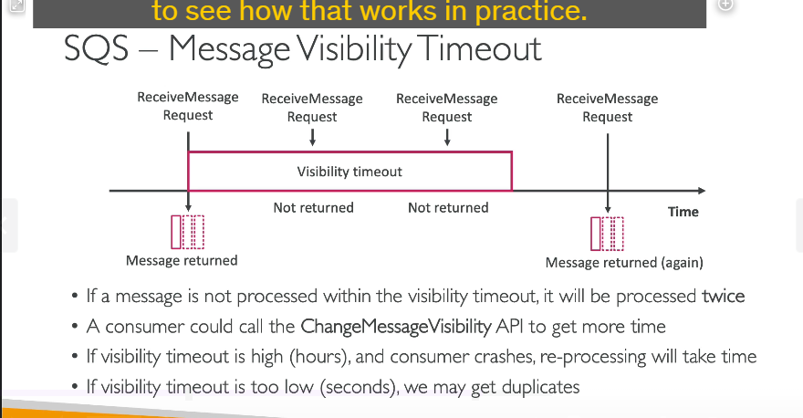

### **Message Visibility Timeout trong SQS**

---

#### **1. Message Visibility Timeout là gì?**

- **Khái niệm**:

  - Khi một consumer **poll** một message từ SQS, message này trở nên **invisible** (không thể thấy) với các consumer khác trong khoảng thời gian **visibility timeout**.
  - **Mặc định**: Thời gian này là **30 giây**.

- **Tình huống**:
  - Nếu consumer xử lý xong và **delete message** trước khi timeout kết thúc, message sẽ không bị xử lý lần nữa.
  - Nếu không xóa, message sẽ quay lại queue (reappear), và có thể được xử lý lại bởi consumer khác hoặc cùng consumer.

---

#### **2. Vấn đề với Visibility Timeout**

- **Timeout quá dài**:

  - Nếu consumer bị crash, message sẽ mất nhiều thời gian (đến khi hết timeout) để trở nên visible lại, làm chậm xử lý.

- **Timeout quá ngắn**:

  - Consumer không kịp xử lý, dẫn đến message bị nhận lại nhiều lần bởi các consumer khác nhau.

- **Duplicate Processing**:
  - Nếu message timeout và được đưa trở lại queue trong khi vẫn đang được xử lý, dẫn đến xử lý trùng lặp.

---

#### **3. API hỗ trợ: ChangeMessageVisibility**

- **Khi nào sử dụng**:

  - Nếu consumer biết rằng việc xử lý một message sẽ cần thêm thời gian (hơn thời gian visibility timeout), nó có thể gọi API **ChangeMessageVisibility**.

- **Tác dụng**:
  - Gia hạn visibility timeout cho message đó, giữ message invisible lâu hơn, tránh bị xử lý trùng lặp.

---

#### **4. Cách đặt Visibility Timeout hợp lý**

- **Cân nhắc**:

  - Thời gian này phải **phù hợp với ứng dụng**.
  - Thời gian phải đủ dài để consumer xử lý, nhưng không quá dài để tránh message bị giữ lại quá lâu nếu có lỗi.

- **Tùy chỉnh**:
  - Thay đổi giá trị mặc định (từ **0 giây** đến **12 giờ**) trong cài đặt SQS queue.
  - Gọi **ChangeMessageVisibility API** nếu cần thay đổi timeout cho từng message riêng lẻ.

---

#### **5. Use Case minh họa**

- **Ví dụ thực tế**:

  1. Consumer A nhận một message từ SQS và bắt đầu xử lý.
  2. Trong thời gian visibility timeout, các consumer khác không thấy được message này.
  3. Nếu A không xóa message trước khi timeout, message quay lại queue và có thể được nhận bởi consumer B.

- **Xử lý đúng cách**:
  - Nếu A cần thêm thời gian xử lý, nó gọi **ChangeMessageVisibility API** để gia hạn thời gian.
  - Sau khi xử lý xong, A **delete message** để đảm bảo message không bị xử lý lần nữa.

---

#### **6. Tóm tắt**

1. **Visibility Timeout**:

   - Là khoảng thời gian một message trở nên invisible sau khi được nhận bởi một consumer.
   - Thời gian mặc định là **30 giây**.

2. **Vấn đề**:

   - Timeout dài gây chậm trễ.
   - Timeout ngắn dẫn đến duplicate processing.

3. **API hỗ trợ**:

   - **ChangeMessageVisibility API** giúp gia hạn timeout cho từng message.

4. **Cách đặt timeout**:

   - Phụ thuộc vào thời gian xử lý của ứng dụng.
   - Thay đổi trong cài đặt queue hoặc thông qua API.

5. **Lưu ý khi xử lý**:
   - Xóa message sau khi xử lý để tránh bị xử lý lại.
   - Điều chỉnh timeout hợp lý với workload của ứng dụng.

---

### **Điểm quan trọng cho kỳ thi**

- Hiểu cơ chế hoạt động của **visibility timeout**.
- Biết cách sử dụng **ChangeMessageVisibility API**.
- Có thể trả lời các tình huống liên quan đến duplicate processing và timeout hợp lý.
