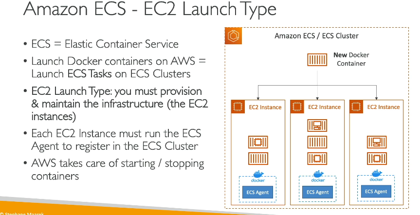
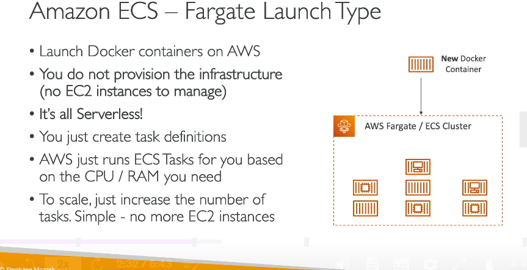
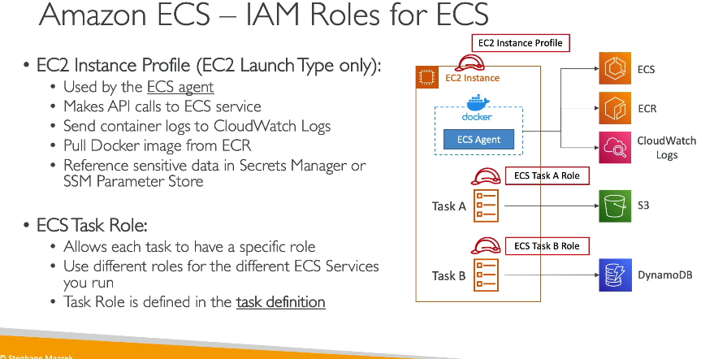
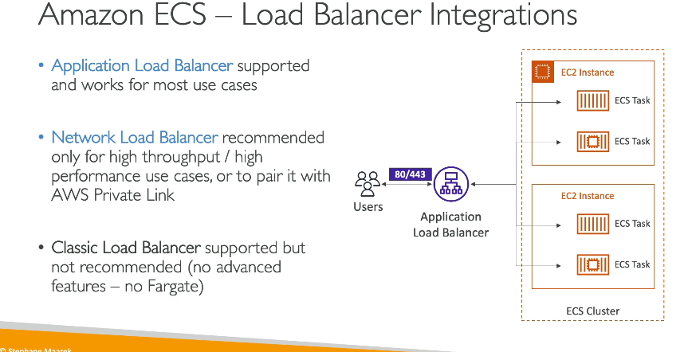
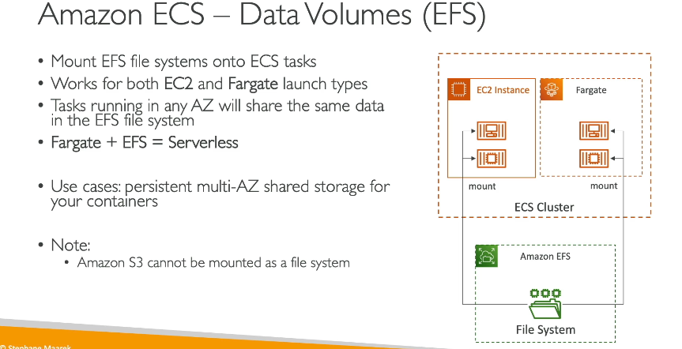

### Tổng quan về Amazon ECS (Elastic Container Service)

---

#### **1. Amazon ECS và các Launch Types**

- **Amazon ECS (Elastic Container Service):**
  - Là dịch vụ quản lý container do AWS cung cấp.
  - Chạy các **ECS Tasks** (nhiệm vụ ECS) trong **ECS Cluster**.

##### **EC2 Launch Type:**

- **Mô tả:**
  - ECS Cluster bao gồm các EC2 Instances.
  - Người dùng cần tự quản lý và cung cấp cơ sở hạ tầng (EC2 Instances).
- **Cách hoạt động:**
  - Mỗi EC2 Instance trong Cluster chạy **ECS Agent**.
  - ECS Agent đăng ký EC2 Instance vào ECS Cluster.
  - Docker containers được tự động phân bổ trên các EC2 Instances.
- **Ưu điểm:**
  - Hoàn toàn kiểm soát được hạ tầng.
- **Nhược điểm:**
  - Phức tạp trong việc quản lý EC2 Instances.

##### **Fargate Launch Type:**

- **Mô tả:**
  - **Serverless:** AWS quản lý toàn bộ hạ tầng.
  - Người dùng chỉ cần định nghĩa **task definition** (định nghĩa nhiệm vụ).
- **Cách hoạt động:**
  - Không cần tạo EC2 Instances.
  - ECS Tasks được chạy dựa trên cấu hình CPU và RAM.
  - AWS tự động xử lý mọi khía cạnh cơ sở hạ tầng.
- **Ưu điểm:**
  - Đơn giản hóa triển khai.
  - Không cần lo lắng về quản lý hạ tầng.
- **Nhược điểm:**
  - Ít khả năng tùy chỉnh hơn EC2 Launch Type.

---

#### **2. IAM Roles trong Amazon ECS**

##### **EC2 Launch Type:**

- **EC2 Instance Profile Role:**
  - Gắn với ECS Agent chạy trên EC2 Instances.
  - **Chức năng:**
    - Gọi API ECS để đăng ký Instance vào Cluster.
    - Gửi logs tới CloudWatch.
    - Kéo Docker Images từ Amazon ECR.
    - Truy cập dữ liệu nhạy cảm qua Secrets Manager hoặc SSM Parameter Store.

##### **ECS Task Roles:**

- **Áp dụng cho cả EC2 Launch Type và Fargate.**
- **Chức năng:**
  - Gắn quyền cụ thể cho từng ECS Task.
  - Ví dụ:
    - **Task A Role:** Cho phép ECS Task A gọi API Amazon S3.
    - **Task B Role:** Cho phép ECS Task B gọi API DynamoDB.
  - Được định nghĩa trong **task definition**.

---

#### **3. Tích hợp Load Balancer**

- **Application Load Balancer (ALB):**
  - Dùng để phân phối HTTP/HTTPS traffic.
  - Tích hợp tốt với ECS (cả EC2 và Fargate).
  - **Khuyến nghị:** Sử dụng ALB cho hầu hết các use case.
- **Network Load Balancer (NLB):**

  - Dùng cho ứng dụng có **hiệu suất cao** hoặc **băng thông lớn**.
  - Tương thích với AWS PrivateLink.

- **Classic Load Balancer (CLB):**
  - Không khuyến nghị vì thiếu các tính năng hiện đại.
  - Không hỗ trợ Fargate.

---

#### **4. Data Persistence trong ECS**

- **Amazon EFS (Elastic File System):**
  - **Mô tả:**
    - Hệ thống file chia sẻ hỗ trợ multi-AZ.
    - Tương thích với cả EC2 Launch Type và Fargate.
  - **Cách sử dụng:**
    - Mount EFS lên ECS Tasks để chia sẻ dữ liệu giữa các container.
  - **Ưu điểm:**
    - **Serverless:** Không cần quản lý hạ tầng.
    - Hỗ trợ trả phí theo nhu cầu (pay-as-you-go).
  - **Use case:** Lưu trữ dữ liệu chia sẻ lâu dài giữa các containers.

---

#### **5. Kết hợp ECS và EFS**

- **Ultimate Combo:**
  - Sử dụng Fargate (serverless) để chạy ECS Tasks.
  - Sử dụng EFS (serverless) để lưu trữ dữ liệu.
  - Tối ưu cho việc triển khai ứng dụng linh hoạt, không cần quản lý hạ tầng.

---

#### **Tóm tắt:**

- **EC2 Launch Type:** Quản lý hạ tầng tự động hóa nhưng phức tạp hơn.
- **Fargate Launch Type:** Serverless, đơn giản hóa triển khai.
- **IAM Roles:** Phân quyền rõ ràng giữa ECS Agent và ECS Tasks.
- **Load Balancer:** ALB là lựa chọn tốt nhất để tích hợp ECS.
- **EFS:** Giải pháp lưu trữ dữ liệu chia sẻ cho ECS, tối ưu trong môi trường serverless.

---

### Sự khác biệt giữa **Task Role** và **Task Execution Role** trong Amazon ECS

| **Yếu tố**             | **Task Role**                                  | **Task Execution Role**                               |
| ---------------------- | ---------------------------------------------- | ----------------------------------------------------- |
| **Dùng bởi**           | Ứng dụng chạy trong container.                 | Amazon ECS service để quản lý ECS Tasks.              |
| **Mục đích**           | Gọi API tới các dịch vụ AWS khác từ container. | Hỗ trợ ECS Tasks (kéo image, gửi logs, etc.).         |
| **Định nghĩa trong**   | **Task Definition.**                           | **Task Definition.**                                  |
| **Ví dụ quyền cần có** | `s3:PutObject`, `dynamodb:Query`.              | `ecr:GetDownloadUrlForLayer`, `logs:CreateLogStream`. |
| **Quản lý bảo mật**    | Gắn quyền phù hợp cho container cụ thể.        | Gắn quyền phù hợp để ECS thực hiện công việc hỗ trợ.  |

---

#### **Tóm lại:**

- **Task Role**: Dành cho ứng dụng bên trong container, để truy cập các dịch vụ AWS.
- **Task Execution Role**: Dành cho ECS service, để quản lý và khởi chạy ECS Tasks.

---

## lưu ý : phía dưới chỉ để Long cá vàng hiểu

task defi là dockerfile
task coi như là container đi
phần tạo service trong ecs hiểu như các lệnh docker đi  
cluster là các task

---

### **So sánh chi tiết**

| Đặc điểm                 | **ECS Task Role**                                          | **EC2 Instance Profile**                     |
| ------------------------ | ---------------------------------------------------------- | -------------------------------------------- |
| **Cấp độ áp dụng**       | Task ECS (container trong ECS task)                        | Toàn bộ EC2 instance                         |
| **Phạm vi quyền**        | Cụ thể theo từng task                                      | Toàn bộ ứng dụng và dịch vụ trên instance    |
| **Quản lý quyền IAM**    | Từng ECS task definition                                   | Gắn khi khởi tạo EC2 instance                |
| **Đối tượng sử dụng**    | ECS task chạy trên ECS cluster                             | EC2 instance (bao gồm cả ECS host)           |
| **Bảo mật và phân tách** | Rất chi tiết, bảo mật theo nguyên tắc tối thiểu quyền      | Ít chi tiết, áp dụng quyền chung             |
| **Use Case điển hình**   | Nhiều container với quyền khác nhau trên cùng một instance | EC2 instance chạy dịch vụ cần quyền truy cập |

---

### **Kết hợp ECS Task Role và EC2 Instance Profile**

- Nếu bạn đang sử dụng **ECS trên EC2 launch type**:
  - EC2 Instance Profile cần thiết để ECS agent hoạt động (ví dụ: đăng ký container instance với ECS).
  - ECS Task Role có thể được sử dụng để phân quyền cho từng task riêng biệt.
- Với **Fargate launch type**, chỉ cần ECS Task Role vì không có EC2 instance.

---

### **Tóm lại**

- **ECS Task Role**: Phù hợp để gắn quyền chi tiết cho **các container** (ECS tasks).
- **EC2 Instance Profile**: Dành cho **toàn bộ EC2 instance** để thực hiện các hành động AWS API.
