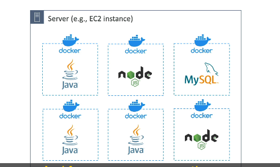
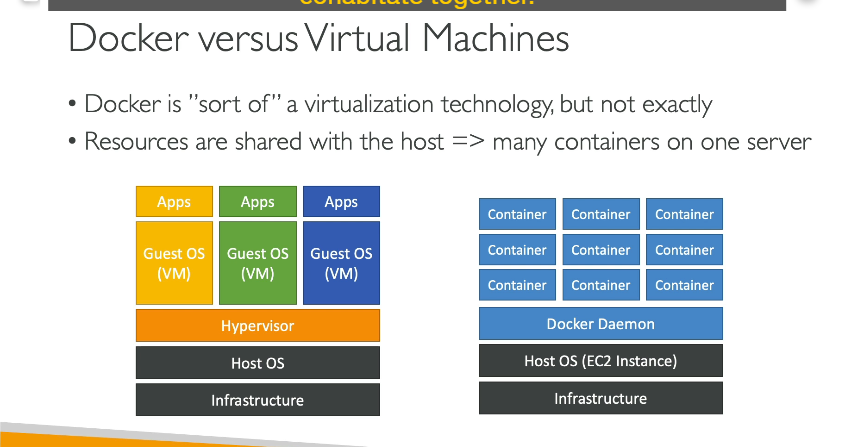
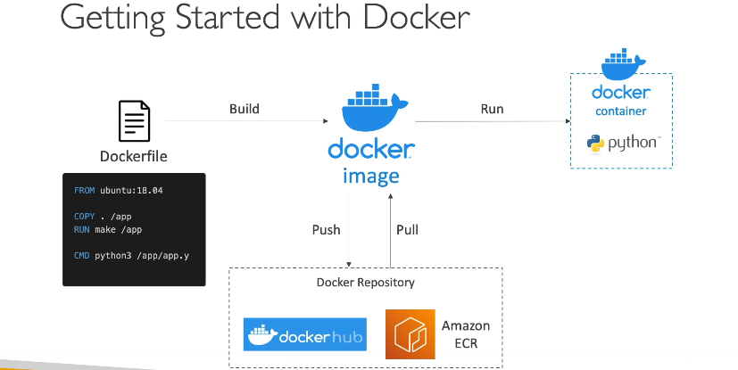

### Chi tiết kiến thức về **Docker**, **ECS**, và **EKS**

---

#### **1. Docker là gì?**

Docker là một nền tảng phát triển phần mềm sử dụng công nghệ **container** để đóng gói và triển khai ứng dụng.

- **Đặc điểm của Docker:**

  - **Container hóa ứng dụng:** Ứng dụng được đóng gói trong các container với cách thức tiêu chuẩn hóa.
  - **Tương thích đa nền tảng:** Ứng dụng chạy đồng nhất trên bất kỳ hệ điều hành nào mà không gặp vấn đề tương thích.
  - **Dễ bảo trì và triển khai:** Container hóa giúp giảm thời gian cấu hình, đảm bảo tính ổn định và dự đoán được hành vi của ứng dụng.
  - **Đa ngôn ngữ, đa công nghệ:** Hỗ trợ bất kỳ ngôn ngữ lập trình, hệ điều hành hoặc công nghệ nào.

- **Use case chính của Docker:**
  - **Kiến trúc microservices:** Đóng vai trò quan trọng trong việc xây dựng các hệ thống dựa trên microservices.
  - **Chuyển ứng dụng từ on-premises lên cloud.**
  - **Chạy các container trên nhiều môi trường khác nhau.**

---

#### **2. Cách Docker hoạt động trên hệ điều hành**

- **Môi trường hoạt động:**

  - Một server (VD: máy chủ EC2 hoặc bất kỳ máy chủ nào) cài đặt **Docker Agent**.
  - Docker Agent quản lý và chạy các container.

- **Cách triển khai:**
  - Mỗi container chứa ứng dụng (VD: Java, Node.js).
  - Hỗ trợ chạy nhiều instance container cùng một ứng dụng hoặc ứng dụng khác nhau.
  - Có thể chạy cơ sở dữ liệu (VD: MySQL) trong container.
  - **Tính linh hoạt cao**: Dễ dàng quản lý nhiều loại ứng dụng trên cùng một server.

---

#### **3. Nơi lưu trữ Docker Images**

- **Docker Repository:** Lưu trữ các Docker Images.
  - **Docker Hub:**
    - Public repository phổ biến.
    - Chứa các base image (VD: Ubuntu, MySQL, Node.js).
  - **Amazon ECR (Elastic Container Registry):**
    - Lưu trữ Docker Image ở dạng **private** hoặc **public** thông qua **Amazon ECR Public Gallery**.

---

#### **4. Sự khác biệt giữa Docker và Virtual Machine (VM)**

- **Virtual Machine (VM):**

  - Cấu trúc:
    1. Infrastructure.
    2. Host OS.
    3. Hypervisor.
    4. Guest OS + Apps.
  - Mỗi VM được cách ly hoàn toàn, không chia sẻ tài nguyên.
  - Phù hợp cho các ứng dụng cần mức độ bảo mật cao hơn.

- **Docker Container:**
  - Cấu trúc:
    1. Infrastructure.
    2. Host OS (VD: EC2 Instance).
    3. Docker Daemon.
    4. Docker Containers.
  - Chia sẻ tài nguyên hệ thống giữa các container.
  - **Nhẹ hơn** và **chạy nhanh hơn** VM, nhưng ít cách ly hơn.
  - Tối ưu cho việc chạy nhiều container trên một server.

---

#### **5. Quy trình làm việc với Docker**

- **Bước 1:** Viết **Dockerfile** để định nghĩa cấu trúc container.
- **Bước 2:** Build Dockerfile thành Docker Image.
- **Bước 3:** Lưu trữ Docker Image trong:
  - **Docker Hub** (public).
  - **Amazon ECR** (private/public).
- **Bước 4:** Kéo (pull) Docker Image từ repository về server.
- **Bước 5:** Chạy Docker Image thành Docker Container.

---

#### **6. Quản lý Docker Container trên AWS**

- **Amazon ECS (Elastic Container Service):**

  - Nền tảng Docker quản lý bởi AWS.
  - Hỗ trợ triển khai và quản lý container.
  - **Deep dive:** Tập trung vào ECS trong phần sau.

- **Amazon EKS (Elastic Kubernetes Service):**

  - Dịch vụ Kubernetes được quản lý bởi AWS.
  - Kubernetes là dự án mã nguồn mở giúp quản lý container.

- **AWS Fargate:**

  - Nền tảng **serverless container** của AWS.
  - Hỗ trợ cả ECS và EKS.

- **Amazon ECR (Elastic Container Registry):**
  - Lưu trữ Docker Image riêng tư hoặc công khai.
  - Tích hợp tốt với ECS và EKS.

---

#### **Tóm tắt**

- Docker là công nghệ container hóa giúp triển khai ứng dụng một cách nhẹ nhàng và linh hoạt.
- AWS cung cấp nhiều dịch vụ để quản lý container như ECS, EKS, Fargate, và ECR.
- Tập trung vào hiệu quả triển khai, quản lý container trong môi trường cloud.
