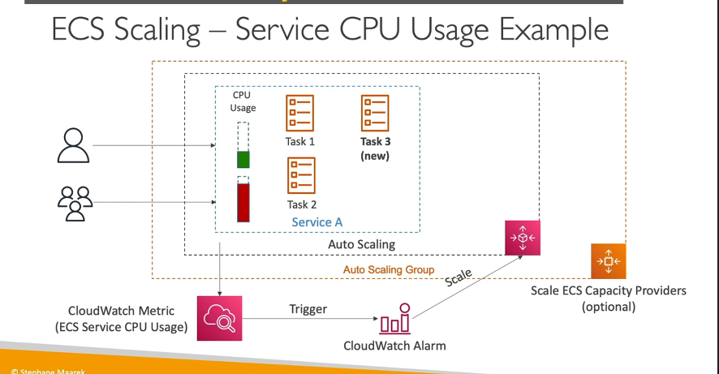

### **ECS Dịch vụ Tự động Co giãn (ECS Service Auto Scaling)**

Amazon ECS hỗ trợ tự động điều chỉnh số lượng **nhiệm vụ (tasks)** trong một dịch vụ để phù hợp với sự thay đổi của tải công việc. Dưới đây là chi tiết về tính năng này:

---

### **1. Lợi ích của Tự động Co giãn**

- **Tăng hiệu suất:** Đáp ứng nhanh với sự gia tăng hoặc giảm nhu cầu sử dụng tài nguyên.
- **Tối ưu chi phí:** Chỉ sử dụng tài nguyên cần thiết, tránh lãng phí.
- **Tăng tính linh hoạt:** Tự động phản hồi với các thay đổi về tải, giảm bớt công việc thủ công.

---

### **2. Các chỉ số theo dõi để tự động co giãn**

AWS Application Auto Scaling cho phép co giãn dựa trên ba loại chỉ số chính:

1. **Sử dụng CPU** (ECS Service CPU Utilization):
   - Theo dõi mức sử dụng CPU của các task trong dịch vụ ECS.
2. **Sử dụng RAM** (ECS Service Memory Utilization):
   - Theo dõi mức sử dụng bộ nhớ của các task .
3. **Số lượng yêu cầu ALB trên mỗi mục tiêu** (ALB Request Count Per Target):
   - Đếm số lượng yêu cầu mà Application Load Balancer (ALB) gửi đến các task .

---

### **3. Các loại tự động co giãn**

AWS cung cấp ba cách để thực hiện tự động co giãn:

#### **3.1. Target Tracking Scaling (Co giãn theo mục tiêu):**

- Theo dõi một chỉ số nhất định (ví dụ: sử dụng CPU ở 70%) và tự động điều chỉnh số lượng task để đạt được mức mục tiêu.
- **Ví dụ:**
  - Nếu sử dụng CPU vượt 70%, tự động thêm task .
  - Nếu sử dụng CPU dưới 50%, tự động giảm task

#### **3.2. Step Scaling (Co giãn theo bước):**

- Co giãn theo các bước được xác định trước dựa trên các ngưỡng của CloudWatch Alarm.
- **Ví dụ:**
  - Nếu CPU vượt 80%, thêm 2 task .
  - Nếu CPU vượt 90%, thêm 5 task .

#### **3.3. Scheduled Scaling (Co giãn theo lịch):**

- Lập lịch để tăng hoặc giảm số lượng task vào thời điểm cụ thể.
- **Ví dụ:**
  - Tăng số lượng task vào 8 giờ sáng và giảm vào 8 giờ tối, phù hợp với các ứng dụng có mô hình sử dụng dự đoán được.

---

### **4. Tự động co giãn trong hai loại ECS Launch Types**

#### **4.1. EC2 Launch Type:**

- **Lưu ý:** Co giãn số lượng task không tự động mở rộng số lượng **EC2 Instances** trong ECS Cluster.
- **Giải pháp:**
  - **Auto Scaling Group (ASG):**
    - Tự động mở rộng hoặc thu hẹp nhóm EC2 Instances dựa trên các chỉ số như sử dụng CPU.
  - **ECS Cluster Capacity Provider:**
    - Quản lý tự động co giãn thông minh hơn bằng cách kết hợp với ASG.
    - Khi ECS Cluster thiếu tài nguyên để chạy , ECS Capacity Provider sẽ tự động mở rộng ASG.

#### **4.2. Fargate Launch Type:**

- Không cần quản lý tài nguyên cơ sở hạ tầng (như EC2 Instances).
- **Dễ dàng hơn để tự động co giãn**, vì tất cả các task đều chạy trên kiến trúc serverless.

---

### **5. Quy trình hoạt động của tự động co giãn**

1. **Giám sát chỉ số CloudWatch:**
   - ECS dịch vụ theo dõi các chỉ số như CPU, RAM hoặc số lượng yêu cầu ALB.
2. **Kích hoạt cảnh báo CloudWatch (Alarm):**
   - Khi một chỉ số vượt ngưỡng, CloudWatch sẽ gửi cảnh báo.
3. **Tự động co giãn:**
   - AWS Application Auto Scaling thêm hoặc xóa các task dựa trên cảnh báo.
4. **Điều chỉnh tài nguyên backend (EC2 Launch Type):**
   - Với EC2 Launch Type, ECS Capacity Provider hoặc ASG sẽ mở rộng hoặc thu hẹp số lượng EC2 Instances nếu cần.

---

### **6. Tóm tắt kiến thức quan trọng**

| **Loại co giãn**            | **Mô tả**                                                                       |
| --------------------------- | ------------------------------------------------------------------------------- |
| **Target Tracking Scaling** | Theo dõi chỉ số như CPU, RAM và điều chỉnh task để đạt mức mục tiêu.            |
| **Step Scaling**            | Điều chỉnh task theo các bước cụ thể dựa trên ngưỡng cảnh báo.                  |
| **Scheduled Scaling**       | Điều chỉnh task theo lịch trình định sẵn.                                       |
| **ECS Capacity Provider**   | Tự động mở rộng hoặc thu hẹp EC2 Instances khi cần tài nguyên để chạy thêm việc |
| **Fargate**                 | Tự động co giãn dễ dàng hơn vì không cần quản lý cơ sở hạ tầng.                 |

---

Hy vọng phần chi tiết này giúp bạn hiểu rõ hơn về **ECS Service Auto Scaling**!
