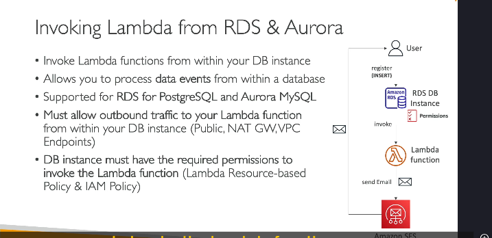
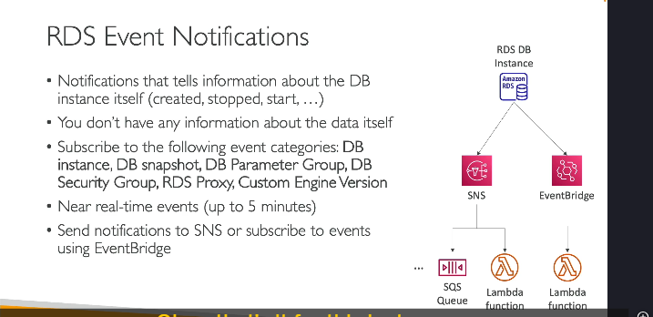

---

### **1. Gọi Lambda từ cơ sở dữ liệu (RDS/Aurora):**

- Một số cơ sở dữ liệu như **RDS for PostgreSQL** và **Aurora MySQL** cho phép **gọi hàm Lambda trực tiếp từ bên trong cơ sở dữ liệu**.
- Lợi ích:
  - Xử lý các sự kiện dữ liệu xảy ra trong cơ sở dữ liệu.
  - Ví dụ: 
    - Khi người dùng thêm dữ liệu (như đăng ký tài khoản) vào bảng "registration".
    - Cơ sở dữ liệu sẽ tự động gọi hàm Lambda.
    - Lambda có thể xử lý công việc, như: 
      - Gửi email chào mừng.
      - Thực hiện các xử lý khác liên quan.

---

### **. Thiết lập:**

- **Lưu ý:** Thiết lập này được thực hiện **bên trong cơ sở dữ liệu**, **không qua AWS Console**.
- Khi cơ sở dữ liệu gọi Lambda:
  - Phải đảm bảo **kết nối mạng** giữa cơ sở dữ liệu và Lambda:
    - Lambda có thể công khai (Public).
    - Hoặc dùng NAT Gateway, VPC Endpoint, hoặc các thiết lập VPC tương tự.
  - **Cấp quyền:** RDS/Aurora cần có **IAM Policy phù hợp** để gọi Lambda.

---

### **2 So sánh với RDS Event Notifications:**

- **RDS Event Notifications** cung cấp các thông tin về **trạng thái và sự kiện của cơ sở dữ liệu**, như:

  - Khi cơ sở dữ liệu được tạo, khởi động, hoặc chụp snapshot.
  - Các sự kiện liên quan đến nhóm tham số, bảo mật, proxy, hoặc phiên bản động cơ tùy chỉnh.

- **Hạn chế:**
  - **Không cung cấp thông tin về dữ liệu trong cơ sở dữ liệu**.
  - Chỉ nhận được sự kiện về cơ sở dữ liệu, **không phải dữ liệu**.

---

### **. RDS Event Notifications:**

- **Gần thời gian thực:** Các sự kiện được gửi trong vòng **tối đa 5 phút**.
- Có thể gửi thông báo đến:
  - **SNS (Simple Notification Service):**
    - Gửi thông báo đến hàng đợi SQS hoặc hàm Lambda.
  - **EventBridge:**
    - Hỗ trợ nhiều điểm đích hơn, bao gồm cả Lambda.

---

### **Tóm lại:**

- **Gọi Lambda từ RDS/Aurora:**
  - Tốt để xử lý **sự kiện dữ liệu trực tiếp** từ cơ sở dữ liệu.
  - Phải thiết lập mạng và quyền IAM đúng cách.
- **RDS Event Notifications:**
  - Chỉ cung cấp thông tin về **trạng thái cơ sở dữ liệu**, không liên quan đến dữ liệu.
  - Phù hợp để giám sát hoặc quản lý cơ sở hạ tầng.

Hy vọng bạn hiểu rõ hơn về tích hợp RDS, Aurora và Lambda! 😊
