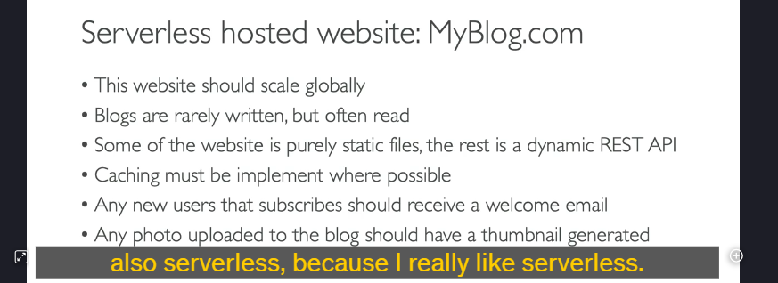
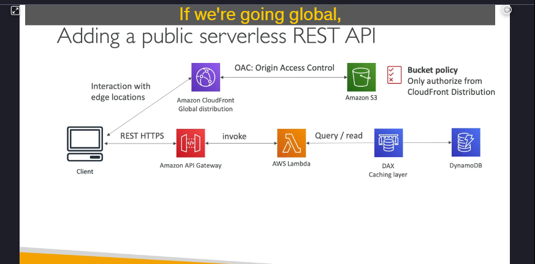
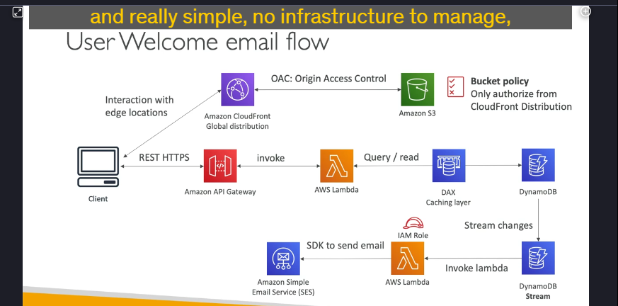
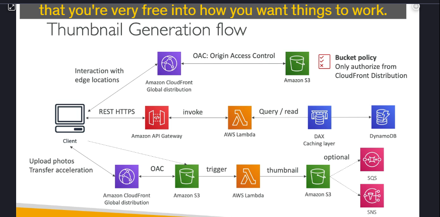
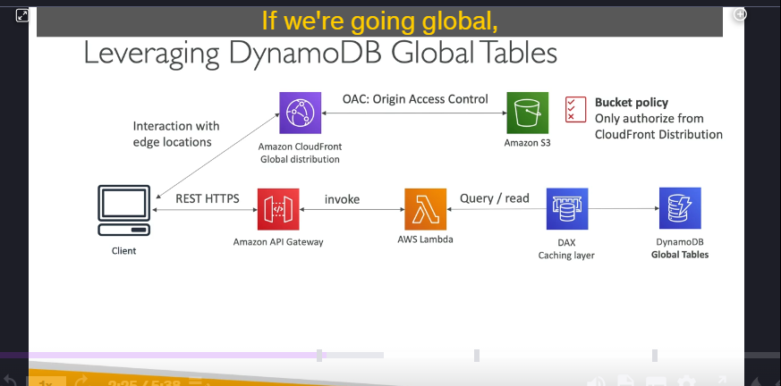
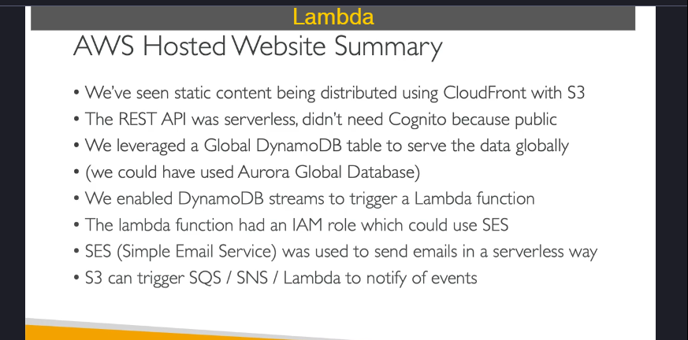

### **Chi Tiết Kiến Thức Về Serverless Hosted Website (MyBlog.com)**

cách xây dựng một **website serverless** có tên **MyBlog.com** với các yêu cầu cụ thể như khả năng scale toàn cầu, tối ưu hiệu suất, và tự động hóa các tác vụ như gửi email chào mừng và tạo thumbnail cho ảnh. Dưới đây là các điểm chính và chi tiết kỹ thuật:

---

### **1. Yêu Cầu Của Website**

- **Scale toàn cầu**: Website cần phục vụ hàng trăm nghìn người dùng trên toàn thế giới.
- **Tần suất đọc/ghi**:
  - **Đọc nhiều**: Blog được đọc thường xuyên.
  - **Ghi ít**: Blog mới được thêm vào 1 lần/ngày hoặc 1 lần/tuần.
- **Tối ưu hiệu suất**: Cần caching để giảm độ trễ và chi phí.
- **Tự động hóa**:
  - Gửi email chào mừng khi người dùng đăng ký.
  - Tạo thumbnail tự động khi người dùng upload ảnh.
- **Serverless**: Tất cả các thành phần phải là serverless để giảm thiểu quản lý và chi phí.

---

### **2. Kiến Trúc Serverless Đề Xuất**

#### **a. Phân Phối Nội Dung Tĩnh (Static Content)**

- **Amazon S3**:
  - **Vai trò**: Lưu trữ các file tĩnh (HTML, CSS, JS, hình ảnh).
  - **Lợi ích**: Dễ dàng scale, chi phí thấp.
- **Amazon CloudFront**:
  - **Vai trò**: CDN (Content Delivery Network) phân phối nội dung tĩnh từ S3 đến người dùng trên toàn cầu.
  - **Lợi ích**: Giảm độ trễ bằng cách cache nội dung tại các edge locations.
  - **Bảo mật**: Sử dụng **Origin Access Control (OAC)** để đảm bảo chỉ CloudFront có thể truy cập vào S3 bucket.

#### **b. REST API Động (Dynamic REST API)**

- **Amazon API Gateway**:
  - **Vai trò**: Cung cấp các HTTPS endpoints để tương tác với backend.
  - **Tích hợp với Lambda**: API Gateway kích hoạt các hàm Lambda để xử lý yêu cầu.
- **AWS Lambda**:
  - **Vai trò**: Xử lý logic nghiệp vụ (ví dụ: lấy danh sách blog).
- **Amazon DynamoDB**:
  - **Vai trò**: Lưu trữ dữ liệu blog.
  - **Tối ưu hiệu suất**: Sử dụng **DynamoDB Accelerator (DAX)** để cache các truy vấn đọc.
  - **Scale toàn cầu**: Sử dụng **DynamoDB Global Tables** để giảm độ trễ cho người dùng ở các khu vực khác nhau.

#### **c. Gửi Email Chào Mừng (Welcome Email)**

- **DynamoDB Streams**:
  - **Vai trò**: Theo dõi các thay đổi trong bảng người dùng (ví dụ: khi có người đăng ký mới).
  - **Tích hợp với Lambda**: Khi có thay đổi, DynamoDB Streams kích hoạt một hàm Lambda.
- **AWS Lambda**:
  - **Vai trò**: Gửi email chào mừng thông qua **Amazon Simple Email Service (SES)**.
  - **Lợi ích**: Serverless, tự động scale, và dễ dàng tích hợp.

#### **d. Tạo Thumbnail Tự Động (Thumbnail Generation)**

- **Amazon S3**:
  - **Vai trò**: Lưu trữ ảnh gốc được upload bởi người dùng.
  - **Tích hợp với Lambda**: Khi một file mới được upload vào S3, nó sẽ kích hoạt một hàm Lambda.
- **AWS Lambda**:
  - **Vai trò**: Tạo thumbnail từ ảnh gốc và lưu vào một S3 bucket khác.
  - **Lợi ích**: Tự động hóa quá trình xử lý ảnh mà không cần quản lý máy chủ.
- **Tùy chọn khác**: S3 cũng có thể kích hoạt **SQS** (Simple Queue Service) hoặc **SNS** (Simple Notification Service) để xử lý các sự kiện phức tạp hơn.

---

### **3. Lợi Ích Của Kiến Trúc Serverless**

- **Không cần quản lý máy chủ**: AWS quản lý tất cả tài nguyên.
- **Tự động scale**: Ứng dụng tự động scale dựa trên nhu cầu.
- **Chi phí thấp**: Chỉ trả tiền cho tài nguyên sử dụng.
- **Hiệu suất cao**: Sử dụng caching (CloudFront, DAX) để giảm độ trễ.
- **Bảo mật**: Sử dụng OAC để bảo vệ S3 bucket và IAM roles để kiểm soát quyền truy cập.

---

### **4. Lưu Ý Quan Trọng**

- **Sử dụng CloudFront để phân phối nội dung tĩnh**: Đảm bảo nội dung được phân phối nhanh chóng trên toàn cầu.
- **DynamoDB Global Tables**: Giúp giảm độ trễ cho người dùng ở các khu vực khác nhau.
  
- **S3 Transfer Acceleration**: Tăng tốc độ upload file lên S3 nếu cần.
- **Không lưu trữ credentials trên client**: Luôn sử dụng temporary credentials hoặc IAM roles để đảm bảo bảo mật.

---

### **5. Tổng Kết**

Kiến trúc serverless cho **MyBlog.com** bao gồm:

- **S3 + CloudFront**: Phân phối nội dung tĩnh toàn cầu.
- **API Gateway + Lambda + DynamoDB**: Xử lý các yêu cầu động và lưu trữ dữ liệu.
- **DynamoDB Streams + Lambda + SES**: Gửi email chào mừng tự động.
- **S3 + Lambda**: Tạo thumbnail tự động khi upload ảnh.

Đây là một kiến trúc hoàn chỉnh, serverless, và có khả năng scale toàn cầu, phù hợp cho các ứng dụng có lượng truy cập lớn.
