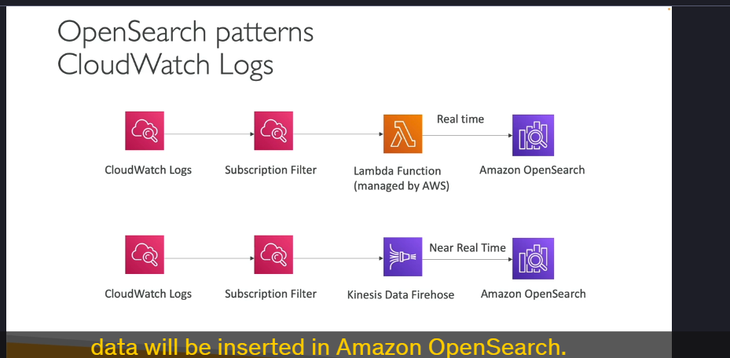

Amazon OpenSearch Service (trước đây là Amazon Elasticsearch Service) là một dịch vụ quản lý hoàn toàn (managed service) cho phép bạn thực hiện các tác vụ tìm kiếm và phân tích dữ liệu một cách hiệu quả. Dưới đây là các chi tiết quan trọng về Amazon OpenSearch Service:

---

### 1. **Tổng quan về Amazon OpenSearch**

- **Kế thừa từ Elasticsearch**: OpenSearch là phiên bản kế thừa của Elasticsearch, được đổi tên do các vấn đề về giấy phép.
- **Khả năng tìm kiếm mạnh mẽ**: Khác với DynamoDB (chỉ cho phép truy vấn dữ liệu bằng primary key hoặc index), OpenSearch cho phép tìm kiếm trên bất kỳ trường nào, kể cả tìm kiếm **partial matches** (khớp một phần).
- **Hỗ trợ phân tích dữ liệu**: Ngoài tìm kiếm, OpenSearch còn được sử dụng để thực hiện các truy vấn phân tích (analytic queries).

---

### 2. **Các chế độ triển khai**

- **Managed Cluster**: Bạn có thể tạo một cụm (cluster) OpenSearch với các instance vật lý được AWS quản lý. Bạn có thể chọn loại instance, số lượng node, và các cấu hình khác.
- **Serverless Cluster**: OpenSearch Serverless cho phép bạn sử dụng OpenSearch mà không cần quản lý cơ sở hạ tầng. AWS tự động xử lý việc mở rộng (scaling) và vận hành.

---

### 3. **Ngôn ngữ truy vấn**

- **Ngôn ngữ riêng**: OpenSearch sử dụng ngôn ngữ truy vấn riêng, không hỗ trợ SQL một cách tự nhiên.
- **SQL Plugin**: Bạn có thể kích hoạt **SQL compatibility plugin** để sử dụng SQL để truy vấn dữ liệu trong OpenSearch.

---

### 4. **Nhập dữ liệu vào OpenSearch**

Dữ liệu có thể được nhập vào OpenSearch từ nhiều nguồn khác nhau, bao gồm:

- **Kinesis Data Firehose**: Nhập dữ liệu gần thời gian thực (near real-time).
- **IoT Core**: Nhập dữ liệu từ các thiết bị IoT.
- **CloudWatch Logs**: Nhập logs từ CloudWatch.
- **Ứng dụng tùy chỉnh**: Bạn có thể xây dựng ứng dụng để nhập dữ liệu vào OpenSearch.

---

### 5. **Bảo mật**

- **IAM**: Quản lý quyền truy cập thông qua AWS Identity and Access Management (IAM).
- **Cognito**: Tích hợp với Amazon Cognito để xác thực người dùng.
- **Mã hóa**: Hỗ trợ mã hóa dữ liệu khi lưu trữ (encryption at rest) và mã hóa dữ liệu khi truyền (encryption in-flight).

---

### 6. **Phân tích và trực quan hóa dữ liệu**

- **OpenSearch Dashboards**: Công cụ trực quan hóa dữ liệu tích hợp sẵn, cho phép bạn tạo các biểu đồ, bảng điều khiển (dashboards) và báo cáo từ dữ liệu trong OpenSearch.
- **Analytic Queries**: Bạn có thể thực hiện các truy vấn phân tích phức tạp trên dữ liệu được lưu trữ trong OpenSearch.

---

### 7. **Các mẫu kiến trúc phổ biến**

#### **a. Tích hợp với DynamoDB**

- **Mục đích**: Cung cấp khả năng tìm kiếm mạnh mẽ cho dữ liệu trong DynamoDB.
- **Cách thức hoạt động**:
  1. Dữ liệu được lưu trữ trong DynamoDB.
  2. **DynamoDB Streams** ghi lại các thay đổi (insert, update, delete) trong DynamoDB.
  3. Một **Lambda Function** đọc dữ liệu từ DynamoDB Streams và chèn vào OpenSearch.
  4. Ứng dụng có thể tìm kiếm dữ liệu trong OpenSearch (ví dụ: tìm kiếm một phần tên sản phẩm).
  5. Khi tìm thấy kết quả, ứng dụng sẽ truy vấn DynamoDB để lấy thông tin chi tiết.

#### **b. Nhập CloudWatch Logs vào OpenSearch**

- **Cách 1: Sử dụng Lambda Function**:
  1. **CloudWatch Logs Subscription Filter** gửi dữ liệu logs đến một Lambda Function.
  2. Lambda Function chèn dữ liệu vào OpenSearch trong thời gian thực.
- **Cách 2: Sử dụng Kinesis Data Firehose**:
  1. **CloudWatch Logs Subscription Filter** gửi dữ liệu logs đến Kinesis Data Firehose.
  2. Kinesis Data Firehose chèn dữ liệu vào OpenSearch gần thời gian thực (near real-time).

#### **c. Nhập dữ liệu từ Kinesis Data Streams**

- **Cách 1: Sử dụng Kinesis Data Firehose**:
  1. Kinesis Data Firehose đọc dữ liệu từ Kinesis Data Streams.
  2. Dữ liệu có thể được biến đổi (transform) bằng Lambda Function trước khi chèn vào OpenSearch.
- **Cách 2: Sử dụng Lambda Function**:
  1. Một Lambda Function đọc dữ liệu từ Kinesis Data Streams.
  2. Lambda Function chèn dữ liệu vào OpenSearch trong thời gian thực.

---

### 8. **Ưu điểm của Amazon OpenSearch**

- **Tìm kiếm linh hoạt**: Hỗ trợ tìm kiếm trên mọi trường dữ liệu, kể cả partial matches.
- **Phân tích dữ liệu**: Cung cấp khả năng phân tích dữ liệu mạnh mẽ.
- **Tích hợp dễ dàng**: Hỗ trợ nhập dữ liệu từ nhiều nguồn như DynamoDB, CloudWatch Logs, Kinesis, và IoT.
- **Bảo mật cao**: Tích hợp với IAM, Cognito, và hỗ trợ mã hóa dữ liệu.
- **Trực quan hóa dữ liệu**: OpenSearch Dashboards giúp tạo các báo cáo và dashboard dễ dàng.

---

### 9. **Tổng kết**

Amazon OpenSearch Service là một công cụ mạnh mẽ để thực hiện các tác vụ tìm kiếm và phân tích dữ liệu. Với khả năng tích hợp linh hoạt với các dịch vụ AWS khác như DynamoDB, CloudWatch, Kinesis, và IoT, OpenSearch trở thành một giải pháp lý tưởng cho các ứng dụng cần tìm kiếm và phân tích dữ liệu thời gian thực.
