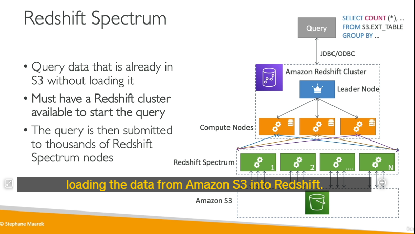

Amazon Redshift là một dịch vụ kho dữ liệu (data warehouse) được xây dựng dựa trên PostgreSQL, nhưng nó được thiết kế cho các tác vụ phân tích dữ liệu quy mô lớn (OLAP - Online Analytical Processing) thay vì xử lý giao dịch trực tuyến (OLTP - Online Transaction Processing). Dưới đây là các chi tiết quan trọng về Amazon Redshift:

### 1. **Đặc điểm chính của Redshift**

- **Hiệu suất cao**: Redshift cung cấp hiệu suất tốt hơn 10 lần so với các kho dữ liệu truyền thống, và có khả năng mở rộng lên đến petabyte dữ liệu.
- **Lưu trữ dữ liệu dạng cột**: Dữ liệu trong Redshift được lưu trữ dưới dạng cột thay vì dòng, giúp tối ưu hóa việc thực hiện các truy vấn phân tích, đặc biệt là các phép tính tổng hợp (aggregations) và thống kê.
- **Công cụ truy vấn song song**: Redshift sử dụng một công cụ truy vấn song song để tăng tốc độ thực thi các truy vấn.

### 2. **Các chế độ triển khai**

- **Provisioned Cluster**: Bạn có thể tự cung cấp và quản lý các cụm (cluster) Redshift, chọn loại instance phù hợp và có thể đặt trước (reserve) các instance để tiết kiệm chi phí.
- **Serverless Cluster**: Redshift Serverless cho phép bạn sử dụng Redshift mà không cần quản lý cơ sở hạ tầng. AWS sẽ tự động quản lý việc mở rộng và thu hẹp tài nguyên dựa trên nhu cầu của bạn.

### 3. **Kiến trúc của Redshift Cluster**

- **Leader Node**: Là nút quản lý việc lập kế hoạch truy vấn (query planning) và tổng hợp kết quả (results aggregation). Nó nhận truy vấn từ người dùng, lập kế hoạch thực thi, và gửi các phần của truy vấn đến các Compute Nodes.
- **Compute Nodes**: Là các nút thực thi truy vấn và gửi kết quả trở lại Leader Node. Mỗi Compute Node chịu trách nhiệm xử lý một phần của dữ liệu.

### 4. **So sánh Redshift và Athena**

- **Redshift**: Có hiệu suất truy vấn nhanh hơn, hỗ trợ các phép join và tổng hợp tốt hơn nhờ vào việc sử dụng indexes. Tuy nhiên, bạn cần phải cung cấp và quản lý một cụm (cluster).
- **Athena**: Là dịch vụ serverless, không yêu cầu quản lý cơ sở hạ tầng, và dữ liệu được lưu trữ trực tiếp trong S3. Athena phù hợp cho các truy vấn ad hoc và phân tích dữ liệu không thường xuyên.

### 5. **Snapshots và Disaster Recovery (DR)**


- **Snapshots**: Là các bản sao lưu theo thời điểm (point-in-time backups) của một cụm Redshift. Snapshots được lưu trữ trong S3 và chỉ lưu các thay đổi (incremental), giúp tiết kiệm không gian lưu trữ.
  - **Manual Snapshots**: Bạn có thể tạo snapshot thủ công và giữ chúng cho đến khi bạn xóa.
  - **Automated Snapshots**: Redshift có thể tự động tạo snapshot theo lịch trình (ví dụ: mỗi 8 giờ hoặc mỗi khi có 5GB dữ liệu thay đổi). Bạn có thể thiết lập thời gian lưu trữ cho các snapshot tự động.
- **Disaster Recovery (DR)**:
  - **Single-AZ**: Hầu hết các cụm Redshift hoạt động trong một Availability Zone (AZ). Để đảm bảo khả năng phục hồi sau thảm họa, bạn cần sử dụng snapshot.
  - **Multi-AZ**: Một số loại cụm Redshift hỗ trợ chế độ Multi-AZ, giúp tự động phục hồi dữ liệu trong trường hợp có sự cố.
  - **Cross-Region Snapshots**: Redshift cho phép bạn cấu hình để tự động sao chép snapshot (cả manual và automated) sang một AWS Region khác, giúp bạn có chiến lược Disaster Recovery toàn diện.

### 6. **Quy trình phục hồi từ Snapshot**

- Bạn có thể khôi phục một snapshot vào một cụm Redshift mới. Nếu snapshot được sao chép sang một Region khác, bạn có thể khôi phục cụm Redshift từ snapshot đó trong Region mới, đảm bảo khả năng phục hồi dữ liệu trong trường hợp có sự cố tại Region gốc.

### 7. **Tích hợp với các công cụ BI**

- Redshift tích hợp trực tiếp với các công cụ Business Intelligence (BI) như **Amazon QuickSight** và **Tableau**, giúp bạn dễ dàng tạo báo cáo và dashboard từ dữ liệu trong Redshift.

---

Amazon Redshift cung cấp nhiều cách để đưa dữ liệu vào cụm (cluster) của nó, cũng như các tính năng mạnh mẽ như **Redshift Spectrum** để phân tích dữ liệu trực tiếp từ Amazon S3 mà không cần tải dữ liệu vào Redshift. Dưới đây là chi tiết về các phương pháp nhập dữ liệu và tính năng Redshift Spectrum:

---

### 1. **Các phương pháp nhập dữ liệu vào Redshift**


#### **a. Sử dụng Amazon Kinesis Data Firehose**

- **Cách thức hoạt động**:
  - Kinesis Data Firehose nhận dữ liệu từ các nguồn khác nhau (ví dụ: IoT devices, ứng dụng, logs).
  - Dữ liệu được ghi vào một **Amazon S3 bucket**.
  - Sau đó, Kinesis Data Firehose tự động thực hiện lệnh **COPY** để tải dữ liệu từ S3 vào Redshift.
- **Ưu điểm**: Tự động hóa quá trình nhập dữ liệu, phù hợp cho các luồng dữ liệu thời gian thực.

#### **b. Sử dụng lệnh COPY từ S3**

- **Cách thức hoạt động**:
  - Bạn tải dữ liệu lên **Amazon S3**.
  - Sau đó, sử dụng lệnh **COPY** trong Redshift để sao chép dữ liệu từ S3 vào Redshift.
  - Lệnh COPY sử dụng **IAM role** để xác thực và truy cập dữ liệu trong S3.
- **Hai cách thực hiện**:
  - **Không sử dụng Enhanced VPC Routing**: Dữ liệu sẽ đi qua internet để từ S3 vào Redshift.
  - **Sử dụng Enhanced VPC Routing**: Dữ liệu sẽ đi qua **Virtual Private Cloud (VPC)**, đảm bảo tính bảo mật và riêng tư.
- **Ưu điểm**: Linh hoạt, phù hợp cho các tác vụ nhập dữ liệu theo lô (batch).

#### **c. Sử dụng JDBC Driver**

- **Cách thức hoạt động**:
  - Bạn có thể sử dụng **JDBC driver** để kết nối trực tiếp từ ứng dụng hoặc EC2 instance vào Redshift.
  - Dữ liệu được chèn vào Redshift thông qua các câu lệnh **INSERT**.
- **Lưu ý**:
  - Để tối ưu hiệu suất, nên chèn dữ liệu theo **batch lớn** thay vì từng dòng một.
  - Chèn dữ liệu từng dòng có thể gây ra hiệu suất kém do Redshift được thiết kế cho các tác vụ xử lý hàng loạt (batch processing).
- **Ưu điểm**: Phù hợp cho các ứng dụng cần ghi dữ liệu trực tiếp vào Redshift.

---

### 2. **Redshift Spectrum: Phân tích dữ liệu trực tiếp từ S3**



#### **a. Tổng quan**

- **Mục đích**: Redshift Spectrum cho phép bạn phân tích dữ liệu trực tiếp từ **Amazon S3** mà không cần tải dữ liệu vào Redshift.
- **Yêu cầu**: Bạn cần có một **Redshift cluster** để khởi tạo truy vấn.
- **Cách thức hoạt động**:
  - Khi bạn chạy một truy vấn trên dữ liệu trong S3, Redshift Spectrum sẽ tự động khởi động hàng nghìn **Spectrum nodes** để thực thi truy vấn.
  - Các nodes này sẽ đọc dữ liệu từ S3, thực hiện các phép tính (ví dụ: tổng hợp, lọc) và gửi kết quả trở lại Redshift cluster.
  - Redshift cluster sau đó trả về kết quả cho người dùng.

#### **b. Ví dụ**

- **Truy vấn dữ liệu từ S3**:
```sql
  SELECT * FROM s3://your-bucket/path/to/data;
```
  - Redshift Spectrum sẽ tự động xử lý truy vấn này bằng cách sử dụng hàng nghìn nodes để đọc dữ liệu từ S3.
- **Kết quả**: Dữ liệu được xử lý và trả về Redshift cluster, sau đó hiển thị cho người dùng.

#### **c. Ưu điểm của Redshift Spectrum**

- **Không cần tải dữ liệu vào Redshift**: Tiết kiệm thời gian và không gian lưu trữ.
- **Sử dụng tài nguyên tính toán mạnh mẽ**: Redshift Spectrum sử dụng hàng nghìn nodes để xử lý dữ liệu, giúp tăng tốc độ truy vấn.
- **Phù hợp cho dữ liệu lớn**: Bạn có thể phân tích dữ liệu lớn trong S3 mà không cần lo lắng về giới hạn tài nguyên của Redshift cluster.

---

### 3. **Tổng kết**

#### **Các phương pháp nhập dữ liệu vào Redshift**

1. **Kinesis Data Firehose**: Tự động hóa quá trình nhập dữ liệu từ các nguồn thời gian thực.
2. **Lệnh COPY từ S3**: Linh hoạt và phù hợp cho các tác vụ nhập dữ liệu theo lô.
3. **JDBC Driver**: Phù hợp cho các ứng dụng cần ghi dữ liệu trực tiếp vào Redshift.

#### **Redshift Spectrum**

- Cho phép phân tích dữ liệu trực tiếp từ S3 mà không cần tải dữ liệu vào Redshift.
- Sử dụng tài nguyên tính toán mạnh mẽ để xử lý dữ liệu lớn.
- Phù hợp cho các tác vụ phân tích dữ liệu quy mô lớn.

---

### 4. **Lưu ý quan trọng**

- **Enhanced VPC Routing**: Nên kích hoạt tính năng này nếu bạn muốn đảm bảo dữ liệu di chuyển trong mạng riêng ảo (VPC) để tăng cường bảo mật.
- **Batch Insert**: Khi sử dụng JDBC driver, luôn ưu tiên chèn dữ liệu theo batch để tối ưu hiệu suất.
- **Redshift Spectrum**: Sử dụng khi bạn cần phân tích dữ liệu lớn trong S3 mà không muốn tải dữ liệu vào Redshift.

Amazon Redshift là một công cụ mạnh mẽ cho các tác vụ phân tích dữ liệu quy mô lớn, và với các tính năng như Redshift Spectrum, nó trở thành một giải pháp linh hoạt và hiệu quả cho nhiều trường hợp sử dụng khác nhau.
