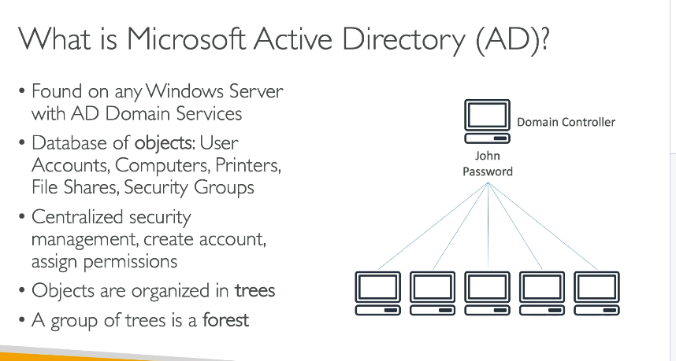
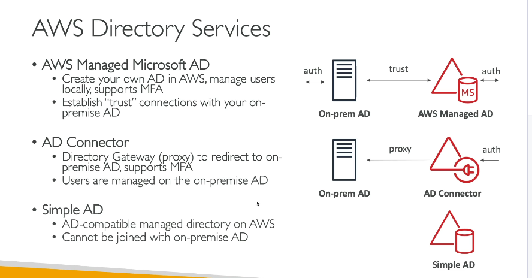
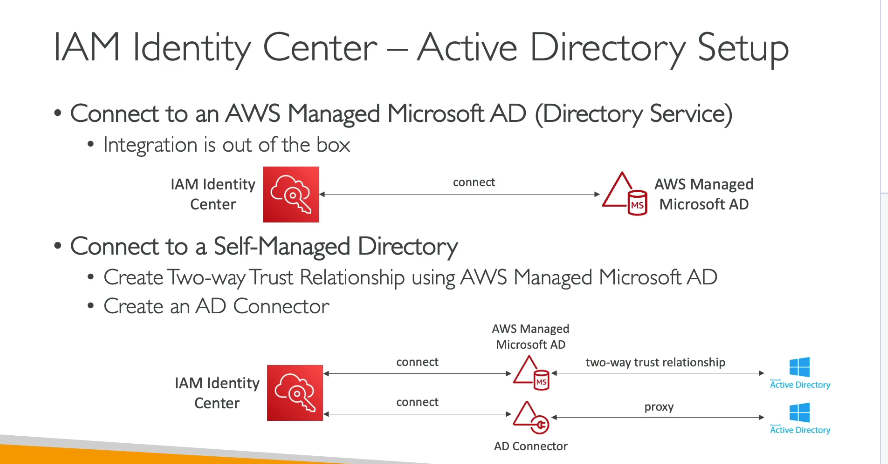

## 1. Microsoft Active Directory (AD)

**Microsoft Active Directory (AD)** là dịch vụ quản lý danh tính và quyền truy cập được cài đặt trên Windows Server với vai trò AD Domain Services. Nó là một cơ sở dữ liệu tập trung chứa các đối tượng (objects) như:

- **User accounts:** Tài khoản người dùng
- **Computers:** Các máy tính trong hệ thống
- **Printers, file shares:** Các tài nguyên chia sẻ
- **Security groups:** Nhóm bảo mật

### Các đặc điểm chính của Microsoft AD:

- **Quản lý tập trung:**Tất cả các tài khoản người dùng, máy tính và tài nguyên được quản lý từ một nơi thông qua một domain controller.Khi một người dùng đăng nhập trên bất kỳ máy tính nào trong mạng cùng được kết nối với domain controller, thông tin đăng nhập được tra cứu và xác thực từ AD.
- **Cấu trúc cây và rừng (Tree và Forest):**Các đối tượng được tổ chức dưới dạng một cây (tree) và một tập hợp các cây tạo thành một rừng (forest). Đây là khái niệm về cách phân cấp và quản lý các đối tượng, giúp mở rộng quản lý trên một khu vực rộng lớn.
- **Chức năng bảo mật:**
  AD giúp bạn tạo và gán các quyền truy cập cho tài khoản người dùng, từ đó đảm bảo tính bảo mật cho hệ thống và các tài nguyên mạng.

**Ví dụ:**
Giả sử có một domain controller trong mạng nội bộ. Khi tạo một tài khoản người dùng (ví dụ: username "John" với mật khẩu "Password"), tài khoản này được lưu trữ trên domain controller. Khi một máy tính khác trong mạng sử dụng thông tin đăng nhập của "John", máy đó sẽ gửi yêu cầu xác thực tới domain controller để kiểm tra thông tin và cho phép đăng nhập nếu thông tin hợp lệ. Nhờ đó, người dùng "John" có thể truy cập vào bất kỳ máy tính nào trong hệ thống.

---

## 2. AWS Directory Services

**AWS Directory Services** cung cấp các giải pháp để triển khai Active Directory trên AWS. Điều này giúp tích hợp dịch vụ quản lý danh tính của Microsoft AD với các tài nguyên trên AWS, đặc biệt hữu ích khi triển khai các EC2 instance chạy Windows.

AWS Directory Services có 3 “hương vị” chính, mỗi loại phục vụ các trường hợp sử dụng khác nhau:

### A. AWS Managed Microsoft AD

- **Đặc điểm:**

  - Triển khai Active Directory đầy đủ trên AWS được quản lý bởi AWS.
  - Cho phép quản lý người dùng và nhóm trực tiếp từ cloud.
  - Hỗ trợ tính năng bảo mật nâng cao như multi-factor authentication (MFA).
- **Tính năng nổi bật:**

  - Bạn có thể thiết lập **mối quan hệ tin cậy (trust relationship)** với AD on-premise.
    - Điều này có nghĩa là người dùng và nhóm từ hệ thống on-premise và AWS đều có thể được xác thực qua nhau.
  - Thích hợp khi bạn muốn có một directory độc lập trên AWS nhưng vẫn muốn đồng bộ người dùng với hệ thống AD hiện có ở on-premise.

### B. AD Connector

- **Đặc điểm:**

  - AD Connector hoạt động như một **proxy (cổng chuyển tiếp)** cho phép kết nối từ AWS tới AD on-premise.
  - Tất cả các yêu cầu đăng nhập và tra cứu danh tính được chuyển tiếp về AD on-premise.
  - Người dùng và thông tin quản lý vẫn được lưu trữ và quản lý từ on-premise.
- **Tính năng nổi bật:**

  - Đáp ứng nhu cầu của các tổ chức không muốn di chuyển hoặc nhân đôi Active Directory lên cloud.
  - Hỗ trợ multi-factor authentication khi cần.
  - Thích hợp khi bạn muốn giữ hệ thống quản lý người dùng ở on-premise nhưng cần một giải pháp để cho các tài nguyên AWS (ví dụ: ứng dụng chạy trên EC2) sử dụng dịch vụ xác thực của AD.

### C. Simple AD

- **Đặc điểm:**

  - Một dịch vụ directory tương thích với AD được quản lý bởi AWS nhưng **không dựa trên công nghệ Microsoft AD**.
  - Không hỗ trợ kết nối với AD on-premise.
- **Tính năng nổi bật:**

  - Dành cho các trường hợp sử dụng đơn giản trong cloud, khi không có sẵn AD on-premise hoặc không cần khả năng kết nối trust với hệ thống ngoài.
  - Phù hợp cho các ứng dụng hoặc môi trường nhỏ, nơi chỉ cần một giải pháp directory cơ bản để xác thực người dùng trên các EC2 instance chạy Windows.

---

## 3. Tích hợp với IAM Identity Center

AWS Directory Services có thể được tích hợp với **IAM Identity Center** (trước đây là AWS Single Sign-On) để quản lý truy cập người dùng cho các ứng dụng và dịch vụ trên AWS.

- **Với AWS Managed Microsoft AD:**Việc tích hợp được thực hiện “out of the box” (tức là rất dễ thiết lập) bằng cách chỉ cần chỉ định directory đã được triển khai.
- **Với AD Connector:**Yêu cầu AD Connector được sử dụng để chuyển tiếp các truy vấn xác thực từ IAM Identity Center đến AD on-premise.Điều này cho phép người dùng từ hệ thống on-premise có thể sử dụng để truy cập các ứng dụng trên AWS, mặc dù có thể tồn tại một chút độ trễ do phương thức chuyển tiếp.
- **Lựa chọn giữa AWS Managed AD và AD Connector:**

  - Nếu bạn muốn quản lý người dùng từ cloud và có thể bổ sung thêm các chính sách bảo mật (MFA, v.v…), thì **AWS Managed Microsoft AD** là lựa chọn phù hợp.
  - Nếu bạn chỉ muốn “proxy” các yêu cầu từ AWS về hệ thống AD on-premise và không cần quản lý người dùng cloud, **AD Connector** là giải pháp thích hợp.

---

## 4. Lợi ích khi sử dụng Directory Services trên AWS cho môi trường Windows

- **Tăng cường bảo mật và quản lý tập trung:**Cho phép các instance Windows trên AWS tham gia vào domain controller, giúp quản lý truy cập và bảo mật một cách tập trung tương tự như trong môi trường on-premise.
- **Giảm độ trễ và tối ưu hiệu suất:**Khi các EC2 instance chạy Windows được kết nối với directory gần với chúng, việc truy xuất thông tin đăng nhập và chính sách bảo mật được thực hiện nhanh chóng.
- **Tích hợp liền mạch với các giải pháp AWS:**
  Dễ dàng tích hợp với IAM Identity Center và các dịch vụ khác của AWS, đảm bảo quy trình quản lý danh tính và truy cập thống nhất trên toàn bộ hạ tầng.

---

## Kết Luận

- **Microsoft Active Directory** là hệ thống quản lý danh tính nội bộ, tập trung vào quản lý người dùng, máy tính và tài nguyên trên hệ thống Windows.
- **AWS Directory Services** giúp bạn triển khai các giải pháp directory trên AWS với ba lựa chọn:
  - **AWS Managed Microsoft AD:** Cho phép tạo một Active Directory đầy đủ trên AWS, có thể kết nối trust với AD on-premise.
  - **AD Connector:** Hoạt động như một proxy, chuyển tiếp yêu cầu xác thực về AD on-premise.
  - **Simple AD:** Directory cơ bản, phù hợp với môi trường không có AD on-premise.
- **Tích hợp với IAM Identity Center** giúp mở rộng việc quản lý truy cập một cách đơn giản và liền mạch, tùy theo cấu trúc quản lý người dùng của tổ chức.
