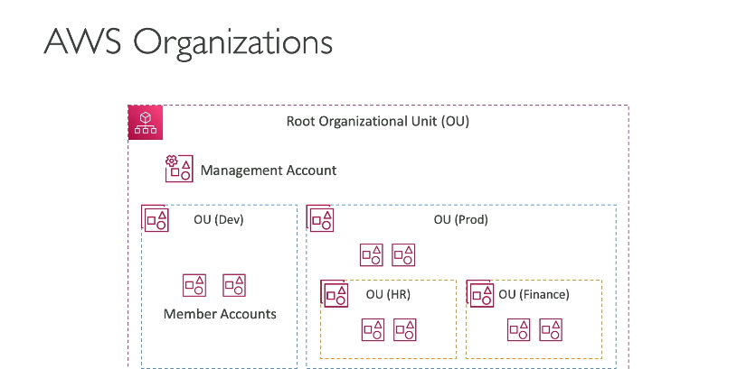
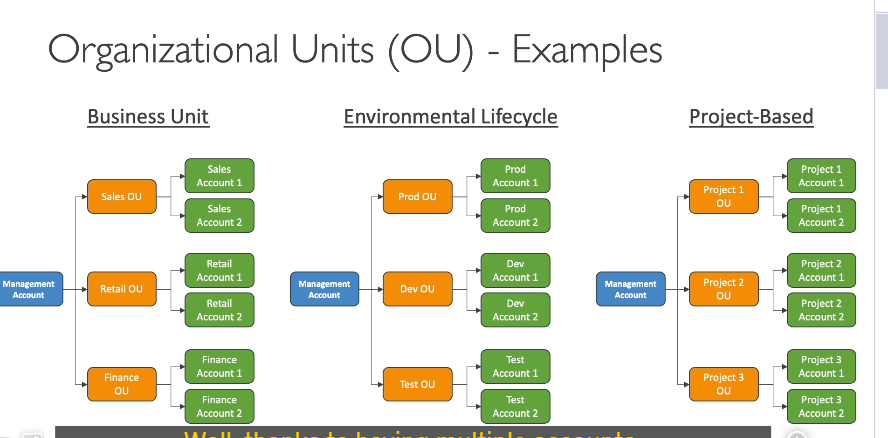
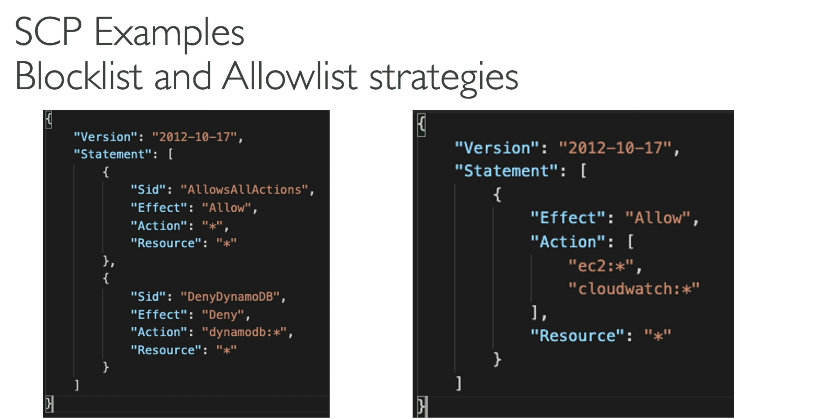
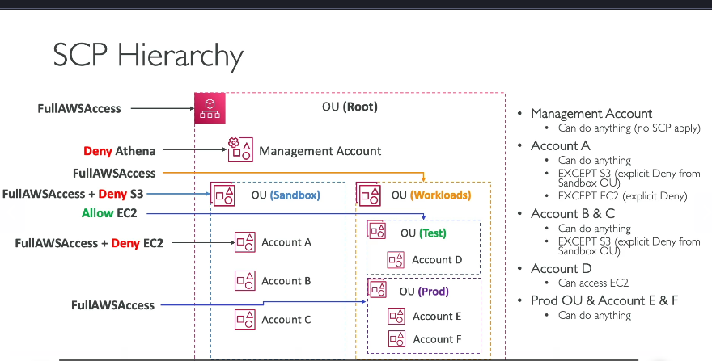

Dưới đây là bản dịch chi tiết và đầy đủ sang tiếng Việt, giữ nguyên thuật ngữ kỹ thuật:

---

**AWS Organizations – Tổ Chức AWS**
Giờ hãy cùng thảo luận về **AWS Organizations**.

### **Tổng Quan**

- Đây là một **dịch vụ toàn cầu** của AWS, cho phép bạn quản lý nhiều tài khoản AWS **cùng lúc**.
- Bạn tạo một **tổ chức (organization)**, trong đó:
  - Tài khoản chính được gọi là **tài khoản quản lý (management account)**.
  - Các tài khoản khác tham gia tổ chức hoặc được tạo từ tổ chức gọi là **tài khoản thành viên (member accounts)**.
  - **Lưu ý**: Mỗi tài khoản chỉ thuộc **một tổ chức** duy nhất.

---

### **Lợi Ích Chính**

1. **Hóa Đơn Hợp Nhất (Consolidated Billing)**

   - Thanh toán tập trung qua **tài khoản quản lý** với một phương thức thanh toán duy nhất.
   - **Ưu đãi chi phí** từ việc tổng hợp mức sử dụng:
     - Ví dụ: Nhiều tài khoản dùng chung EC2/S3 sẽ được **giảm giá lớn** do tổng lượng dùng được cộng dồn.
     - Chia sẻ **Reserved Instances** và **Savings Plans** giữa các tài khoản: Nếu một Reserved Instance không dùng ở tài khoản A, tài khoản B có thể tận dụng để tiết kiệm chi phí.
2. **Tự Động Hóa Tạo Tài Khoản**

   - Sử dụng **API** để tạo tài khoản tự động trong tổ chức, giúp quản lý dễ dàng.

---

### **Cấu Trúc Tổ Chức (Organizational Units - OUs)**



- **Root OU**: Đơn vị tổ chức gốc, chứa **tài khoản quản lý**.
- **Sub-OUs**: Tạo các OU con để phân nhóm tài khoản linh hoạt:
  - Ví dụ:
    - **Môi trường**: Prod/Test/Dev.
    - **Phòng ban**: HR/Finance.
    - **Dự án**: OU riêng cho từng dự án.
  - Có thể kết hợp nhiều cách phân loại tùy nhu cầu.

---

### **Lợi Thế Khi Dùng AWS Organizations**

1. **Bảo Mật Tốt Hơn**

   - Tách biệt tài khoản hiệu quả hơn so với dùng nhiều VPC trong một tài khoản.
2. **Quản Lý Tập Trung**

   - Áp dụng **tiêu chuẩn tagging** để theo dõi chi phí.
   - Bật **CloudTrail** cho tất cả tài khoản và gửi log về một **S3 bucket tập trung**.
   - Gửi **CloudWatch Logs** đến tài khoản logging chun
   - Thiết lập **cross-account roles** để quản trị tự động từ tài khoản quản lý.
3. **Service Control Policies (SCPs)**
   

   - **SCP** là chính sách IAM áp dụng cho OU/tài khoản để **giới hạn quyền** của người dùng/role.
   - **Đặc điểm quan trọng**:
     - **Tài khoản quản lý** luôn có **toàn quyền**, không chịu ảnh hưởng của SCP (tránh khóa quyền vĩnh viễn).
     - SCP yêu cầu **cho phép tường minh (explicit allow)** ở mọi cấp OU để thực hiện hành động.

---

### **Ví Dụ Về SCP**

- **Scenario 1**: Chặn dịch vụ cụ thể

```json
  {
    "Version": "2012-10-17",
    "Statement": [
      { "Effect": "Allow", "Action": "*", "Resource": "*" },  // Cho phép mọi thứ
      { "Effect": "Deny", "Action": "dynamodb:*", "Resource": "*" }  // Chặn DynamoDB
    ]
  }
```
- **Scenario 2**: Chỉ cho phép EC2 và CloudWatch

```json
  {
    "Version": "2012-10-17",
    "Statement": [
      { "Effect": "Allow", "Action": ["ec2:*", "cloudwatch:*"], "Resource": "*" }  // Whitelist
    ]
  }
```

---

### **Cơ Chế Áp Dụng SCP**



- **Ví dụ phân cấp**:

  - **Root OU**: Áp dụng SCP "Full AWS Access".
  - **Sandbox OU**: Thêm SCP "Deny S3".
  - **Account A**: Thêm SCP "Deny EC2".→ Kết quả:
    - Account A bị chặn **S3** (từ Sandbox OU) và **EC2** (từ chính nó).
    - Các tài khoản khác trong Sandbox chỉ bị chặn S3.
- **Lưu ý**:

  - SCP **Deny** luôn ghi đè lên Allow.
  - Cần có **Full Access** ở cấp cao hơn để kế thừa quyền.

---

### **Kết Luận**

AWS Organizations giúp tối ưu hóa quản lý, bảo mật và chi phí cho doanh nghiệp dùng nhiều tài khoản AWS. SCP và cấu trúc OU linh hoạt là công cụ mạnh để kiểm soát quyền và tài nguyên.

Hy vọng bài viết này hữu ích! Hẹn gặp lại ở phần tiếp theo.

---
