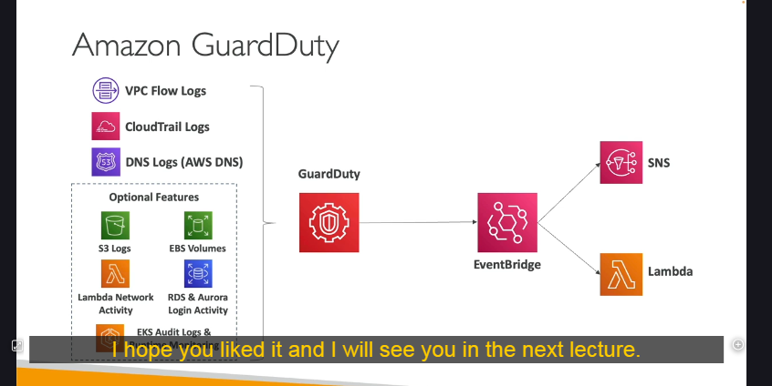

# Amazon GuardDuty - Bảo Vệ Tài Khoản AWS Với Phát Hiện Mối Đe Dọa Thông Minh

## Giới Thiệu

Amazon GuardDuty giúp phát hiện các mối đe dọa thông minh để bảo vệ tài khoản AWS của bạn. Dịch vụ này hoạt động bằng cách sử dụng thuật toán học máy, thực hiện phát hiện bất thường và sử dụng dữ liệu từ bên thứ ba để tìm ra các mối đe dọa.

## Cách Kích Hoạt

- Chỉ cần một cú nhấp chuột để bật
- Có phiên dùng thử 30 ngày
- Không cần cài đặt phần mềm bổ sung

## Nguồn Dữ Liệu Đầu Vào

GuardDuty phân tích nhiều nguồn dữ liệu đầu vào khác nhau:

### 1. CloudTrail Event Logs

- Tìm kiếm các cuộc gọi API bất thường hoặc triển khai trái phép
- Phân tích cả sự kiện quản lý và sự kiện dữ liệu:
  - **Sự kiện quản lý**: Ví dụ như tạo VPC Subnet, v.v.
  - **Sự kiện dữ liệu S3**: GetObject, ListObjects, DeleteObjects, v.v.

### 2. VPC Flow Logs

- Phát hiện lưu lượng internet bất thường
- Xác định địa chỉ IP đáng ngờ

### 3. DNS Logs

- Phát hiện các phiên bản EC2 gửi dữ liệu được mã hóa trong các truy vấn DNS
- Dấu hiệu của máy chủ đã bị xâm nhập

### 4. Tính Năng Tùy Chọn

Phân tích các nguồn dữ liệu đầu vào bổ sung như:

- EKS Audit Logs
- RDS và Aurora Login Events
- EBS Volumes
- Lambda Network Activity
- S3 Data Events

## Thông Báo và Tự Động Hóa

Có thể thiết lập EventBridge Rules để được thông báo tự động khi có phát hiện. Các quy tắc này có thể nhắm mục tiêu đến bất kỳ dịch vụ nào mà EventBridge hỗ trợ, chẳng hạn như:

- AWS Lambda functions
- SNS topics
- Các dịch vụ xử lý sự kiện khác

## Bảo Vệ Chống Tấn Công Cryptocurrency

GuardDuty là một công cụ hiệu quả để bảo vệ chống lại các [cuộc tấn công cryptocurrency](./security-concepts/cryptocurrency-attacks.md) vì nó có một cơ chế phát hiện chuyên dụng cho loại tấn công này. Dịch vụ phân tích tất cả dữ liệu đầu vào và xác định được dấu hiệu của các hoạt động đào tiền ảo trái phép.

## Kiến Trúc Tổng Thể

1. **Nguồn Dữ Liệu Đầu Vào**:

   - VPC Flow Logs
   - CloudTrail Logs
   - DNS Logs
   - Các nguồn tùy chọn (S3 logs, EBS volumes, Lambda network activity, RDS/Aurora login activity, EKS logs, Runtime monitoring)

2. **Xử Lý và Phân Tích**:

   - GuardDuty phân tích dữ liệu bằng học máy và phát hiện bất thường
   - Tạo ra các Findings khi phát hiện các mẫu đáng ngờ

3. **Tạo Phát Hiện (Findings)**:

   - Khi phát hiện mối đe dọa, GuardDuty tạo ra một finding
   - Mỗi finding chứa thông tin chi tiết về mối đe dọa

4. **Thông Báo và Tự Động Hóa**:

   - Findings kích hoạt sự kiện trong Amazon EventBridge
   - EventBridge rules có thể:
     - Kích hoạt tự động hóa thông qua Lambda functions
     - Gửi thông báo thông qua SNS
     - Tích hợp với các hệ thống SIEM hoặc ticketing

## Ứng Dụng Thực Tế

### 1. Phát Hiện Xâm Nhập

GuardDuty giúp phát hiện nhanh chóng các tài khoản đã bị xâm nhập hoặc thông tin đăng nhập bị rò rỉ thông qua việc xác định các hành vi bất thường như:

- Cuộc gọi API từ địa điểm địa lý không thường xuyên
- Truy cập vào tài nguyên không sử dụng trước đây
- Triển khai các loại tài nguyên mới không phù hợp với mẫu sử dụng thông thường

### 2. Phát Hiện Mã Độc và Backdoors

GuardDuty có thể phát hiện các dấu hiệu của mã độc hoặc backdoors bằng cách xác định:

- Kết nối đến các IP độc hại đã biết
- Truy vấn DNS đáng ngờ
- Các mẫu lưu lượng mạng bất thường

### 3. Ngăn Chặn Rò Rỉ Dữ Liệu

Theo dõi và phát hiện các hoạt động trích xuất dữ liệu bất thường như:

- Lượng dữ liệu lớn bất thường được truyền ra ngoài
- Truy cập đến các bucket S3 từ các IP không xác định
- Các mẫu truy cập API không thường xuyên vào nguồn dữ liệu nhạy cảm

## Các Phương Pháp Tốt Nhất

1. **Kích hoạt ở tất cả các region**:

   - Mối đe dọa có thể xuất hiện ở bất kỳ region nào

2. **Thiết lập tự động hóa phản hồi**:

   - Sử dụng EventBridge và Lambda để tự động phản hồi các mối đe dọa

3. **Tích hợp với các hệ thống quản lý sự cố**:

   - Đảm bảo các phát hiện được xử lý trong quy trình vận hành

4. **Xem xét các tính năng tùy chọn**:

   - Các tính năng bổ sung có thể cung cấp bảo vệ toàn diện hơn

5. **Kiểm tra phát hiện thường xuyên**:

   - Thực hiện các bài kiểm tra để đảm bảo hệ thống hoạt động đúng

## Kết Luận

Amazon GuardDuty là một dịch vụ bảo mật mạnh mẽ giúp bảo vệ môi trường AWS của bạn khỏi các mối đe dọa mạng. Bằng cách phân tích nhiều nguồn dữ liệu khác nhau và sử dụng trí tuệ nhân tạo, GuardDuty có thể phát hiện các mối đe dọa mà các phương pháp truyền thống có thể bỏ qua. Việc tích hợp với EventBridge cho phép tự động hóa phản hồi, giúp giảm thời gian phát hiện và phản hồi đối với các sự cố bảo mật.

Trong môi trường cloud ngày nay, nơi bề mặt tấn công liên tục thay đổi và phát triển, GuardDuty đóng vai trò quan trọng trong chiến lược bảo mật nhiều lớp, đặc biệt là đối với các tổ chức có môi trường AWS phức tạp.

## Tóm Tắt

- GuardDuty là dịch vụ phát hiện mối đe dọa thông minh của AWS
- Phân tích nhiều nguồn dữ liệu (CloudTrail, VPC Flow Logs, DNS)
- Sử dụng học máy và phát hiện bất thường để xác định mối đe dọa
- Tích hợp với EventBridge để tự động hóa phản hồi
- Hiệu quả đặc biệt trong việc phát hiện các cuộc tấn công cryptocurrency
- Không yêu cầu phần mềm bổ sung và có phiên dùng thử 30 ngày
